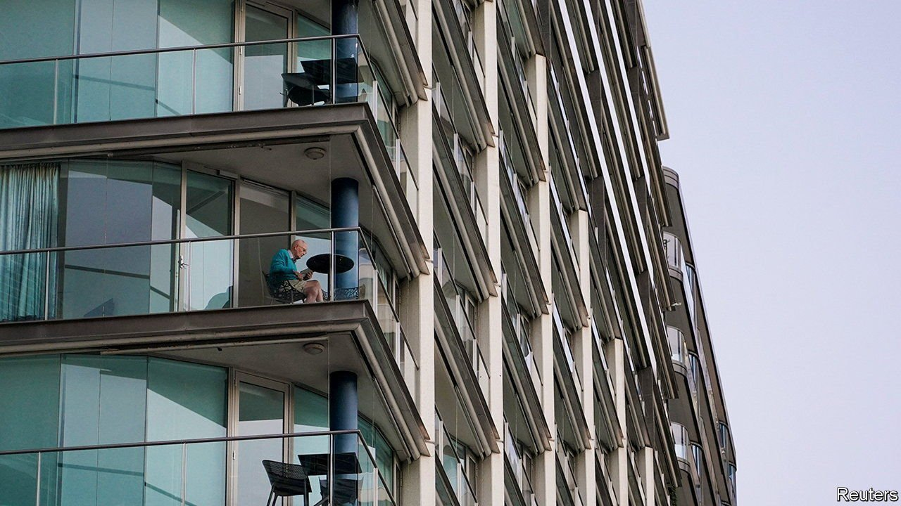

###### Lock me down at your peril

# Australia’s covid-19 strategy is being tested 

##### The Delta variant combined with a low vaccination rate is causing trouble 

 

> Jul 24th 2021 

TO SYDNEYSIDERS, most of whom have lived freely throughout the pandemic, it feels as if the virus has just got going. They are in the midst of their worst outbreak since the spring of 2020. It began last month when an infected man wandered through a mall in Sydney’s beach-fringed eastern suburbs. After four weeks of lockdown, the city of 5m is now recording just over 100 new infections a day. By Australia’s previously low rates, that is no joke.

Even with curbs on travel, the virus has leaked into rural towns and across state borders. Victoria has been plunged into its fifth lockdown to confront an outbreak of more than 140 active cases. South Australia issued stay-at-home orders on July 20th, after a man who caught the virus in Sydney infected several others. Over half of Australia’s 25m people are now locked down.


Many Australians point the finger at Gladys Berejiklian, the Liberal (meaning conservative) premier of New South Wales. They blame her for not immediately shutting down Sydney when the first case was detected there. Her government has relied on contact-tracing to quash past outbreaks. But its teams were unable to keep up with the more transmissible Delta variant. Ms Berejiklian is accused of acting too little, too late.

The Lucky Country, which basked in praise for keeping covid-19 out by promptly shutting its borders, is in a rut because its failure to get people vaccinated quickly makes it vulnerable to more transmissible strains. Only about 15% of its adult population is fully jabbed, one of the lowest rates in the OECD, a club mostly of rich nations.

Supplies are short because Mr Morrison’s government did not sign enough deals to start with. The one vaccine that Australia has plenty of—AstraZeneca’s—is recommended by the government only for over-60s. Many of them would rather not have it because it has been associated with rare cases of blood clotting. With almost no coronavirus in the country, they reason, why take the risk?

Stressing that it has merely followed its immunisation experts’ advice, the government has fanned scepticism by repeatedly changing its recommendations on who can safely receive AstraZeneca’s jab. The result is that a quarter of the 25% of over-70s who have yet to be vaccinated have deferred or refused vaccinations because they want a different jab.

Watching the world’s viral travails from afar, Australians have had cause to feel smug. They overwhelmingly support the closure of their border to foreigners. But as other countries open up, their patience is beginning to fray. Support for Mr Morrison’s coalition government has slumped. Polling for the Australian, a conservative newspaper, puts Labor, out of power since 2013, ahead of the ruling coalition. Voters may now put more faith in state leaders, whose powers have grown.

As people clamour for tougher controls, Ms Berejiklian has thrown a ring around Sydney’s worst-affected suburbs, banning travel in and out for all but emergency workers. Hotels and ski slopes have been abandoned. For the first time, builders have been told to down tools. For every week that building sites are closed, the state’s economy could lose as much as A$1.4bn ($1bn), according to industry groups. If the lockdowns drag on, the national economy may shrink in the third quarter for the first time in more than a year, says Sarah Hunter, an economist.

Hope comes in the form of 1m doses of Pfizer’s vaccine, which have just landed. More are coming. With luck, says Stephen Duckett, a health economist at the Grattan Institute, a think-tank, Australia could vaccinate 80% of its adult population by the new year. He thinks that is roughly the proportion it would need to reach before it contemplates rejoining the world.

Until then, it is moving away from normality. Its border closures make it tough even for citizens to fly home from abroad. Mr Morrison has just halved the limit on the number allowed in weekly to 3,000. Australians both at home and away are increasingly grumpy. ■

Dig deeper

All our stories relating to the pandemic and the vaccines can be found on our . You can also find trackers showing ,  and the virus’s spread across  and .

