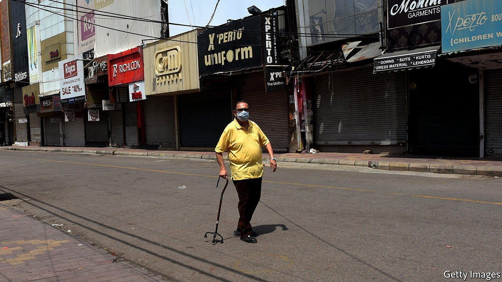
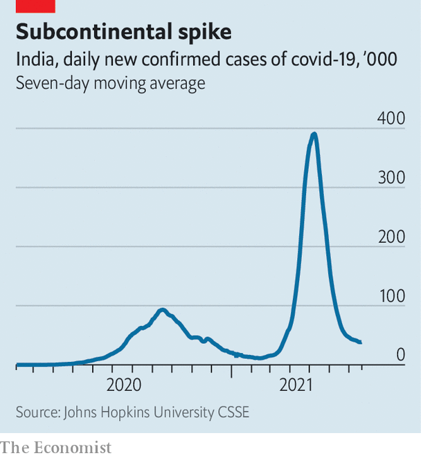

###### The sick man of Asia

# India’s economy is suffering from long covid 

##### As a devastating wave of the virus recedes, the effects will linger for much longer 

 

> Jul 22nd 2021 

THE SYMPTOMS are a peculiar mix. They include sluggishness, a general malaise, depression and an inability to focus. It is a bit like long covid. Except that the victim of this particular form of delayed recovery from the virus is not a person. It is India’s economy.

Some 4m Indians had died of covid-19 by the end of June, according to The Economist’s latest estimate of , endorsed in a new study published this week by Abhishek Anand and colleagues at the Centre for Global Development, a think-tank in Washington, DC. That is ten times as many as official figures show. It suggests the virus has been much deadlier in India than in hard-hit rich countries such as Britain and America, whose mortality rates looked roughly similar to India’s until its . So it is no surprise that the country is struggling to get back on track.


India also stands out because its economy has been hammered so hard. As richer countries begin to bounce back, India is stuck with persistent unemployment, high inflation, limp demand, and falling savings and investment. Many of those troubles pre-date covid-19 but were worsened by it. With the vaccination campaign crawling along like an ambulance in Mumbai traffic, the economy’s—and the country’s—path to better health will be longer and more painful than for others.

Consider Neeraj Vora, an appliance salesman in Mumbai, India’s financial capital. During last year’s nationwide lockdown his salary was cut from 26,000 rupees ($348) a month to 14,000 rupees. This spring his father fell ill with the virus. As the cost of treatment mounted, both he and a sister broke into their fixed-deposit savings. When that proved too little he turned to clients whose trust he had earned. Their goodwill helped him cover a medical bill for 280,000 rupees.

Mr Vora’s family is now fine. But his father’s medication still eats 3,000-4,000 rupees a month, on top of the 5,000 rupees he pays in rent and the debts he now owes. “I don’t even understand when the money gets credited and when it disappears,” says Mr Vora, who now never leaves home without mask, gloves and sanitiser. “My family can’t afford for this ever to happen again.”

In the fiscal year that ended on March 31st India’s GDP shrank by 7.3%, more than any other big Asian economy. That was just before the virus’s massive second wave. Its economic impact may not have been as severe as the long lockdown suddenly imposed in mid-2020, which left millions of migrant workers stranded and jobless. But for many, particularly in India’s salaried middle class, the psychological shock of the second round of the pandemic has been worse. While tens of millions have found themselves, like Mr Vora, abruptly tipped down the income ladder, even those more comfortably off have had to dip into savings and put off investments. Bank loans against gold jewellery, India’s most traditional way of saving, jumped by 82% in the past fiscal year.

A poll of white-collar workers by Grant Thornton, a consulting firm, found that 40% of employees had suffered a pay cut last year. Another survey, of 3,000 mostly informal workers in Delhi, the capital, found that male breadwinners had on average suffered a 39% fall in income in the past year. Of the more than 38,000 respondents to another survey—carried out online, meaning all were rich enough to enjoy internet access—more than three-quarters said they expected their incomes to fall in the current year.

Anecdotal evidence corroborates the grimness. Charities report growing demand for food handouts. Private schools, most of which are cheap and basic rather than fancy, and which educate some 120m children, report falling enrolment despite measures such as cuts in teachers’ salaries and lower fees. The All India Mobile Retailers Association, a trade group, says over 40,000 mobile-phone shops have shut down since 2019. Sales of motorbikes—India is the world’s biggest two-wheeler market—are stuck at the level of 2014.

Most economists predict fairly robust growth this year, enough to make up for last year’s debacle. But for the medium term the talk is not of how fast “normal” growth will resume, but of how many years have been lost, and whether “normal” will be in the range of the 7-8% that India achieved in the 2000s, or more like the 3-5% of earlier decades. A recent study by the National Council of Applied Economic Research (NCAER), a think-tank in Delhi, suggests that without a fast-growth strategy India may never make up for the lost growth and may never reap the demographic dividend of a relatively large workforce with relatively few dependants.

India’s government is aware of the pressure. In late June it announced a further $85bn in stimulus measures, or about 3% of GDP, following a nominal $300bn pledged last year. It has extended by another five months the supply of free food grains that has kept many families afloat, shored up banks and helped small businesses, especially in hard-hit sectors such as tourism.

In real terms, though, government spending is not expanding but shrinking. In the quarter to June, state investment in new projects fell by 42% compared with the first three months of the year. According to the NCAER, total expenditure this year will amount to just 16.3% of GDP, a significant fall from the previous year’s 17.8%.

These numbers reflect the fact that India remains a poor country. The government keeps a wary eye on its credit rating, interest rates and inflation, which has crept above the central bank’s theoretical upper limit of 6%. But if India’s post-covid troubles are due to anything, it is to a legacy of poor choices by its leaders, from a chronic failure to invest in human capital to shying away from a fuller transition to a truly competitive economy.

 


Even now the pandemic could resurge. A survey of 36,000 people in 70 districts across 21 Indian states released by the Indian Council of Medical Research this week found that over two-thirds of Indians had covid-19 antibodies, including 62% of the unvaccinated. Like the excess death toll, that is vastly more than would be expected based on the official case count of just over 31m after the second wave (see chart). But it still leaves nearly half a billion people without any antibodies at all. Only 6.5% of the population has been fully vaccinated. Many of those with antibodies acquired through infection with earlier variants of the virus stand to still suffer mild disease and go on to infect all those unprotected people with the Delta variant or with new mutations that are yet to emerge.

Vivek Kaul, a canny economic commentator, says of his country’s economic decision-making: “You construct a house poorly and a storm hits. Now you are drenched due to a leaking roof. Is the storm the only one to blame?” Unfortunately, more storms may yet be on their way. ■

Dig deeper

All our stories relating to the pandemic and the vaccines can be found on our . You can also find trackers showing ,  and the virus’s spread across  and .

An early version of this article was published online on July 18th 2021

