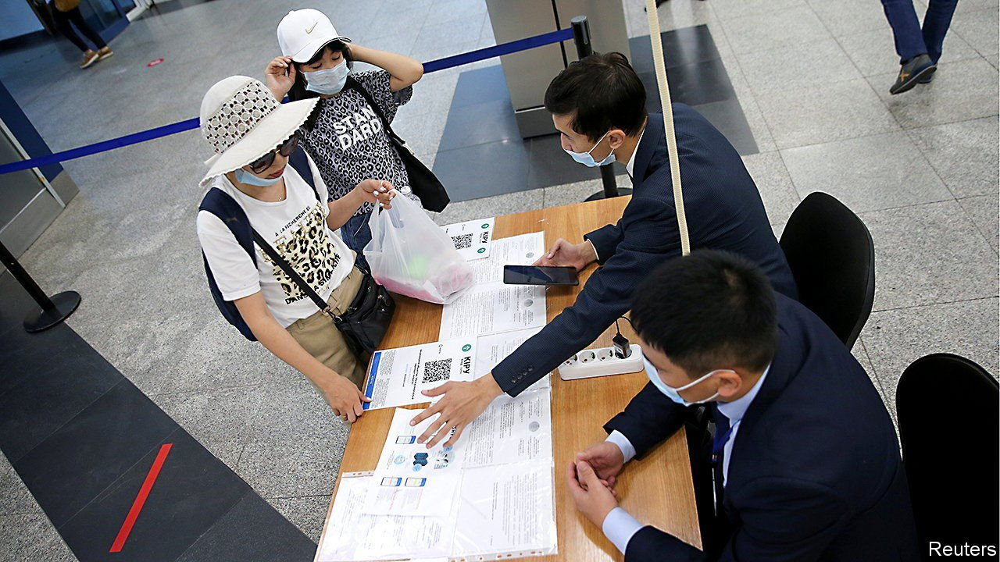

###### No vaccine? No problem

# Kazakhstan is awash in fake vaccination passports 

##### Corruption helps spread covid-19 

 

> Jul 24th 2021 

PEOPLE TEND to join dating apps to find love. But social-media users in Kazakhstan swipe right for less romantic services. On an array of platforms hustlers now do a roaring trade in fake vaccination documents.

“Vaccination passport without the vaccination” is how one account offers to register you in Kazakhstan’s e-government system. This then gives you an electronic vaccination passport, so far mainly for use only within the country, at a cost of up to $70, around 12% of the average monthly wage.


Why pay when vaccinations and vaccine passports are free of charge? One reason is that many Kazakhstanis are anti-vaxxers but need a certificate to go to work. Everyone in direct contact with the public—from waiters and shop assistants to shoe repairers and dry cleaners—must produce vaccination passports, unless they have medical exemptions or have recently had the virus.

Kazakhstan’s health-care system is one of the country’s most corrupt sectors. A black market in fake exemption certificates and in forged covid-19 tests showing a negative result is thriving. The penalty for forgery is up to four years in prison, but the chances of being caught are slim. The police as well as medical staff can often be bribed. Since President Kassym-Jomart Tokayev ordered action over this “direct threat to public health and security”, some medical people have been arrested. But the forgers are blasé about damaging the country’s health. “If someone doesn’t want to get vaccinated and has the chance to forge a passport, that’s their right,” says one counterfeiter.

Currently only 16% of Kazakhstanis have officially been double-jabbed. The government says it is trying to get over half the population jabbed by September using Russian and Chinese vaccines and a homegrown version. Health officials are getting more inventive. On July 17th they took some particularly vocal anti-vaxxers on a tour of covid-19 wards in Almaty, the commercial capital, where hospitals are filling up.

Yet anti-vax feeling persists. A Gallup poll late last year showed only 25% of Kazakhstanis were willing to be jabbed. In a more recent poll 59% viewed the vaccine as the only way out of the crisis, but a third still did not intend to get it. Many subscribe to conspiracy theories that vaccination is part of a malevolent plot to embed chips in humans to monitor them. Others simply distrust whatever the government tells them.

Better communication rather than coercion is key to changing attitudes, says Botagoz Kaukenova, a doctor who runs an organisation that counters disinformation about the virus. A recent poll found that only 19% of Kazakhstanis reckoned that government messaging about the virus was reliable.

Besides endangering public health, the rampant forgery has plunged some Kazakhstanis into Kafkaesque nightmares. One young man complained to local media that he had been given an unwelcome gift—a fake vaccination passport that his parents had bought with a bribe without his knowledge. Now he cannot get vaccinated, even though he wants to, because the system shows him as already jabbed.

Dig deeper

All our stories relating to the pandemic and the vaccines can be found on our . You can also find trackers showing ,  and the virus’s spread across  and .

