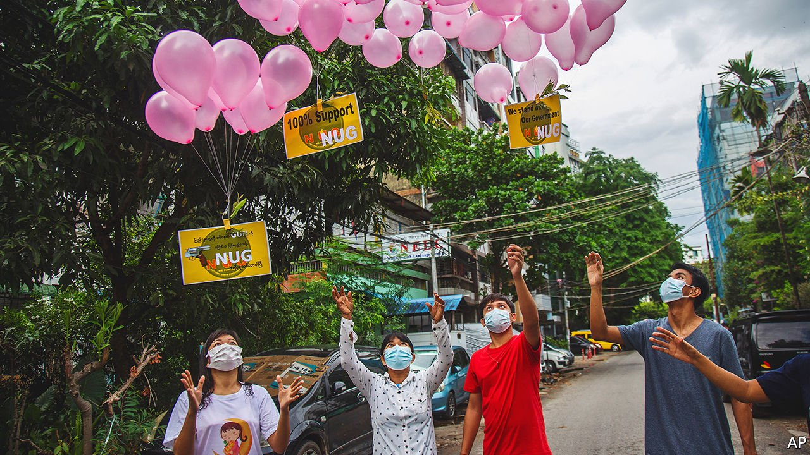

###### Government of national disunity

# Myanmar’s underground civilian rulers are struggling for recognition 

##### Supporters at home and abroad are wary of throwing their full weight behind them 

 

> Jul 24th 2021 

FOR AROUND an hour on the afternoon of June 4th, as on so many previous occasions this year, the internet was out across Myanmar. For opponents of the country’s ruling military junta, the reason was clear: the generals were trying to stop people from watching a press conference by the National Unity Government (NUG), an underground alliance of civilian politicians who claim to be the legitimate representatives of the Burmese people.

The generals are right to worry about the appeal of an alternative set of rulers. Myanmar has been riven by unrest ever since the Tatmadaw, as the army is known, retook power from the civilian government in a coup on February 1st. Bloody repression failed to deter all protesters; many have taken up arms. But the NUG remains far from its aim to topple the junta and gain international recognition as the rightful government.


The underground body was formed in April by lawmakers mostly from Aung San Suu Kyi’s National League for Democracy (NLD), the ruling party ousted by the generals; Ms Suu Kyi is back in detention. It is more inclusive than her administration, which was composed largely of elderly bureaucrats from the Bamar ethnic majority and which defended the army’s persecution of the Muslim Rohingyas. The NUG, though led by NLD members, is ethnically and politically diverse. It promises to repeal a discriminatory law that bars Rohingyas from becoming citizens. Half the cabinet are from minority groups, including the vice-president and the prime minister.

The NUG is fighting an uphill battle. Its diversity, though essential in a country that has suffered ethnic strife for decades, has drawbacks too. Many of the ethnic groups it seeks to unite have spent decades fighting not only the army but occasionally each other. Not all members trust the NLD’s newfound keenness on ethnic inclusivity.

That spells trouble. Diplomats and business leaders reckon that the army is likely to keep its grip on power for years to come, even at the cost of ever more brutal crushing of dissent and collapsing functions of state. Whereas some powerful ethnic militias have offered support to the NUG, others have kept well away. The chances of combining all militias into a unified opposition army are slim.

The NUG’s attempts to bring the business lobby on side have not been plainly successful, either. Business leaders pay attention to the NUG’s statements, says a well-connected analyst in Yangon. But following its demands to halt tax and dividend payments is trickier because it entails violating the law and putting staff at risk. Some big Asian investors remain hesitant to sever ties with the Tatmadaw.

Nor has there been an outpouring of international support for the underground government. Laetitia van den Assum, a retired Dutch diplomat who used to advise Ms Suu Kyi, says the NUG’s international contacts amount to “de facto recognition”. Some Burmese diplomats have switched allegiance to represent it abroad. Its status will be debated at the UN General Assembly in September. But no foreign government or international body has yet recognised the NUG. China, Myanmar’s largest trading partner and one of its biggest foreign investors, has thrown its weight behind the junta. Western governments are wary of recognising the NUG for fear of being drawn into a proxy war.

All this means that the underground government will struggle to stay relevant as the army tightens its grip. The devastating wave of covid-19 spreading through Myanmar presents an opportunity of sorts. The generals, busy locking up dissenting health-care workers, have botched the response. Hospitals are filling up. Oxygen is running out. People are dying in the streets. If the NUG manages to channel medical support to the right places, it may yet bolster its support.

For the moment, the NUG has no plans to go completely into exile, says Dr Sasa, its minister for international co-operation and spokesman. Rather, it will operate virtually, with cabinet members inside and outside the country. “Our offices are online. We are an e-government,” he says. He can only hope that his voice will not be lost in the ether. ■

