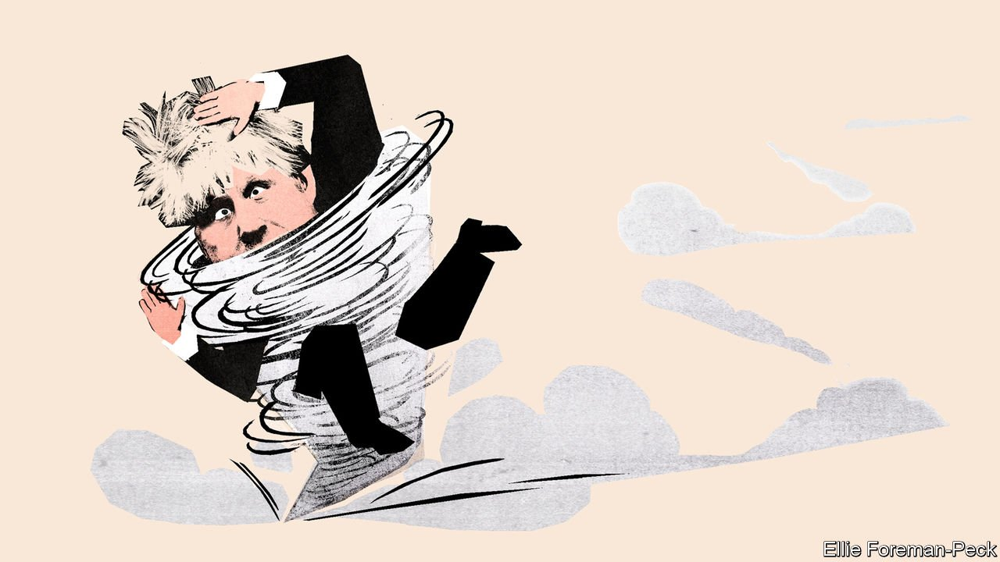

###### Bagehot

# Boris Johnson marks his second anniversary in Number 10 

##### It has been a period of extraordinary turmoil 

 

> Jul 24th 2021 

IT FEELS SURPRISING that July 24th marks only the second anniversary of Boris Johnson’s arrival at Number 10, the prime-ministerial residence: into those two years he has packed enough incident to keep another man going for two decades. He has divorced for a second time, married for a third, witnessed the birth of what is thought to be his sixth child, contracted covid-19 and flirted with the Grim Reaper. On the politics front he has prorogued Parliament, expelled 21 Tory grandees from the party for voting against the government on Brexit, lost his majority in the process, won spectacular re-election and signed a Brexit deal.

What to make of this whirling dervish? Mr Johnson is notoriously a “Marmite” politician: fans forgive him anything; enemies regard him as a dangerous buffoon. The latter group now includes his former chief adviser, Dominic Cummings, who this week told the BBC that the very idea of Mr Johnson being prime minister “obviously is ludicrous”. He is also an alpha/gamma politician, to invoke the pompous marking scheme of his former alma mater, Oxford University, sometimes dazzling with political genius and at others appalling with incompetence. The question is which will predominate during the rest of his time in office.


Mr Johnson understood intuitively that the financial crisis of 2008 ended the neoliberal consensus. Globalisation had left too many voters behind, and created self-satisfied, self-obsessed winners. No mere Trumpian wrecking ball, he is trying to reshape globalisation in the mould of Britain’s buccaneering maritime past, rather than the European Union’s bureaucratic pettifoggery. As parties withered and voters became more celebrity-obsessed, he cultivated a dishevelled bonhomie and became a media star, ascending to the top job by way of television studios and the London mayor’s office rather than stuffy committees and the whip’s office.

But the man who can sniff the future on every changing breeze can also make the most godawful hash of things. He fulfilled a promise to “get Brexit done” by blithely agreeing to a customs border in the Irish Sea and then denying that it meant anything. He dawdled in his initial response to covid-19, missing the first five emergency meetings to try to sort out his personal affairs. Scandals come thick and fast, from the £200,000 ($275,000), some of it fronted by party donors, that went on redecorating his Downing Street flat to a (rapidly reversed) decision to exempt himself from isolating when told to do so by the national contact-tracing app.

The prime minister’s great problem—and therefore the country’s—is that the very same characteristics and conditions account for both alpha and gamma. One is an unusual tolerance for chaos. Mr Johnson was brought up in an unstable home, with an endlessly unfaithful father and a mother who had a nervous breakdown and spent months in a mental institution; the two divorced. The family moved home 32 times in his first 14 years—around the age when he transformed himself from Alexander the introverted swot into Boris the Etonian swell. In both personal and professional life he repeatedly returns to chaos as an addict returns to the needle. Explaining why he chose politics over a comfortable life as an author and journalist, he chose a telling metaphor: “There comes a point when you’ve got to put the dynamite under your own tram tracks…[and] derail yourself.” He has been derailing Britain ever since.

This tendency towards chaos is linked to two others: persistent optimism and a belief in the power of individuals (in particular, one Boris Johnson) to shape events. His sentences ring with exuberant words—“amazing”, “fantastic” and “splendid”—as though Sinclair Lewis’s Babbitt had swallowed a volume of P.G. Wodehouse. He loathes the common establishment affectation of world-weariness. On the matter of Scottish independence, upon which depends the very future of the United Kingdom he governs, he seems to think that the threat will dissipate if he does nothing. He instinctively hews to the “great man” theory of history, according to which figures such as Winston Churchill, about whom he has written a book, or Silvio Berlusconi, with whom he seemed smitten for a time, bend “fortuna” to their will.

This psychology lies behind his more inspired moves, from breaking the Conservative impasse over Brexit to handing the vaccine-procurement programme to a venture capitalist, Kate Bingham, with a virtually unlimited budget and permission to operate outside the usual government strictures. But it also lies behind his worst ones. Even his predecessor, Theresa May, who has not a scintilla of alpha about her, nevertheless recognised that the conundrum posed by the Irish border could neither be ignored nor wished away. Jeremy Hunt, who led the competition against Mr Johnson for the Conservative leadership in 2019, may not thrill the crowds like the man who defeated him. But thousands fewer might well have died in the early, chaotic phase of the pandemic if just 50,000 Conservative Party members had chosen calm competence over tousle-haired unpredictability.

Buckle up

Ominously for anyone who likes a quiet life, the gamma grades are becoming more numerous. Mr Johnson’s seat-of-the-pants approach is ill-suited to sorting and stacking the building blocks of the post-Brexit political settlement. Moreover, he seems increasingly to have fallen for his own mythmaking. He succeeded as London mayor by appointing a crack team to handle administration while he hogged the limelight. But as prime minister he has failed to delegate, first falling for the grenade-throwing Mr Cummings and latterly acting like the king of a faction-ridden court. In testimony to a parliamentary select committee on covid-19 in May, Mr Cummings recalled complaining about the chaotic handling of the pandemic. “Chaos isn’t that bad,” Mr Johnson replied, in Mr Cummings’s retelling. “Chaos means that everyone has to look to me to see who’s in charge.” ■

For more coverage of matters relating to Brexit, visit our 

