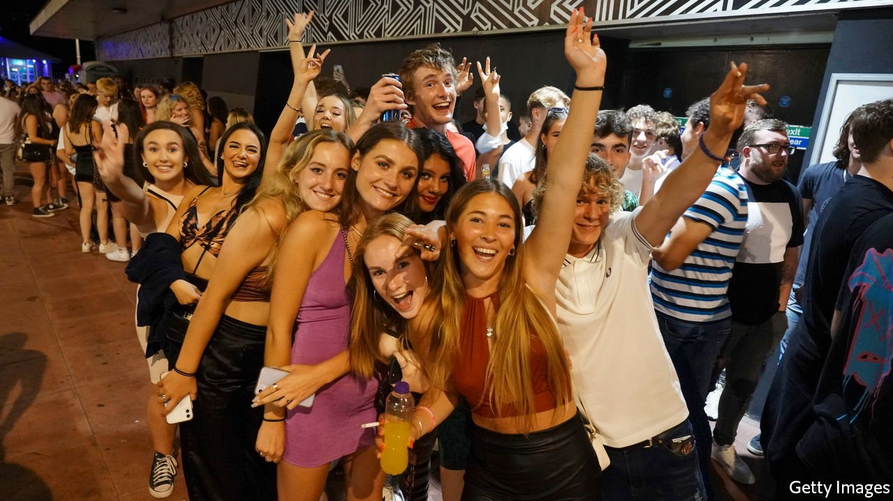

###### Covid-19

# Britain tests the limits of mass vaccination 

##### The government is taken by surprise at the implications of its strategy 

 

> Jul 20th 2021 

AS MIDNIGHT ARRIVED marking the start of “Freedom Day” on July 19th, clubbers returned to the dance floor. Yet there was trepidation. “It’s quite clear there’s extreme pressure on Boris to backtrack on ending restrictions,” read a viral Instagram post by a promoter. “If numbers surge he will 100% blame clubs as being superspreader events!” So please, it continued, take a lateral-flow test before heading out. They are “FREE from chemist[s]!”

The Delta covid-19 variant is ripping through Britain, with more than 40,000 cases reported a day (two-thirds of the peak in January). The number is doubling roughly every fortnight. The decision by the prime minister, Boris Johnson, to end most mitigation measures in England—including restrictions on the size of gatherings, and requirements to wear masks and keep distant—looks considerably braver than when he announced it earlier in the month. The club promoter had read the political dynamics more or less correctly.


What happens next is of interest beyond Britain’s borders. It is the first country to face a wave of the more transmissible Delta variant having already vaccinated most of its adult population. It will be watched by policymakers seeking to answer a crucial question: will a combination of vaccination and acquired immunity allow them to end severe restrictions and to treat covid-19 more like other endemic diseases, for example influenza and the coronaviruses that cause common colds?

Britain provides such a case study for two reasons. One is that Delta arrived early. The other is that a speedy vaccination campaign means the country has offered two jabs to all of the most vulnerable, and at least one to all adults. Nearly 95% of over-65s in England have been vaccinated, compared with 80% of that age group in America and fewer still in the European Union. As a result of this and better treatment for those who fall ill, the British case-fatality rate has fallen sharply. Many countries will not have caught up by the time the Delta variant takes off, so in this sense Britain provides a best-case scenario.

Even if deaths are much lower than otherwise would have been the case, huge numbers of infections can still cause immediate damage. Officials are keeping a wary eye on the health service. At the moment, more than 700 covid-19 patients are admitted to hospital each day: a sixth of the peak in January, but twice as many as a few weeks ago. Growth in hospitalisations appears to be at the high end of official modelling that dates from the start of July. But with younger patients spending less time in hospital, bed occupancy remains in line with central expectations.

Predicting what is to come is even more difficult than normal. “You have three or four sources of uncertainty, and when you multiply them the uncertainty grows,” says Marc Baguelin of Imperial College London’s modelling team. These include how people will react to freedom with cases climbing, the degree of protection provided by infection with previous variants and exactly how well vaccines guard against the Delta variant. The difference between 95% and 98% protection against death may not look like much, but, as Mr Baguelin points out, the former implies more than twice as many deaths as the latter.

Don’t step out of this house

The government appears ill-prepared for the turbulence. Advice for the immunosuppressed, who are most at risk, was vague and delayed, arriving only on July 12th. In the most recent week for which data are available, more than 800,000 people were asked to isolate by contact tracers or the National Health Service (NHS) app. Already, one in five 18- to 24-year-olds has deleted the app, many to avoid being “pinged”. In January modelling by researchers at the University of Oxford, Public Health England and the health department found that lateral-flow tests could pick up around 90% of infections among those who have come into contact with a positive case, suggesting a test-and-release strategy could have many of the benefits of quarantine, at a much lower cost.

It was not until May that the government started a pilot study to test the idea. Some 40,000 people are now enrolled, but it has yet to produce results. In the meantime the government has vacillated over the best course of action. The prime minister’s office has contradicted two ministers: one who suggested the government would reduce the app’s sensitivity; another who described the guidance to isolate as advice, rather than instruction. Instead, ministers settled upon exempting asymptomatic fully vaccinated “critical workers”, such as railway signallers, air-traffic controllers and doctors, from the requirement to isolate, thereby enabling them to go to work. When the government announced the policy, it had yet to decide upon who precisely would count as such a worker.

Having ruled out vaccine passports, Mr Johnson announced on July 19th that they would, in fact, be used in “closed spaces, crowded places and close-contact settings”. They will also be required to get into clubs—with a negative test not sufficient, as had previously been suggested—in an attempt to increase vaccination rates among younger Britons. But this measure will apparently be introduced only in September, by when any wave will have done its worst. “I don’t know who’s advising them on their comms strategy,” says a scientist who is advising the government. “Whoever it is, they should be fired.”

TV producers used shots of heaving clubs to illustrate the reopening. These told only a small part of the story, however. Polling by YouGov found that, even among regular clubbers, nearly three-quarters were not yet willing to hit the dance floor. Our “economic-activity index”, constructed from Google data on visits to offices, transit stations and retail and recreation sites, has dropped by 5% or so since peaking in June, with  since July 19th. Even without being ordered to, people are staying at home.

That will slow any economic recovery. And the government’s blunders will damage the goodwill from a stellar vaccine roll-out. How much will depend on the progress of the huge experiment in which the British population has been enrolled. ■

Dig deeper

All our stories relating to the pandemic and the vaccines can be found on our . You can also find trackers showing ,  and the virus’s spread across  and .

