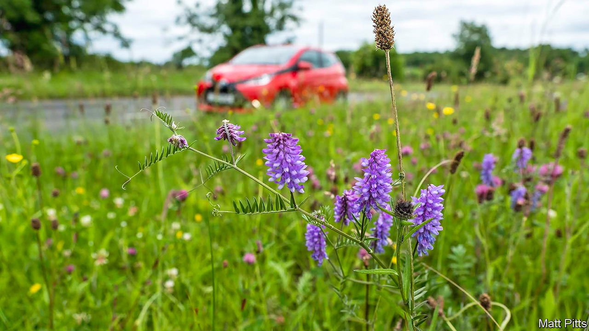

###### Roadside verges

# Britain’s roads are becoming messier and more colourful 

##### Verges may seem insubstantial, but they make up more than 1% of the country 

 

> Jul 24th 2021 

AS THEY PICK their way through a road verge on the outskirts of Blandford Forum, Giles Nicholson of Dorset Council and Phil Sterling of Butterfly Conservation list the plants they see. Being wildflowers, these mostly have common names, not the Latin monikers that gardeners use for their potted perennials: bird’s-foot trefoil, black knapweed, field scabious, lady’s bedstraw, ploughman’s-spikenard, pyramidal orchid, self-heal, wild carrot. “If it was bigger, it would be a nature reserve,” says Mr Nicholson, as the cars roar by.

This small patch of ground near a Lidl supermarket was a test bed. Since 2016 it has been managed with the aim of generating diverse native flowers, and the insects that feed on them, for little money—less than it would cost to mow the grass in the normal fashion. It has been influential, seeding other experiments in Dorset and elsewhere. Over the next few years more parts of Britain will start to look equally ragged and colourful.


Although road verges seem trivial next to great blocks of forest, moorland and farmland, they are collectively substantial. In a new paper, Benjamin Phillips of the University of Exeter and others estimate that road verges cover 257,900 hectares (637,000 acres), or 1.2% of Britain’s land area. That is more land than is owned by the National Trust, a large conservation charity. They can be havens for rare plants and invertebrates, if the latter can avoid colliding with windscreens.

Along country roads, where vegetation is usually cut speedily with tractor-mounted flails, local authorities can encourage plant growth simply by mowing less often—Dorset has moved from cutting twice a year to once. But in urban areas a more ambitious approach is possible. Some councils are going from cutting six or seven times a year to twice, removing the grass clippings each time to prevent them from returning nutrients to the soil. After a few years the ground is so starved of nutrients that grass can barely grow, and wildflowers spring up. Some verges in Blandford Forum are so nutritionally impoverished that Mr Nicholson thinks he can tell where dogs have urinated. The grass grows better in those nitrogen-rich patches.

These techniques have spread from town to town in Dorset, and from there around Britain. Cambridgeshire, Cornwall, Denbighshire and Fife are all experimenting with “cut and collect” methods. Norfolk, which already contains 111 “roadside nature reserves”, plans to add another 188. Last December Highways England, which manages motorways and other important carriageways, changed its policies. Now, when it creates a new road, it will not add a thick layer of topsoil—which encourages luxuriant grass—but will keep the verges impoverished and hopefully floriferous.

Local authorities have various reasons for letting their verges go to seed. They want to promote biodiversity and cut their carbon emissions. They also want to save money. Although mowers that can collect grass are more expensive, contractors save so much on labour that the cost falls. Dorset’s budget for road verges has roughly halved since 2015.

Many people are happy with the changes, or at least not as angry as they used to be. Kate Petty of Plantlife, a charity that has advised many local authorities, puts that down partly to covid-19: people got used to seeing rougher verges last year because contractors could not go out. But Dorchester, another town in Dorset, had to send in the mowers earlier this month after people complained that road signs were being obscured. In 2016 some people in Sunderland complained that flashers might hide in the lengthening grass.

About 80km east of Blandford Forum, in New Alresford, a scheme to turn two verges into meadows has been repeatedly thwarted. Contractors have tried to mow the grass when they should not. A vandal has removed the signs that local residents put up to stop the mowers; somebody even decapitated some pyramidal orchids and left them lying on the grass. As Samantha Dalling, who supports the project, looks at the verge, she wonders whether some of the signs have gone missing again. She is undeterred: “We’ve got spares.” ■

