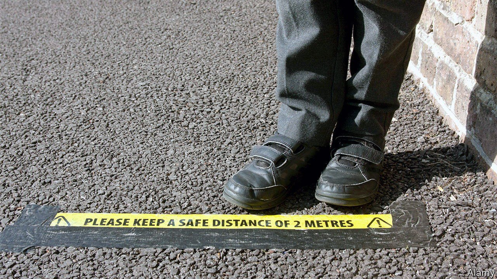

###### Summer blues

# England’s school year staggers to a disappointing end 

##### Almost a quarter of children were absent 

 

> Jul 24th 2021 

THE SCHOOL year in England did not draw to a close, so much as sputter out. By the time schools began breaking up in mid-July, nearly a quarter of pupils were already absent, according to government figures released on July 20th. A large share were stuck at home as a result of rules requiring whole classes to isolate for ten days, should any pupil test positive for covid-19. But absences for other reasons were also far higher than usual. Some parents appeared to have taken children out of school for fear they would be ordered to isolate, potentially grounding the entire family just as the summer holidays began.

It was a depressing finish to a disappointing year. During the autumn term, pupils had seemed to be making up some of the ground lost as a result of low-quality remote teaching when England’s schools were first shut. But the second closure, which began in January, set them back once again. A government study suggests that in April the average primary pupil lagged about two months behind usual prowess in reading, and three months behind in mathematics. Children from poorer families have suffered worst, and will probably also be the slowest to catch up, no matter what help is on offer.


In theory, efforts to help pupils recover from school closures will continue during the holidays. The government has stumped up a little extra funding to enable schools to provide supplementary classes, especially for pupils about to make the tricky transition from primary to secondary school. But one recent survey found that only a fifth of school leaders had firm plans to offer summer lessons. The head teachers who responded said that staff and pupils needed a break, and that parents weren’t keen. In any case, studies suggest that summer schools commonly fail to attract the disadvantaged children most in need of extra help.

Meanwhile, the government is facing severe criticism for skimping on other education catch-up strategies. Last month Sir Kevan Collins, an ex-teacher and education researcher who had only recently been asked to oversee those efforts, resigned after being told that just a tenth of the £15bn or so he had argued for would be forthcoming. He had wanted a lot of that money to go on lengthening the school day. Leaders of schools with lots of disadvantaged pupils believe the government’s catch-up plans are “misconceived and inadequate”, according to a study published on July 14th by the National Foundation for Educational Research, which interviewed 50 of them. The harm done by school closures to children’s mental and emotional health was not being taken sufficiently seriously, they argued. They welcomed more money for personalised tutoring, but said that school leaders should be granted greater freedom to decide what any extra money should be used for.

The prime minister, Boris Johnson, has hinted that more money for schools will be forthcoming in the autumn spending review. In the meantime, the government promises that quarantine rules will be tweaked in order to reduce disruption in the coming academic year. When schools restart in September, whole classes of children will no longer be asked to isolate en masse . Even close contacts of pupils who test positive for covid-19 will be allowed to remain in school while they wait for their own test results. This change might be reversed if infections soar again. But for parents exhausted by on-again, off-again bouts of home-schooling, fewer absences will be a blessed relief. ■

