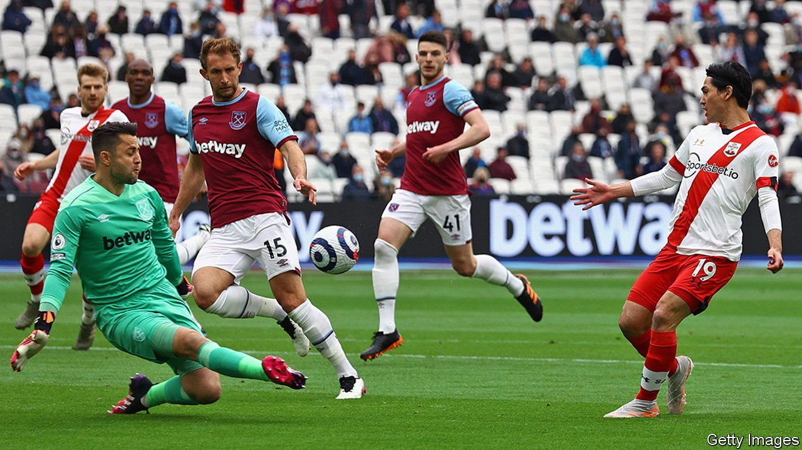
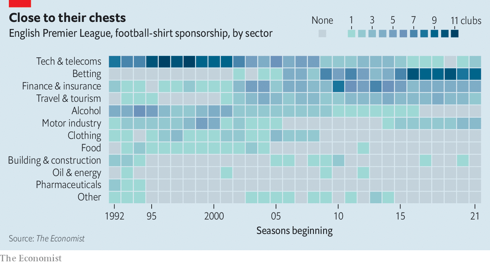

###### Football shirts

# How Premier League shirt sponsors have changed 

##### From local timber merchant to multinational betting sites 

 

> Jul 24th 2021 

EACH YEAR as the English Premier League prepares for kick-off, super-fans wait to see what their heroes will be wearing on the pitch. This year Manchester United stitched the words “youth, courage and success” inside players’ collars. Other changes have less high-minded motives: sponsorship. Once small and local (Arnold Laver, a timber merchant, sponsored Sheffield United from 1985 to 1995), now sponsors are multinationals. In the late 1990s tech and telecoms companies predominated; then financial and insurance firms muscled in. Since 2005, when gambling laws were liberalised, betting firms have worked their way up the league. This season they sponsor 45% of teams.

 


Campaigners worry that the league’s global reach is feeding gambling addiction, not just in Britain but worldwide. A House of Lords report has recommended banning betting firms from shirts; the government’s response is due later this year. In the meantime sponsorship means temptation, says James Grimes, a campaigner and recovering addict. “I still have to fight the 600 mentions of the word ‘bet’ every game.”■

