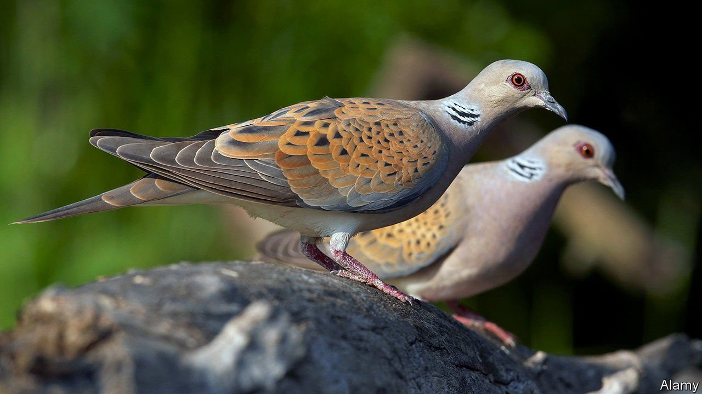

###### Doveish policy

# How an auction is helping Britain’s turtle doves 

##### Economists seek to save a romantic species 

 

> Jul 22nd 2021 

“AS SUN to day, as turtle to her mate,” declares Shakespeare’s Troilus of his commitment to Cressida. Chaucer wrote of “the wedded turtledove with her heart true”. Yet Britain has not been kind to these migratory birds, whose numbers in the British Isles have dwindled by 98% since the 1970s to an estimated 3,600 breeding pairs in 2016.

Paul Klemperer, Elizabeth Baldwin and Alex Teytelboym, all of Oxford University, are using economics to help. They have designed a reverse auction in which farmers bid publicly for contracts to provide suitable habitats. This is trickier than it sounds. Turtle doves need wildflower seeds to eat, shallow-sided open water to drink and thick scrubby hedgerows in which to nest—all in proximity. A farmer might wish to provide just one or two of these, and to rely on neighbours to provide the rest. Moreover, breeding pairs must be able to find the sites, but they must not be too clumped together. And finally, the habitats offered by farmers can vary in quality as well as price—a problem Mr Klemperer encountered during the global financial crisis, when designing an auction in which the Bank of England offered emergency loans to banks against collateral of varying quality.


To solve it this time round, the economists constructed an index of turtle-dove happiness (TDH, or “ta-das”). An algorithm searches combinations of bids, seeking to maximise ta-das for a given budget. Bids both compete with and complement each other: a high-priced offer to grow wildflowers might beat a cheaper one if they would be nearer a nesting site, and would thus create more ta-das. The Royal Society for the Protection of Birds, a charity, has used the system in two pilot auctions in Norfolk and Suffolk, attracting 63 bidders. The latest closed in June, and seeds should be sown in the autumn.

The experiments are funded by the government as part of a broader post-Brexit effort to redirect farming subsidies towards support for providing public goods. The European Union’s common agricultural policy, which rewards intensive farming, had led to the loss of diverse natural habitats for wildlife of all kinds.

Yet international co-operation also matters for saving turtle doves, which migrate to sub-Saharan Africa in winter, facing the risk of being shot by hunters in continental Europe along the way. In June campaigners chalked up a victory when most Spanish regions banned hunting the birds for a year. They hope that, in the fight to save these symbols of love and fidelity, better habitats at home and less hunting abroad will dovetail.

