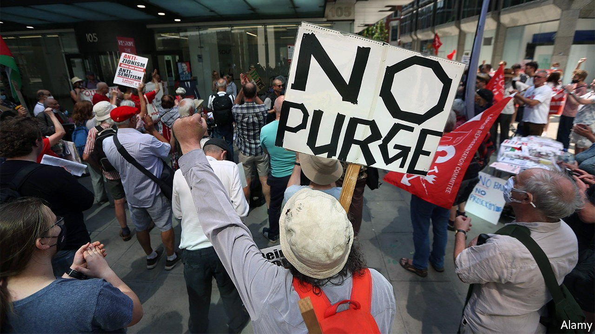

###### Starmerist Regime

# Keir Starmer is still embroiled in battles with Labour’s far left 

##### He needs to do more to connect with voters 

 

> Jul 24th 2021 

EVEN BEFORE the anti-vaxxers turned up, it was an absurd demonstration. Four groups—Labour Against the Witchhunt, Labour in Exile Network, Resist and Socialist Appeal—gathered outside a nearly empty building in the sweltering heat to protest against measures that would see their followers expelled from the Labour Party. It was no use. The party’s National Executive Committee (NEC), which was meeting online, voted to proscribe all four.

Labour continues to clean up the mess left by Jeremy Corbyn, the left-wing perma-protester who led the party from 2015 to 2020. Mr Corbyn lost one general election (in 2017) by a surprisingly small margin, and another (in 2019) by an enormous one. Under his leadership, anti-Semitism flourished. Mr Corbyn himself was suspended from the party last year for claiming that anti-Semitism had been “dramatically overstated for political reasons”.


The four proscribed groups have limited appeal. The first three exist to provide harbour to members expelled or suspended from the party for anti-Semitism. Socialist Appeal, which stands “for the ideas of Marx, Engels, Lenin and Trotsky”, has its origins in the long-banned Trotskyite Militant Tendency. The purge will affect no prominent party member save possibly Ken Loach, a radical film director. But if it seems like a tidying-up exercise, that is a mark of how much has been achieved over the past year.

Sir Keir Starmer, Labour’s moderate leader, has steadily tightened his grip. His supporters have a solid majority on the NEC. The party has grown more centrist. Whereas a YouGov poll of party members in January 2020 found that Mr Corbyn was nearly twice as popular as Tony Blair, Labour’s greatest election-winner, another one in June this year found that Mr Blair had edged ahead. It will help Sir Keir if Unite the Union, the party’s biggest financial backer, acquires a moderate leader in August. That could happen if the left-wing vote splits between two candidates.

Control of one’s party is a necessary condition for a successful opposition leader. Unfortunately, it is not a sufficient one. Labour fared badly during local elections in May, and went on to lose a by-election in Hartlepool, which it had held since the constituency’s creation in 1974. Sir Keir might have faced a serious challenge for the leadership if Labour had not won another by-election by a few hundred votes.

Some senior Labourites worriedly compare Sir Keir to Neil Kinnock, Labour’s leader in the 1980s, who faced down left-wing extremists only to fall short twice in general elections. They argue that Sir Keir needs to define the party’s positions quickly. “Voters don’t hate us,” says one. “They just don’t know what we stand for.”

So far Sir Keir has struggled with this. He is constrained not only by his cautious personality but also by the Ten Pledges he used to woo the left when he ran for party leader in 2020, which tied him to much of the Corbynite manifesto. Last week in Blackpool Sir Keir introduced himself to a group of voters, some of whom had never heard of him. He tried out some new ideas, such as buying British, more funding for children and a jobs guarantee for under-25s. The reaction was lukewarm.

It is always hard for an opposition party to cut through, and harder during a national emergency when the government hogs the headlines. For now, Labour’s poll ratings are simply the inverse of the government’s. But if Sir Keir has brought his party to the point where a government screw-up could conceivably propel it to power, that is much better than nothing.■

