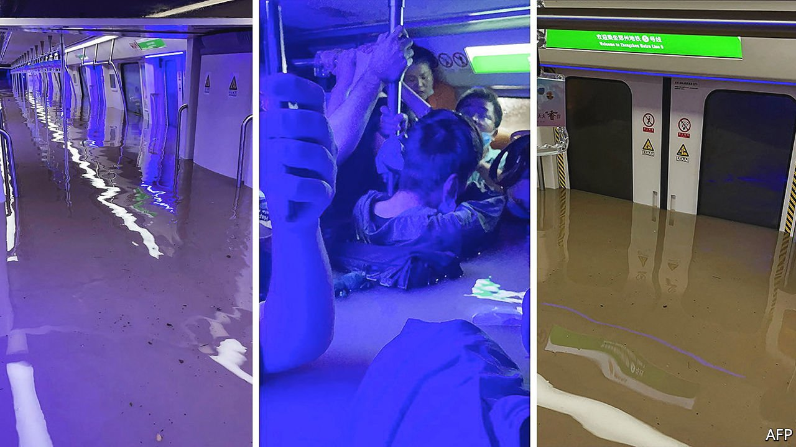

###### Extreme weather

# A deluge in China has killed more than 30 and caused terror 

##### In the city of Zhengzhou, many were trapped on flooded underground trains 

 

> Jul 24th 2021 

IN THREE DAYS, beginning on July 18th, an entire year’s-worth of rain fell on the central city of Zhengzhou in Henan province. One hour alone saw about 20cm of it. Streets were turned into raging torrents that swept up cars and gushed into the underground railway system, filling trains. Videos posted online showed passengers more than chest deep in water. Hundreds of them were eventually rescued, but 12 were among more than 30 who were killed by the floods.■

