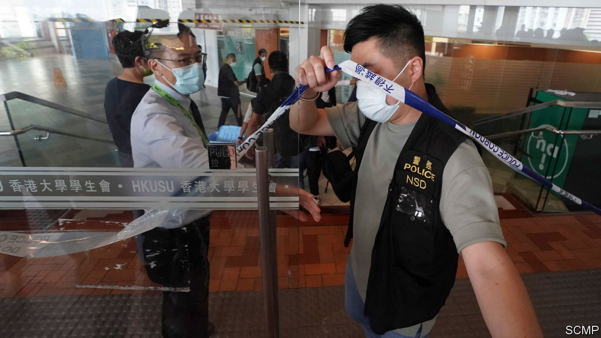

###### Unhallowed halls

# Academics in Hong Kong suffer curbs on their freedoms 

##### A climate of fear has enveloped the city’s campuses 

 

> Jul 21st 2021 

HONG KONG’S universities are on summer holiday. Among the few students who remain on campuses, the mood is gloomy. On July 16th police raided the offices of the student union at the University of Hong Kong (see picture). The city’s police chief said some of the union’s leaders may have breached the national-security law that China imposed on the territory in 2020 following months of student-led unrest in the previous year. After Britain ceded control of Hong Kong nearly a quarter of a century ago, its universities remained free-spirited bastions of liberalism. Now they are gripped by fear.

The pretext for the raid was a resolution issued by the union expressing gratitude for the “sacrifice” of a man who had stabbed a police officer before killing himself. The government said the statement was “no different from supporting and encouraging terrorism”. The union apologised and its leaders resigned. But the authorities did not let the matter rest: police seized files from the union building and banned some of the former leaders from leaving the territory.


Student groups in Hong Kong were at the forefront of the upheaval in 2019. They are in the Communist Party’s sights. During the protests, mainland officials visited Hong Kong to conduct extensive interviews with academics and other residents. They asked questions about how student unions were funded, how their leaders were elected and their connections with the unrest. The mainland’s state-controlled media accused union officers of supporting independence for Hong Kong (a crime that later became punishable by life in prison under the security law) and spreading anti-party sentiment.

To avoid arrest, many students now stay clear of campus politics. During the just-completed academic year, most universities in Hong Kong did not hold student-union elections because of a dearth of candidates. Campus authorities are also treating the unions warily. In February the Chinese University of Hong Kong severed ties with its union because of concerns that the manifestos of some candidates for posts in the student body may have breached the vaguely worded national-security bill.

Academic freedom had started to suffer well before the law was enacted just over a year ago. In 2010 Hong Kong’s universities were rated A, meaning they were among the world’s freest, on the Academic Freedom Index, a ranking developed by several universities and think-tanks in Europe. By 2018 they had fallen to the middle band, C. They are now in the D category, only slightly better than mainland China’s, which have the lowest grade, E. In the past five years the decline in Hong Kong has been sharper than in most other countries.

One reason for this is self-censorship. Some lecturers now avoid sensitive topics, worrying that their colleagues or students will report on what is said in the classroom. Scholars who teach and write about subjects such as Hong Kong, China, civil disobedience and democracy are particularly cautious. “It’s impossible to guess where the red line is anyway, because there is no clear one,” says an academic who teaches modern Chinese history. She says the security law has created a problem for those who specialise in such areas: how to encourage objective study of sensitive issues while protecting students and other faculty members from becoming victims of the security law.

University administrators are also responsible for Hong Kong’s plummeting ratings. Many reports tell of outspoken academics being denied tenure, refused promotion or unable to get their contracts renewed. “They never say it is political,” says Ip Iam-Chong, who taught at Lingnan University for 18 years before its management rejected his application for tenure in 2020, despite support from his department, and refused to renew his contract, which expires in August. Mr Ip believes his difficulties are related to his forthright political views (he founded a pro-democracy news platform, InMediaHK).

Johannes Chan, a prominent supporter of pro-democracy causes, recently ceased full-time work at the University of Hong Kong, where he had served as a law professor. A two-year extension of his contract beyond retirement age (60) had expired. In the past, a five-year extension would have been routine; his application for one was turned down in 2018.

Many academics were disheartened last year when five university presidents signed a letter expressing support for academic freedom but saying they could “understand” the need for a national-security law (its draconian contents were not yet public). “It is upsetting to be part of an institution proactively participating in stifling dissent,” laments one academic, referring to the repressive climate at her university. She says she and many colleagues are looking for jobs in other countries.

Some believe that the chill on campuses is a sign that the Communist Party—which does not operate openly in Hong Kong—has infiltrated academia. Party members have long been secretly gathering information about activities on campuses, says John Burns of the University of Hong Kong. Last year the university’s governing board sacked Benny Tai, a tenured law lecturer who had encouraged student protests in 2014. Mr Tai, who is now in jail, said before his imprisonment that the decision was not made by the board, “but by an authority beyond the university”.

There is another threat to academic freedom that is not directly related to the security law. Mr Burns says the central government in Beijing, as well as the authorities in Hong Kong, have put “huge pressure” on universities to open campuses on the mainland. Such ventures often involve compromises: the subsidiary campuses must observe China’s political taboos. In recent years at least two universities in Hong Kong have opened mainland campuses. Another five, including the University of Hong Kong, say they will follow suit. The territory’s universities risk becoming increasingly similar to their mainland counterparts, where liberal thinkers know they must keep their mouths shut. ■

