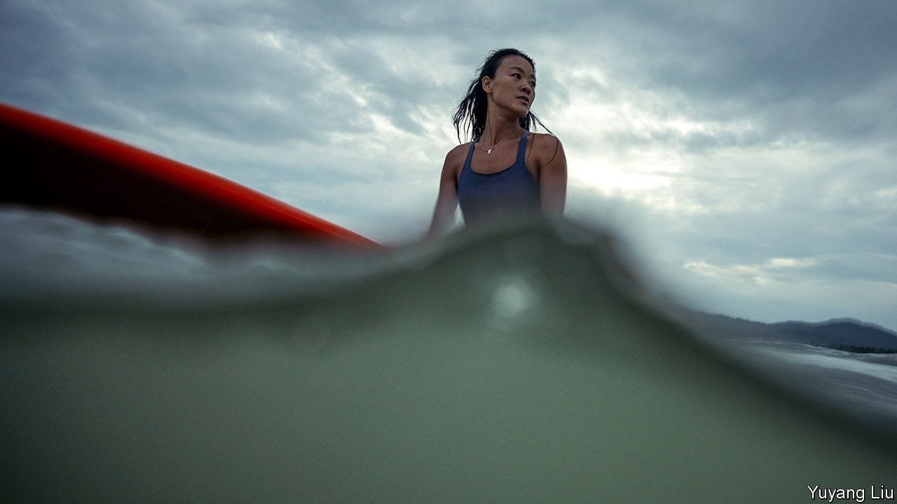

###### Mother ocean

# Female surfers ride the wave to China’s Hainan island 

##### For many the sport is a chance for good photo-opportunities. A few turn professional 

 

> Jul 24th 2021 

BELLA LIU’S family was aghast when she returned to her home inland after a year on Hainan, an island province in the south. She had several scars and a deep tan. “My mother thought I had become a drug dealer working across the border with Vietnam,” says Ms Liu. In fact, the former dietician had taken up full-time surfing. But that was almost as shocking. “I nurtured you for 20 years, and you just want to float out to sea?” she recalls her mother saying.

Ms Liu is now a surf instructor in Houhai Bay, on the island’s southern coast. Small tattoos, including one of a seashell, adorn her muscular arms (body art is another taboo in the eyes of hometown folk). Yet surfing has changed her “inside and out”, she says. She is not alone in seeking out its benefits. Most of her clients are women, many of whom are prepared to go against the tide—by plunging into it.


Hainan’s palm-lined beaches and balmy winters have long been a draw for domestic tourists. But even a decade ago it had few surfing enthusiasts. When an American expatriate organised a surfing contest there in 2008, just two of the 30-odd participants were Chinese. Today Riyue Bay, north of Houhai, is home to the national surfing team’s academy, set up after the International Olympic Committee accepted surfing as an Olympic sport in 2016. (The team did not qualify for the games in Tokyo, which begin on July 23rd and where surfing will make its Olympic debut.) The local government is now eager to turn Hainan into a global surf destination. Its waves are said to be the most dependable ones in China for good surfing.

There was a time when cars loaded with boards would be pulled over by police, and surfers lectured about the dangers of their pastime. Now official approval is prompting more people to try the sport. So is the pandemic. It has forced many Chinese who would normally have holidayed overseas to stay put. Between January and May, Hainan received 11% more visitors than in the same period in 2019. Surfing also gained a lift last year when “Summer Surf Shop”, a variety show filmed in Riyue Bay, began airing on iQiyi, a Netflix-like site.

On a recent weekday in Houhai Bay, dozens of bikini-clad novices, their faces streaked with colourful sunscreen, wobbled on boards in knee-deep water. Many come for just one session, hiring coaches who double as photographers for social-media-worthy snaps. But dedicated surfers are swelling in number, too. All “love nature and the spirit of freedom,” says Ms Liu, the ex-dietician. Darci Liu (no relation), China’s first professional female surfer, runs retreats for women who want to enjoy the sport. “Surfing showed me a bigger world,” she says, one in which “I don’t need to have pale skin, or kids by a certain age.” In March she launched Hainan’s first surfing tournament for women. Expect ever more of them to catch the wave. ■

