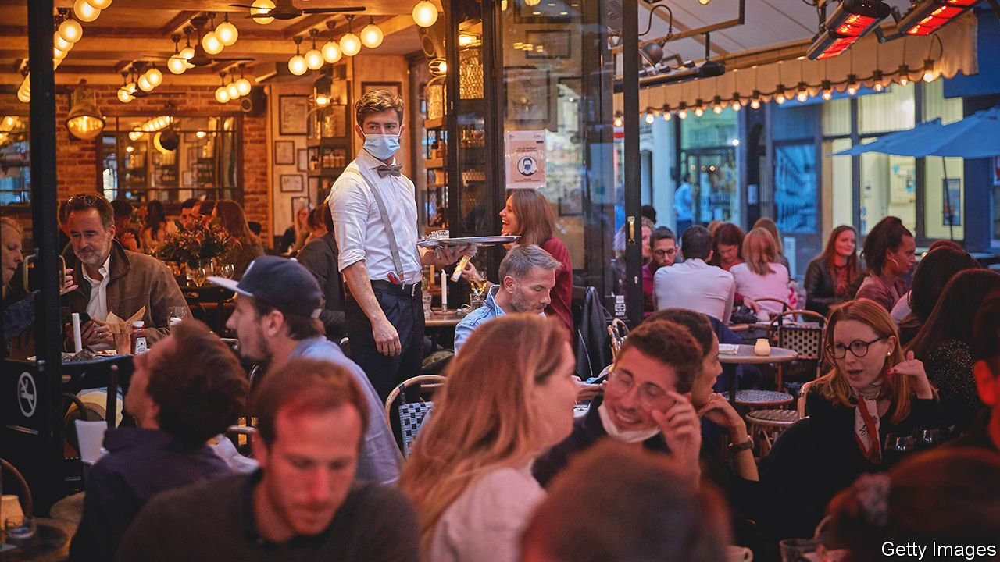

###### France’s labour shortages

# French restaurants are open but short-staffed 

##### Even in gastronomy’s capital, waiters and chefs have lost their taste for the job 

 

> Jul 24th 2021 

STRUGGLING TO FIND extra staff, the manager of a bar in the Paris region recently asked her sister to drive for an hour to help out on a busy evening, during a televised football match. At a Normandy sea-front restaurant, a waitress says they are under-staffed because former colleagues will no longer put up with unsociable evening and weekend work. Diners in Paris report the sudden appearance of shorter menus, as restaurants adapt their kitchens to staff shortages, as well as the presence of improbably young (and ungrumpy) fresh recruits now waiting at tables en terrasse.

Two months after France reopened outdoor dining, restaurants and bars face a staffing crunch. The share of hospitality firms reporting recruitment problems doubled in June from the previous month, according to a Bank of France survey. When restaurants and hotels were closed for months during lockdown, many former staff acquired a taste for normal family life, says Julia Rousseau, head of Éthique RH, a recruitment consultancy. She now sees candidates seeking alternative careers, as estate agents or in banks. “The pandemic has reordered their priorities,” she says.


Hospitality is not the only sector with this trouble. In June 44% of all firms reported recruitment problems, with the figure rising to 50% for construction work. “The bottleneck for French growth in mid-2021”, wrote François Villeroy de Galhau, governor of the Bank of France, earlier this month, is “the reappearance, already, of hiring difficulties.” France’s case is particularly striking because its unemployment rate, at 7.5%, is higher than the OECD average (though lower than that of the euro area). Firms face labour shortages even as 2.4m people are officially looking for work.

Even before the pandemic, this gap was a worry. The government had been trying to close it with extra apprenticeships and training schemes. Now these have been expanded, with a more active approach to getting young people in particular into work. A scheme known as “One youth, one solution” guarantees every under-26-year-old training, an apprenticeship or a job, for which firms may get a public subsidy. The poorest get nearly €500 ($590) extra in benefits a month if they enrol in an active job-hunt scheme. “The government has invested a lot in upskilling,” says Ludovic Subran, chief economist at Allianz, an insurer. “But there’s an underlying mismatch between supply and demand that will remain for some time.”

In parallel, there is an attempt to redesign the unemployment-benefit rules to encourage people to work. President Emmanuel Macron’s reform involves, among other things, curbing the generous pay-outs to high-earners while also increasing from four to six months the length of service required to qualify for full benefits. This latter measure is designed to discourage firms from creating short-term contracts, which they do knowing that people can fall back on benefits in between. But after unions took the reform to France’s highest administrative court, the government was told in June to suspend it until the economy improves. Mr Macron vows it will apply from October, if growth picks up.

Staff shortages in the hospitality business may be linked to its generous furlough schemes. This will be tested at the end of August, when such workers will get only 72% of salaries rather than 84%. That may help firms entice staff back. So might better pay. For the moment, as restaurants prepare to check vaccination passes at entry, uncertainty is discouraging them from promising higher wages. Diners may need to get used to longer waits, and fewer alternatives to the plat du jour. ■

