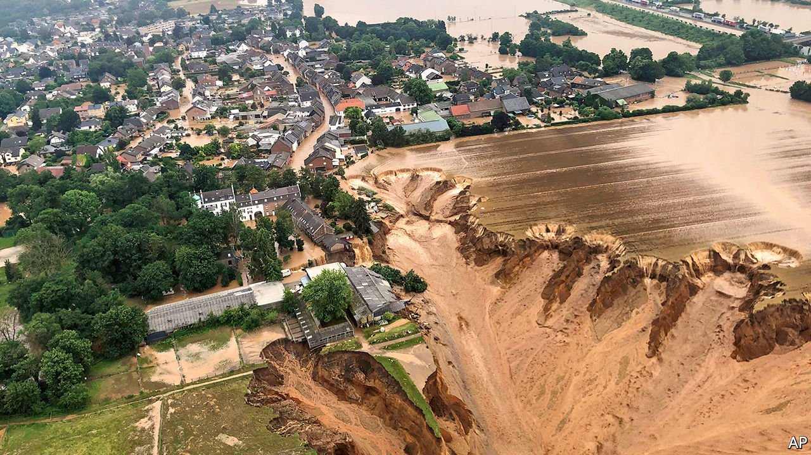
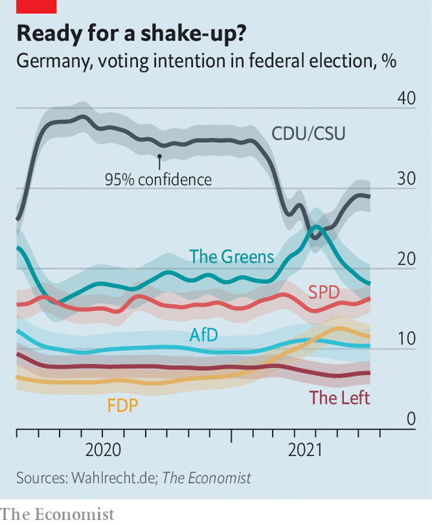

###### After the floods

# Germany grapples with the human and political fallout of the devastating floods 

##### It should help the Greens, but may not 

 

> Jul 20th 2021 

“THE FLOODS and destruction are unimaginable. We cannot even assess the scale of the damage yet,” says Carolin Weitzel, the mayor of Erftstadt, a town in North-Rhine Westphalia (NRW), south-west of Cologne. Blessem, a part of her city, was evacuated after a landslide spreading from a nearby quarry created a huge crater that reached the edge of the town. Part of its historic castle collapsed. Streets were smashed and covered with water and mud. Cars were carried away by the torrents and turned upside down. The contents of family homes became piles of muddy rubbish. Even the crosses at the local cemetery were submerged under water.

Erftstadt was one of the settlements hit most dramatically by the devastating floods in Europe that have cost more than 200 lives in Germany, Belgium and the Netherlands, with the toll still rising. In NRW at least 48 people have died. And in the district of Ahrweiler in Rhineland-Palatinate alone at least 122 have died. Across the country, 160 more people are still missing and now feared dead. So far Erftstadt is not mourning any deaths, but not all its inhabitants have been accounted for.


As the worst floods in Germany’s post-war history subside, the finger-pointing has started. The disaster has also moved climate change to the heart of debate in  due on September 26th. Other than the hard-right Alternative for Germany , all political parties agree that man-made global warming is to blame. Naturally, the Greens have long focused on promoting measures to tackle climate change. But in their reaction to the catastrophe they were careful not to seem to profit from tragedy.

 


Opposition politicians are now calling for the resignation of Horst Seehofer, the federal interior minister, because of what they say was the government’s failure to give people enough warning. Hannah Cloke, a hydrologist at the University of Reading who co-founded the European Flood Awareness System (EFAS) developed by the European Commission in the wake of severe floods in 2002, says that the forecasting was adequate but the response to the warnings of local authorities was highly inconsistent. Under Germany’s decentralised system, city and county councils in the 16 states are in charge of natural-disaster prevention. So it was up to them to act upon EFAS warnings, which Germany’s meteorological service indeed passed on several days before the disaster struck.

In part owing to a reluctance to order evacuations and the assumption that messages through digital tools would work, officials, media and the public in many affected areas communicated too little, too late. Networks were then knocked out, which meant that the warnings that were given did not reach many of the people who needed them. “In 2002 many people died needlessly, and I fear the same happened again,” says Ms Cloke.

As the death toll continues to mount, emotions are raw—and can easily turn. When Frank-Walter Steinmeier, the president, and Armin Laschet, the state premier of NRW and head of the Christian Democratic Union (CDU), visited Erftstadt on July 17th, Mr Laschet was filmed joking and sniggering while the president delivered a solemn speech. Faced with a public outcry, the front-runner to succeed Angela Merkel as chancellor in September was forced to apologise and grovel.

The Green party’s candidate, Annalena Baerbock, who has struggled after a strong start to her campaign, was more careful. She cut short her holiday to visit affected areas, but declined to be accompanied by journalists. Olaf Scholz, the finance minister and candidate of the Social Democratic Party (SPD), visited other areas in Rhineland-Palatinate on the same day as Mr Laschet. He promised an aid package of more than €300m ($350m); in fact €400m has now been pledged.

The right reaction to human suffering on such a scale can make a big difference to political fortunes. In 2002 Gerhard Schröder’s narrow re-election as chancellor was probably a result of his deft handling of a flood disaster. In August of that year floods from the Elbe and its tributaries had ravaged Saxony’s heartland and other parts of the east. Mr Schröder seized the moment to charm beleaguered easterners. He offered cash, reassurance and a spirit of solidarity. Edmund Stoiber, his CDU/CSU rival, remained aloof—and was defeated.

None of this year’s candidates for the chancellorship has Mr Schröder’s political nous. This may not matter, as the elections are still two months away. Manfred Güllner, the head of Forsa, a pollster, thinks the floods will have a negligible impact. It is still not clear whether most people will blame climate change for the catastrophe, he says. And even if they do, they are not sure the Greens will be able to do much about it. As the CDU has been in government for 50 out of the past 70 years, it has at least proved it can usually govern the country competently. Apart from seven years as junior members of a centre-left coalition, the Greens have no experience of national government.

“The Baerbock bubble has burst,” says Matthias Jung of Forschungsgruppe Wahlen, a pollster. Arguably, Ms Baerbock was over-hyped when she got the party’s nod in April to run for chancellor and was bound to suffer a correction. But it was compounded by mistakes of her own making, such as her clumsy handling of accusations of plagiarism. Mr Jung’s latest forecast, published just before the floods, puts the CDU at 30%, the Greens at 20% and the SPD at 15%. Mrs Merkel was again Germany’s most popular politician; Ms Baerbock’s popularity hit a record low for her.

The election campaign remained suspended this week, as Germany attempts to come to terms with an event whose human toll should not have been so high. Public awareness is a huge problem, argues Friederike Otto, a climatologist at Oxford University. “Few in Germany realise that weather can kill,” she says. A catastrophe can be an effective catalyst. The hope is that authorities will learn more this time than they did 19 years ago. ■

For more coverage of climate change, register for The Climate Issue, our fortnightly , or visit our 

