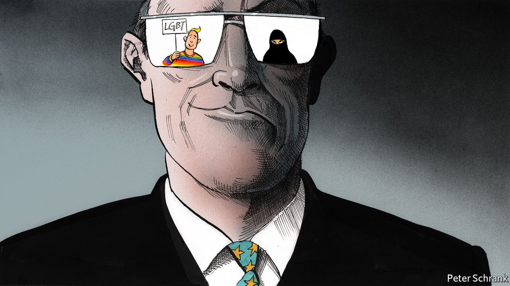

###### Charlemagne

# Minority rights and minorities wronged 

##### The EU is both ally and accomplice when it comes to minority rights in Europe 

 

> Jul 24th 2021 

AL CAPONE WOULD have recognised the tactic. When Hungary introduced a law that banned the “promotion” or positive portrayal of homosexual relationships or transgender people in schools, lawyers at the European Commission got to work. Brussels has little competence over a country’s education policy. No matter. Just as the Chicago gangster went down for tax evasion rather than racketeering or murder, Viktor Orban’s government found itself on 15th July accused of violating the Audiovisual Media Services Directive on being able to broadcast across borders, among other laws. Imagine “The Untouchables” with fewer machineguns and a lot more paperwork.

On the same day, 140 miles from Brussels, a different story was playing out. In Luxembourg, the European Court of Justice ruled that European companies were within their rights to sack Muslim women for refusing to take off a headscarf. Such a decision did not violate the EU’s rules on discrimination at work so long as the rule banned all religious items of clothing and was necessary to stop “social conflict” or to avoid displeasing customers.


In general, EU law is supposed to provide a floor. National governments are free to offer higher protection—more maternity leave, say—than the European minimum. When it comes to the bloc’s rules on discrimination at work, EU judges have dug a basement. The ruling is pandering to prejudice for profit, says Martijn van den Brink at Oxford University.

It was a curious moment. A law primarily designed to ensure European television channels are not swamped with American imports found itself being used to stop a Hungarian education law. Meanwhile, the EU’s laws against discrimination in the workplace offered little protection to Muslim women dismissed for their headwear. When it comes to the rights of minorities, the EU can be an ally or accomplice: it can stick up for them, or it can embed prejudice.

There was a time when the EU could simply ignore such questions. When it was largely an economic bloc, governments could do as they pleased beyond the EU’s narrow competences. Now, the EU covers the gamut of European life, from the cash in an Italian’s wallet to the limits of religion in the public sphere and the treatment of gay people. Everything is everyone else’s business.

This has political consequences. At a recent summit, European leaders queued up to attack Mr Orban’s proposed anti-gay law. Mark Rutte, the Dutch prime minister, told Mr Orban that Hungary should leave the EU if he passes such laws. Normally, domestic Hungarian policy would not rouse a Dutch prime minister. But more money at the EU level means more money dished out to poorer countries. Dutch taxpayers foot the bill for Hungarian bigotry, which means Dutch politicians now care intensely about it. Punishment beatings will continue until morals improve.

The EU is, after all, a tool. It does the bidding of its political masters, which are national governments and, ultimately, European voters. For gay people this has been a positive. Since the start of the millennium, their lot within the EU has improved markedly as old views have changed. Where only a few member states allowed civil partnerships two decades ago, most now do. Countries with once deeply homophobic laws, such as Ireland, where gay sex was criminalised until 1993, have caught up. Although progress has been much slower in eastern Europe, the countries actively going backwards, such as Hungary and Poland, are outliers. By aggressively pursuing Poland and Hungary, the EU institutions are being blown by political winds.

They do not always blow in a liberal direction. In the same time period countries have cracked down on religious items of clothing. France led the way, banning religious items for staff in the public sector as a way of enforcing the state’s strict secularism. Although it applies to all religions, the move hits the country’s Muslims hardest. Other countries followed suit. Now, a third of EU countries have rules banning burqas or headscarves in certain circumstances. Britain, the largest advocate of a laissez-faire multicultural approach, has left the EU. (When Boris Johnson wrote a column deriding some Muslim women as letterboxes, it was in defence of their right to dress as they wish.)

A particular view—that a business is within its rights to sack someone for wearing a headscarf or a kippah—is now embedded in EU law, thanks to the club’s top court. The commission could intervene, by proposing to tighten the law or adopting the Capone approach. It has no wish to do so. Some think it is simply too controversial to try; others reckon the French approach is better than the Anglo-Saxon one. Just as the EU’s institutional might is now swinging behind gay rights, so too is it following the trend on religious clothing, leaving Muslim women, kippah-wearing Jewish men and turbaned Sikhs in the lurch.

Platitudes or a punch-up

Such fights will become more common. Across the club, European politicians increasingly speak of “European values”. Before, they signalled platitudes. European values amounted to democracy, human dignity and long holidays in August. Now, they signal punch-ups. Any EU government that tramples on gay rights can expect a political onslaught and a bureaucratic beating. Depending on who you ask, allowing companies to sack employees for displays of religion is either a defence of European values or an affront to them. The EU has decided it is the former.

Unlike issues in its usual economic domain, these are not policies where one can split the difference. Disputes in the EU are usually solved via money and haggling. Looser regulation of a cherished industry here, removal of a veto there—and a bag of European subsidies for a sack of votes. As the EU barges into questions of identity, these problems are less soluble. EU institutions have to pick a side, someone has to win and someone has to lose. ■

