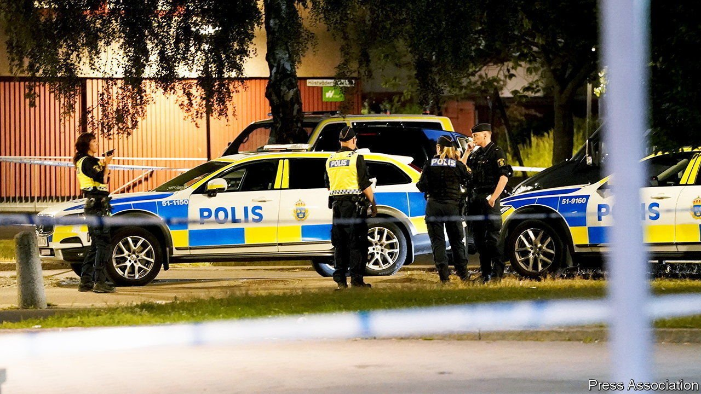

###### Guns galore

# Sweden is being shot up 

##### Gun crime is on the rise 

 

> Jul 24th 2021 

IN LATE MAY a throng of a hundred or so young men, most of them from African or Middle Eastern minorities, started fighting in a square in Hjallbo, a suburb of Gothenburg, Sweden’s second city. Members of rival gangs seem to have started the scrap over the theft of a moped. Two days later a man in a nearby grocery shop was shot in the back of the head, thought to be as an act of revenge for the gangland battle. Then a policeman in Biskopsgarden, another suburb of the city, was shot dead. A few days after that a man was murdered in a barber’s shop in Frolunda, yet another suburb. To add to this litany of recent criminal violence, two young children were lucky to survive last week after being caught in the crossfire of yet another gang shoot-out, this time in Visattra, on the edge of Stockholm, the capital.

In the past 15 years, Sweden has had Europe’s highest rate of death by shooting, according to a recent report by the country’s National Council for Crime Prevention. Analysing data on 22 European countries provided by Eurostat and the UN’s World Health Organisation, Klara Hradilova-Selin, a researcher at the council, reckoned that Sweden came second after Croatia between 2014 and 2017. But by 2018 preliminary data suggested that Sweden had risen to the top spot. Most of the victims are men between 20 and 29. Sweden’s rate of homicide by shooting is two-and-a-half times the European average.


Such violence is invariably fuelled by illegal drugs and ill-feeling between jobless, marginalised young men and the police. Recent immigrants, many of them Somali, have failed to integrate. The Syrian migrant crisis of 2015 has led to more ghettoisation. In Hjallbo 70% of residents were born abroad. Many of them, especially young men, scrape by on welfare benefits and the black market. Shooting has become a common way for gangs to settle their differences.

Some analysts also blame excessive centralisation in the past decade for the falling number of police serving on the streets of Sweden’s grimmer suburbs, despite higher police numbers overall. In some districts where immigrants are prominent, community policing has broken down, letting lethal gangs take over. In 1980 Gothenburg’s police solved 80% of all murders. Nowadays the figure is a dismal 20%.

