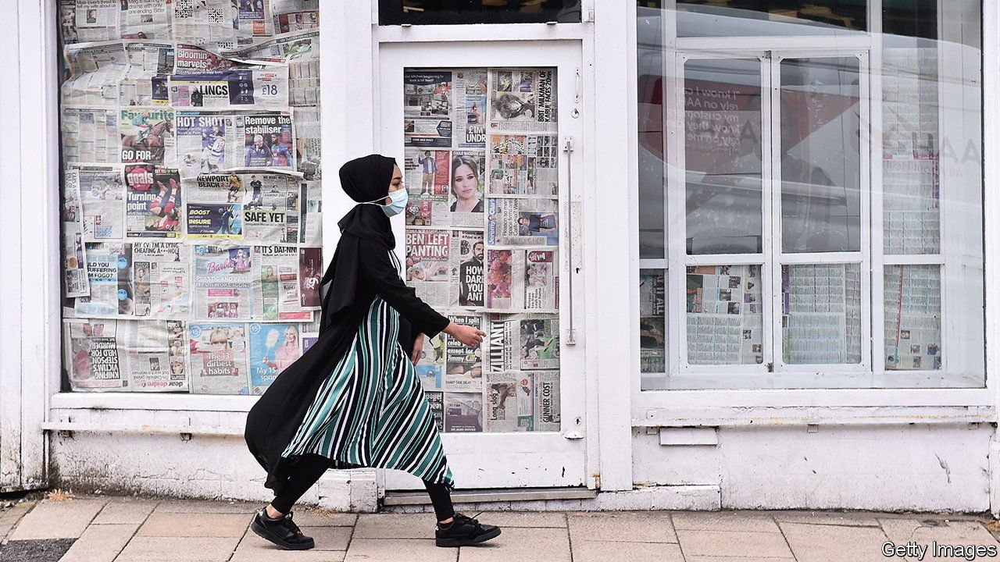
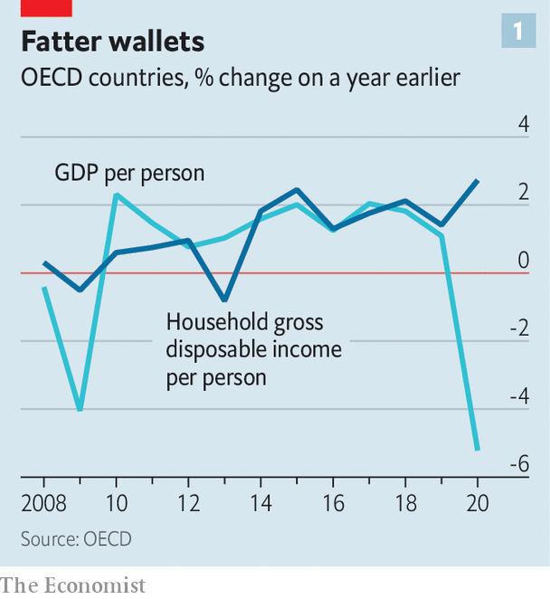
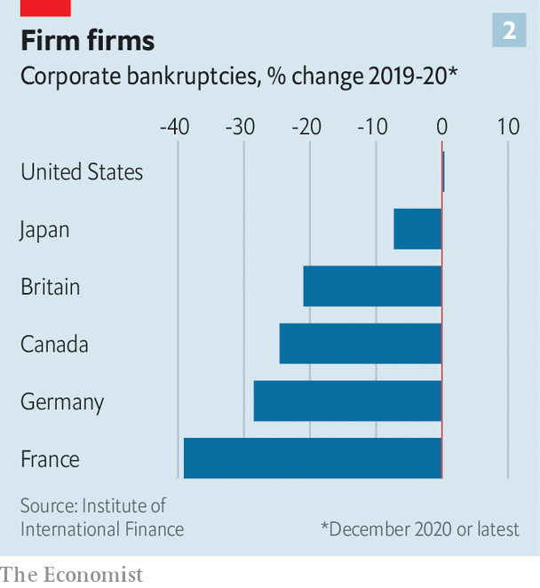
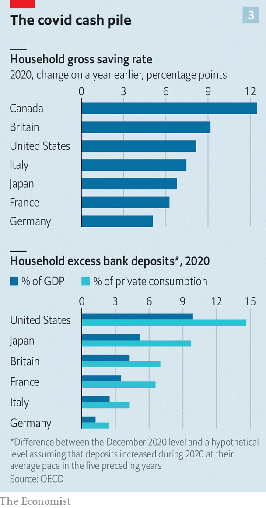

###### Peering down the cliff-edge

# Will the economic recovery survive the end of emergency stimulus? 

##### Rich countries may soon find out if economic scars were avoided, or merely deferred 

 

> Jul 19th 2021 

IN “GAME OF THRONES”, a fantasy drama, a duel takes place between Khal Drogo, a fearsome warrior, and a rival. Khal Drogo comes off barely scathed, suffering only a scratch to his chest. But the wound festers, weakening the fighter. A few scenes later, he falls off his horse and eventually dies.

Many economists worry that the recovery in the rich world could face a similar fate. The past 18 months of lockdowns have left surprisingly few economic scars. But has the damage from covid-19 been avoided, or merely deferred? As stimulus schemes put into place last year come to an end, the question may soon be answered.


When they first imposed lockdowns, governments in the rich world introduced a raft of measures to support firms and households, from doling out cheques and setting up furlough schemes to offering low-interest loans to firms and tax and rent holidays. Many of these are now coming to an end, or have done so already. In the euro area at least three-quarters of debt holidays have expired. In America half of states are abolishing a $300 weekly top-up to unemployment benefits in June and July; the rest follow in September. A federal moratorium on evictions ends on July 31st. Britain’s and Canada’s job-retention programmes end in the autumn.

 


Taken together, these schemes have prevented much of the economic scarring usually seen after a recession. That is not to say that many people have not suffered deprivation; global extreme poverty, for instance, has risen sharply. Yet in the rich world overall family finances look surprisingly strong. Real disposable income per person rose by 3% in 2020 even as GDP tanked (see chart 1). Government spending on extra benefits and cash transfers, which came to 2.3% of rich countries’ GDP, undoubtedly helped. In America the poverty rate rose only slightly from 10.7% in January 2020 to 11% in June this year, albeit with fluctuations in between.

Resilient household finances ensured robust demand for goods and services even in lockdown. That, plus a series of rescue measures, means that firms too look unscathed. In stark contrast to usual recessions, business bankruptcies did not soar but fell sharply in most rich countries last year (see chart 2).

 


The uncertainty now is how this picture will change . In a recent report the Bank for International Settlements, a club of central bankers, identified a “wave of firms’ insolvencies” as a “big question-mark clouding the outlook”. There are three areas of concern: that reduced cash transfers cut people’s incomes and hit spending; that the end of furlough schemes puts millions out of work; and that deferred bills come due, crimping spending or forcing bankruptcies.

Consider cash transfers first. Just as unemployment insurance is becoming stingier in America, Britain too is cutting its main welfare payment by £20 ($27) a week. Some people will surely reduce their outgoings as a result.

 


Yet overall spending need not suffer much. Households in total have saved far more than normal (see chart 3). Our analysis of OECD data puts “excess” savings across the club of mostly rich countries at $3trn, worth a tenth of overall annual consumer spending. The big worry about consumers in 2021 is not that an already large cash pile is no longer topped up, but that .

The second concern relates to job-protection schemes. Research by UBS, a bank, suggests that roughly 5% of employees in the four largest euro-area economies and Britain remain on these programmes. If they cannot find work once the schemes end, the average unemployment rate across the five countries will exceed the peak seen in the global financial crisis.

Here Australia offers hope. Its job-retention scheme, which a year ago was supporting 3.5m people, ended in March. Since then the unemployment rate has dropped to its lowest in a decade. Nine out of ten people on the scheme have moved back into work. As in many rich countries the problem in Australia is not an abundance of labour but a shortage. The pandemic has created new demands and job vacancies.

The third concern is perhaps the most significant—and is also the hardest to judge. It relates to bills that are due but as yet unpaid, from taxes and interest to rents. The Bank of England’s financial-stability report notes that “businesses may face substantial repayments as VAT [valued-added tax] and rent deferrals begin to lapse.” The extent of these is tricky to gauge. Although companies rushed to borrow early in the pandemic, indebtedness has grown less rapidly since. But it is far from clear how company or national accounts treat overdue or deferred bills.

Debtors themselves may not know where they stand. Non-payment of rent by American firms in 2020 “occurred privately and in a somewhat disorganised way”, according to a paper by Goldman Sachs, a bank, leaving “lingering disagreements about whether rents have been truly abated or merely deferred”. Estimates of the “back rent” owed by American households to their landlords vary by a factor of six.

The scale of the problem may be manageable in aggregate. Take commercial rent in America. Estimates of unpaid rent vary, but a report by the city of San Francisco reckons that local businesses failed to pay up to $400m in the nine months to December. Scaling that up as an inevitably rough guide suggests missed rent of about $30bn in America as a whole—about 3% of annual commercial rents paid in a normal year.

So far the evidence suggests that bills are being largely repaid. In Britain over 80% of households taking out deferrals on mortgage payments have since returned to full repayments, suggesting many people may have made use of the scheme out of caution rather than need. In the euro zone loans emerging from moratoriums have performed only slightly worse than the rest of banks’ loan books thus far.

But as with so many things in the pandemic, the likeliest outcome is that withdrawing stimulus will hit people at the bottom hardest. Cutting welfare may push some into poverty, and millions of renters in America . The least productive firms might go bust. In 2020 governments were quick to launch universal, generous stimulus schemes. The task now is to scale those back and enable creative destruction, while protecting those in need. ■

