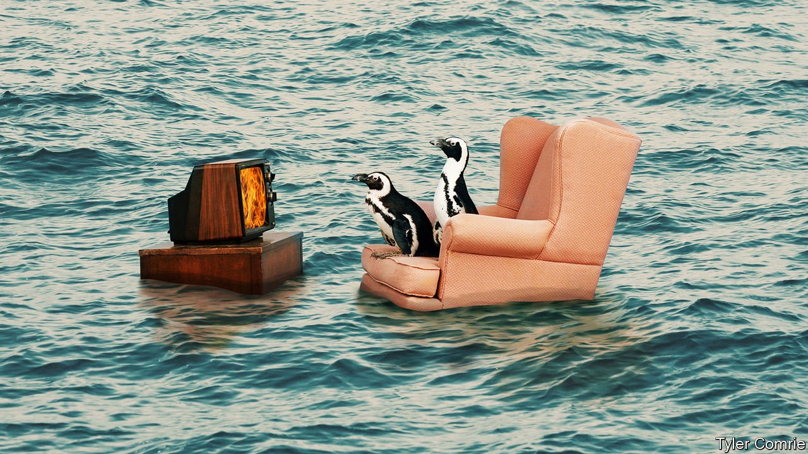

###### Adapting to climate change

# A 3°C world has no safe place 

##### The extremes of floods and fires are not going away, but adaptation can lessen their impact 

 

> Jul 24th 2021 

IN 1745, AS the river Liffey, having broken its banks, clawed at the foundations of the house in which he sat, the young Edmund Burke experienced a strange, perverse thrill. The man who would go on to found modern conservatism drew inspiration from this experience in a later essay on the sublime, writing of the unmatched delight that terrible destruction could stir—provided that it is watched from a certain distance.

The most terrible thing about the spectacular scenes of destruction that have played out around the world over the past weeks is that there is no safe place from which to observe them. The ground under the German town of Erftstadt is torn apart like tissue paper by flood waters; Lytton in British Columbia is burned from the map just a day after setting a freakishly high temperature record; cars float like dead fish through the streets-turned-canals in the Chinese city of Zhengzhou. All the world feels at risk, and most of it is.

Greenhouse-gas emissions have produced a planet more than 1°C (1.8°F) warmer than it was in Burke’s pre-industrial days. Its atmosphere, stoked up and out of joint, is producing heavy weather in ways both predicted and surprising. And, with emissionsontinuing, it will get worse.

Unfortunately, 2021 will probably be one of the 21st century’s coolest years. If temperatures rise by 3°C above pre-industrial levels in the coming decades—as they might even if everyone manages to —large parts of the tropics risk becoming too hot for outdoor work. Coral reefs and the livelihoods that depend on them will vanish and the Amazon rainforest will become a ghost of itself. Severe harvest failures will be commonplace. Ice sheets in Antarctica and Greenland will shrink past the point of no return, promising sea rises measured not in millimetres, as today’s are, but in metres.

Six years ago, in Paris, the countries of the world committed themselves to avoiding the worst of that nightmare by eliminating net greenhouse-gas emissions quickly enough to hold the temperature rise below 2°C. Their progress towards that end remains woefully inadequate. Yet even if their efforts increased dramatically enough to meet the 2°C goal, it would not stop forests from burning today; prairies would still dry out tomorrow, rivers break their banks and mountain glaciers disappear.

Cutting emissions is thus not enough. The world also urgently needs to invest in adapting to the changing climate. The good news is that adaptation makes political sense. People can clearly see the need for it. When a country invests in flood defences it benefits its own citizens above all others—there is no free-rider problem, as there could be for emissions reduction. Nor does all the money come from the public purse; companies and private individuals can see the need for adaptation and act on it. When they do not do so, insurance companies can open their eyes to the risks they are running.

Some adaptation is fairly easily set in place. Systems for  will surely now improve. But other problems require much larger public investment, like that which has been put into water-management in the Netherlands. Rich countries can afford such things. Poor countries and poor people need help, which is why the Paris climate agreement calls for annual transfers of $100bn from rich to poor.

The rich countries have not yet lived up to their side of this. On July 20th John Kerry, President Joe Biden’s special envoy on climate change, reiterated America’s pledge to triple its support to $1.5bn for adaptation in poorer countries by 2024, part of a broader move to increase investment in adaptation and mitigation in developing countries. More such efforts are vital.

But they also have limits. Making do with less water may be possible; getting by on none is not. Some levels of temperature and humidity make outdoors activity impossible. There comes one flood too many, after which you abandon the land. When the reef is gone, it is gone.

If the Paris goal of keeping the rise below 2°C is met, the full extent of those limits will not be tested. But emission-cutting zeal may not accelerate as required. And the climate system could prove more sensitive than it has shown itself to be to date, as some scientists believe possible, producing more warming per tonne of carbon in the atmosphere.

Hence it is also prudent to study the most spectacular, and scary, form of adaptation: solar geoengineering. This seeks to make clouds or particle layers in the atmosphere a bit more mirror-like, reflecting away some sunlight. It cannot provide a straightforward equal and opposite response to greenhouse-gas warming; it will tend, for example, to reduce precipitation somewhat more than temperature, potentially changing rainfall patterns. But research over the past 15 years has suggested that solar geoengineering might significantly reduce some of the harms from greenhouse warming.

What nobody yet knows is how such schemes could be developed so as to reflect not just the interests of their instigators, but also those of all the countries they will affect. Different countries might seek different amounts of cooling; some ways of putting solar geoengineering into effect would help some regions while harming others. Nor is there yet a compelling rejoinder to the risk that the very idea of such things tomorrow reduces the incentive to be ambitious in cutting emissions today.

When good men do nothing

To think about solar geoengineering requires facing those problems—and the risk that powers with little interest in them may try out such schemes regardless. It also means facing squarely what kind of being humankind has become. Watching the rising waters of the Liffey, Burke “considered how little man is, yet in his mind how great…Master of all things, yet scarce can command anything.” Manipulating the climate that humanity has destabilised—unwittingly, at first—spurs similar thoughts of simultaneous power and impotence. It is not nature that humans cannot command, but themselves, in all their insignificance and world-altering might. ■

For more coverage of climate change, register for The Climate Issue, our fortnightly , or visit our 

