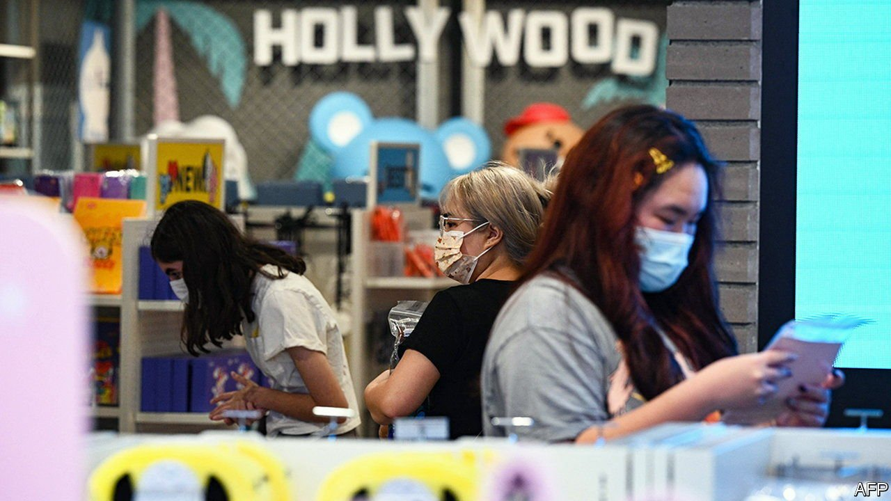
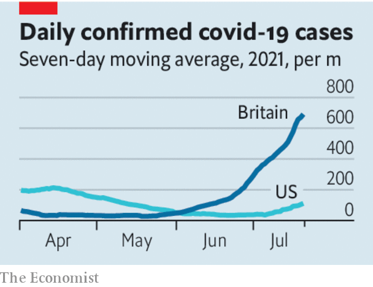

###### Delta’s beta

# Does America face a slowdown in economic growth? 

##### The Delta variant is by far the biggest of several risks to America’s economy 

 

> Jul 24th 2021 

IT WAS INEVITABLE that global economic growth would slow from the breakneck pace set as economies recovered from the pandemic. Lately, investors have begun to worry about something worse: that America’s economy, which has led the rich-world rebound, could decelerate sharply. As well as supply bottlenecks and the withdrawal of economic stimulus, the country, like many others, now faces the ultra-infectious Delta variant. A painful slowdown remains unlikely. But the renewed spread of the virus is the biggest of those three dangers.

To see how the latest rich-world coronavirus waves are likely to develop, consider that on July 20th America reported a seven-day moving average of 112 new cases for every million people. That is roughly where Britain, with a higher rate of vaccination, more restrictions and deadlier past outbreaks, was in mid-June before Delta got going. Britain now has 699 cases per million, the fifth-highest rate in the world. If all else is equal, Delta spreads two or three times as quickly as the original strain of the virus.


Thankfully, vaccines prevent almost all severe cases of disease and treatments have improved, saving more lives among those who are infected. That is why England lifted . But vaccines still let many symptomatic infections through the net: 12-21% of them for the Pfizer jabs America has used most. Delta is so infectious that countries will struggle to vaccinate their way to the threshold of herd immunity that stops the spread of the disease, even after successful campaigns. Given that 44% of Americans of all ages have not had a single dose, cases in the United States are likely to rocket upwards. States like Mississippi and Louisiana, where about three in five people are entirely unvaccinated, risk being struck by sudden and severe outbreaks.

 


The economic consequences of this will depend on how policymakers and consumers react. So far Los Angeles has brought back its mask mandate and New Orleans says it is studying new restrictions. Even if vaccines allow policymakers to avoid the return to strict measures, consumers may be too anxious to visit bars and restaurants. In Britain measures of mobility are down only slightly since June, but the experiment is still new. Exponential growth means that things can change fast.

The risk from Delta is  than the other issues facing America’s recovery; that supply will struggle to match demand and stimulus is due to be removed. So long as the economy stays open, it can ride these bumps.

Shortages, most notably of microchips and space on container ships, have raised consumer-price inflation to 5.4%. Real wages have fallen over the past year as rising prices have eaten into workers’ purchasing power, and there are signs that inflation is beginning to trouble consumers. But during the pandemic households have built up $2.5trn of extra savings, equivalent to 12% of GDP in 2019. In June a record-high number of Americans told Gallup, a pollster, that they themselves were thriving financially. It may be hard to lay your hands on a decently priced car, but so long as Americans venture out of their homes, the service sector can power the economy.

The withdrawal of some forms of stimulus may even help. Service industries are short of workers. The end of enhanced unemployment benefits, which will become universal at the end of September, might bring some of them back into the job market. Other policy cliff-edges, such as the  at the end of July, are a source of uncertainty. But any pain there is more likely to be concentrated than widespread, because the housing market is booming and job vacancies are plentiful.

For the economic recovery to continue, people must be willing to mix with others. Yet, in America and across the world, that is precisely what the Delta variant puts in jeopardy. ■

Dig deeper

All our stories relating to the pandemic and the vaccines can be found on our . You can also find trackers showing ,  and the virus’s spread across  and .

