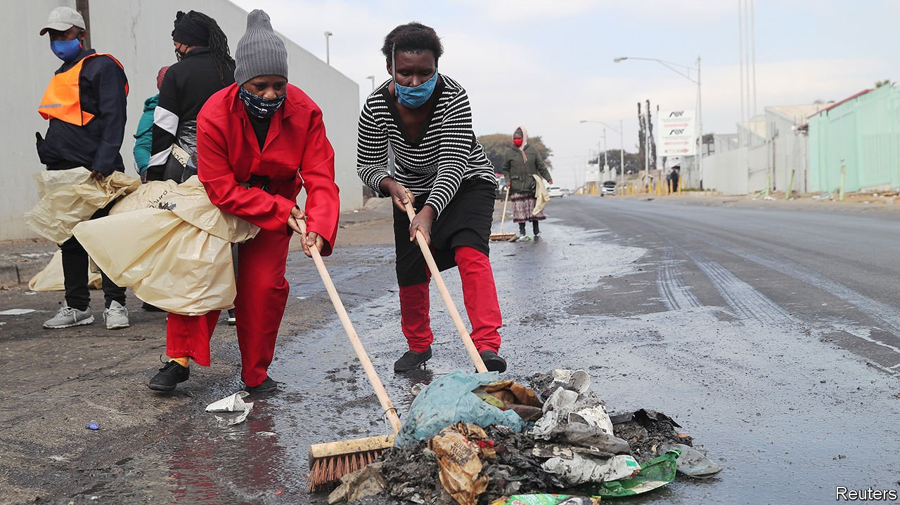

###### Saving South Africa

# End of the line for ANC economics 

##### More than two decades of corruption and misgovernment have led to crisis 

 

> Jul 24th 2021 

THE FLAMES of burning warehouses, shops and factories have at last been doused. In front of shattered malls, local residents wearing luminous yellow or orange vests stand watch like an army of school-crossing wardens. Crowds of volunteers—white and black, young and old, sometimes singing together—sweep up the broken glass and ashes after the week of riots instigated by allies of the tainted former president, Jacob Zuma, in a vain effort to reverse his recent jailing for defying the Constitutional Court. In the clean-up, the optimism and generosity of spirit of the rainbow nation re-emerged, a reminder of the miracle that enabled a liberal democracy to be born, against the odds, 27 years ago, after the brutality of apartheid.

Make no mistake, though. The riots were nothing less than a violent attempt by a pro-corruption faction within the ruling African National Congress (ANC) to overthrow the democratic order. And the fires sparked by Mr Zuma’s allies took flame so fiercely because of the anger generated by more than two decades of misgovernment and graft. This has been largely to blame for one of the world’s highest unemployment rates, which stems from a growth-sapping mix of crony capitalism, fossilised state-owned industries and laws that discourage businesses from hiring new workers.


Start with crony capitalism, which in South Africa goes by the euphemism “black economic empowerment”. The idea behind it seemed laudable enough—to right a historical wrong. Under apartheid the country produced white titans of industry such as the Oppenheimer family (owners of DeBeers), while making it hard for black South Africans to own businesses. The ANC felt it only fair that there should be black billionaires, too. To give them a leg-up it insisted that mining companies should hand at least 26% of their shares to the “historically disadvantaged”. Mining companies (as well as banks and insurers) did so willingly, diluting existing shareholdings when they transferred stakes to the likes of Cyril Ramaphosa, now the president, along with Patrice Motsepe, his brother-in-law, and Bridgette Radebe, his sister-in-law.

If these handouts had been a one-off tax, their harm would by now have been forgotten. But once the new black shareholders had sold their holdings, the government drafted regulations to repeat the process. And so capital investment in mines fell by 45% between 2010 and 2018, with output falling by 10% and employment by 50,000—a tenth of direct employment in the industry in 2010.

The ANC has magnified this harm by insisting that the state keeps control of some 700 companies including Eskom, the electricity monopoly, and Transnet, which runs all the ports and railways. Mismanagement, corruption and a lack of investment have made them drags on growth. Some economists reckon that South Africa’s exports could have been 50% higher during the commodity boom that peaked in 2008 if its mines, railways and ports had run smoothly and had obtained the electricity they needed. Mr Ramaphosa initially sought to clean out corrupt managers. It was a start, but will do nothing to provide the competition needed to make these firms improve.

Perhaps most pernicious have been laws that discourage firms from hiring, by making them jump through hoops when taking on staff, and even higher hoops when trying to sack them. The government has also actively destroyed many thousands of jobs. Since 2009 it has forced hundreds of small clothing firms employing tens of thousands of workers to close, because they did not pay wages as high as those agreed to in a deal between unions and big factories. The government fails to keep the lights on. Yet it blithely puts people out of work.

Little wonder that the number of unemployed (including those who have given up seeking jobs) rose from 5.4m to 9.2m in the ten years to 2019. Almost the only group of people who have prospered because of ANCnomics, apart from billionaires, are those working for the state: their pay went up by about two-thirds in real terms between 2007 and 2019.

Since the riots, NGOs and trade unions have called for a basic income grant to reduce poverty. Mr Ramaphosa says he is looking at these proposals. But the state already pays welfare to 31% of the population, making it the second-largest budget item after education. Mismanaged South Africa cannot afford so vast an expansion of support.

In power, Mr Ramaphosa has made a start by acting against the crooks in his party and government. But if he is to save his country he cannot just throw out the ANC’s bad apples. He must throw out its bad economics too—and change the system that made him and his family rich. If he fails to do that, the country must throw out his party. ■

