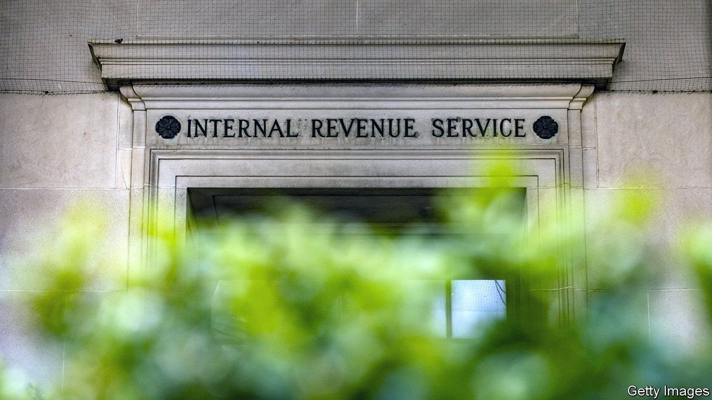

###### Internal affairs

# Fund the IRS properly. But also make taxes simpler 

##### The plan to raise revenue without raising taxes sounds too good to be true. Is it? 

 

> Jul 24th 2021 

THE LATE Donald Rumsfeld once sent a letter to the Internal Revenue Service (IRS) to accompany his tax filing. “The tax code is so complex and the forms are so complicated”, he wrote, “that I know that I cannot have any confidence that I know what is being requested and therefore I cannot and do not know, and I suspect a great many Americans cannot know, whether or not their tax returns are accurate.” This is probably the least controversial statement that George W. Bush’s secretary of defence ever made. Yet despite the widely shared terror of the federal tax-collection agency, Democrats in the Senate are proposing to increase its budget. Is this wise?

The political logic for doing so is clear. To make the arithmetic of a big spending bill just about add up, Democratic senators reckon that some of the required revenue can be found through more energetic enforcement of the tax code. Increasing tax revenue without imposing any new tax increases sounds too good to be true. But the Congressional Budget Office is game, estimating that an extra $20bn spent on enforcement over ten years would bring in $61bn, and that $40bn over the same period would yield $103bn, without any changes to the tax code.


For anyone who has ever filled out an American tax return, the prospect of beefing up the tax-collection agency certainly sounds alarming. For Republicans, some of whom also suspect it of being a tool exquisitely designed to harass conservatives, it is especially sinister. Yet the answer to the maddening complexity of the tax code cannot be to load more and more responsibility onto the IRS while simultaneously cutting its budget. And that is what has been happening.

Since 2010 the IRS’s budget has fallen by 20% in real terms. Meanwhile the tax code has become still more complicated. And in addition to the task of trying to work out who has, and who has not, followed this lengthening set of rules, the agency is also being asked to make decisions over questions such as which organisations deserve non-profit status (and therefore tax breaks), as well as to play a role in the administration of an expanded array of tax credits.

One result has been a decline in the enforcement of tax laws. The share of individual tax returns that the IRS examined fell by almost half in 2010-18; the share of corporate tax returns it scrutinised fell by close to 40%. For those who take a Rumsfeldian view of tax, that sounds like something to cheer. It is not. Conservatives are usually keen on seeing laws enforced consistently. When it comes to tax, though, the combination of unfathomable rules and an overstretched agency means that compliance is encouraged through semi-random acts of menace. Low-income Americans who rely on tax credits are, if anything, more likely to be subjected to audits than wealthy ones.

The decline in enforcement is also an invitation to rule-bending. A probe by Manhattan’s district attorney has thus far revealed that the Trump Organisation paid for the private-school fees, cars and apartments of loyal employees, which had the effect of reducing their individual tax bills. It is not clear how widespread these sorts of practices are, nor even whether they actually break tax law. But for Americans with less rococo tax arrangements, such schemes reinforce a notion that undermines the general support for capitalism: that the rich do not just have more money but are also subject to less onerous rules.

The argument over increased funding for tax collection has become a proxy for a fight over whether taxes should be higher or lower. This is mistaken. Even those who favour lower taxes should want the system to be properly administered. Increasing funding for the IRS therefore makes sense. But Congress should also separate the task of deciding which organisation deserves what tax status from the processing and auditing of tax returns and tax credits. And, most important, the tax code itself needs a radical simplification, so that a former defence secretary and CEO of a pharmaceutical firm can file a return without having to resort to epistemological disclaimers. ■

