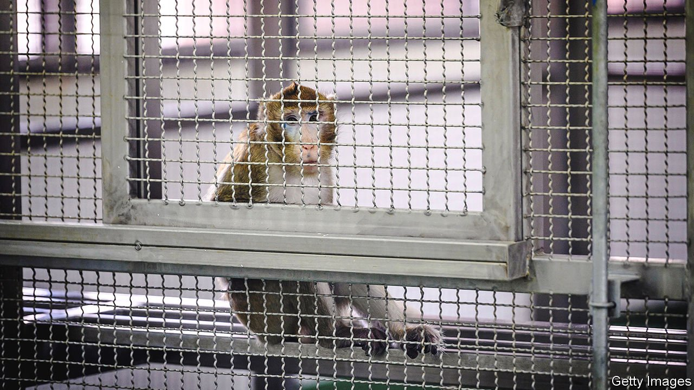

###### Brainstorming

# Neuroscientific research on monkeys is ethically troubling—but vital 

##### America and Europe are falling behind in a crucial scientific field 

 

> Jul 24th 2021 

THE HUMAN brain may be the most complex object on Earth. It contains 85bn nerve cells and trillions of interconnections. As these cells process information, people experience consciousness and thought. The brain is made even more mysterious by the fact it is scrutable only when alive. To truly understand brains means examining them while they are functioning inside the body.

Few humans in their right mind would volunteer to plug today’s instruments and sensors into their living brains. Doing so often involves having someone drill into your skull, with the risk of infection or brain damage. And so neuroscientists seeking to understand human brains turn to humanity’s nearest animal relatives, primates.


This is controversial. Monkeys’ usefulness as a model for human neurology also raises the stakes of conducting experiments upon them: the better their brains serve as analogues for human ones, the more it follows that they probably suffer analogously, too. Animal-rights activists rightly point out that monkeys cannot consent to such treatment. It is unlikely they would acquiesce were they able to do so.

The controversy has had an uneven impact round the world. In Europe and America, under pressure from animal-rights groups, the amount of neuroscience research carried out on monkeys is flat or declining. Both places have or are considering laws requiring an end to their use. But , neuroscience research on monkeys is booming in China and Japan.

America and Europe should narrow this gap. Allowing China to forge ahead in brain science without mounting a comparable programme of research would be strategically foolish. A Chinese neuroscience laboratory in Shanghai has already attracted one of Germany’s leading researchers and his laboratory. As he and his colleagues work out new ways to gain access to and manipulate the brain, China will be the first to enjoy the fruits of that effort. To avoid depending on China for access to such knowledge, America and Europe need to take action now.

More knowledge of the brain is not always a force for good. Given the Chinese state’s official policy of military-civil fusion, there is probably little that can be done to stop the Chinese Communist Party obtaining the capability to build neuro-weapons on the basis of its brain-research programmes, should they bear fruit. But liberal societies should at least keep track of what is possible, and how it works, through research programmes under their own control.

And were laboratories in China and Japan to come up with treatments for neurological diseases such as Alzheimer’s as a result of their studies of monkeys’ brains, it would be near impossible for Western countries to refuse to buy them to treat their citizens. Leaving others to do the dirty work of generating knowledge using means you consider to be unethical, while at the same time encouraging it by adding to demand is not taking the moral high ground. It is hypocrisy. Better for Western countries to carry out the necessary but troubling research themselves, working to the standards they deem necessary.

Taking responsibility for the suffering they cause starts with maintaining America’s and Europe’s high-quality primate research. Keeping up with China’s expansion also makes sense. Neuroscientists should be braver in publicly defending their work. Governments must protect their ability to carry out legal research.

Some experiments on monkeys can be avoided by using computer simulations or by growing brain cells in Petri dishes. But the brain is so poorly understood at present that probing living ones will remain essential for some time. A radical alternative to the use of monkeys in neuroscience would be to rely instead on consenting humans. After all, people already join biomedical studies and they readily don non-invasive brain-scanning hardware.

Grey areas

Getting sensors inside the skull, next to human neurons, is still difficult. However, the tools used to probe brains are becoming smaller and less invasive. One day they may resemble an injectable, connected silicon dust more than an implantable electronic device. Such instruments would make the prospect of gaining informed consent from human subjects less daunting. But to get to that point, humans will have to rely on monkeys for some time. People do not yet understand their brains well enough to study themselves safely. ■

