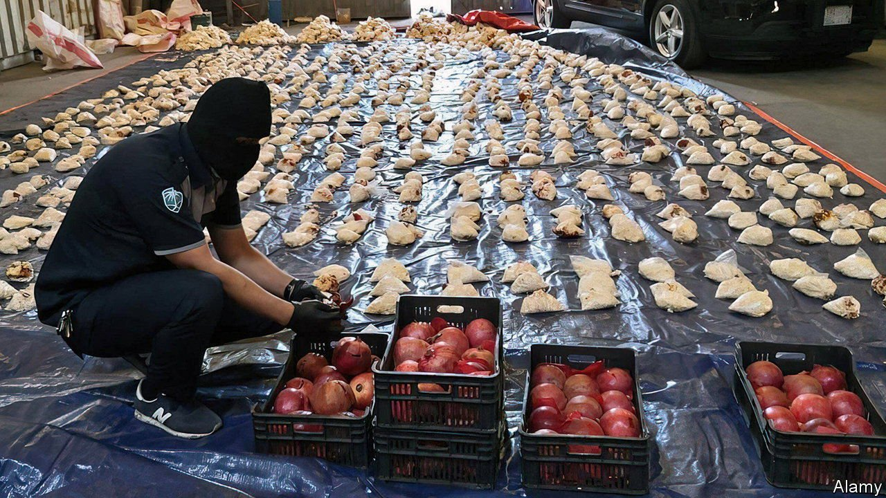
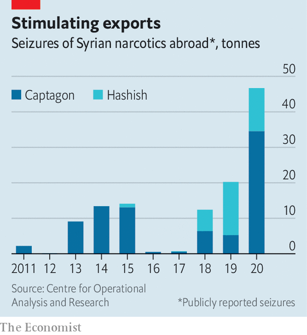

###### Pop a pill, save a dictator

# Syria has become a narco-state 

##### But a popular drug is doing damage at home 

 

> Jul 19th 2021 

IN THE DUNES north of Riyadh, the Saudi capital, the sun sets and the party begins. Girls discard their abayas, the black shrouds that envelop them in public, and begin jiving to techno music with boys. A few swig from bottles, but most prefer Captagon pills, nowadays the Gulf’s favourite drug, at $25 a pop. They call it Abu Hilalain (Father of Two Half-moons), after the two letter “c”s (for Captagon) embossed on the pills. Part of the amphetamine family, it can have a similar effect to Viagra—and conquers sleep. “With one pill,” says a raver, “we can dance all weekend.”

Though Saudi rulers have opposed the regime in Syria for a decade, the pill-popping by young people is funding it. For Syria’s president, Bashar al-Assad, the drug has become a boon—at least in the short run. His country has become the world’s prime pusher of Captagon. As the formal economy collapses under the , sanctions and the predatory rule of the Assads, the drug has become Syria’s main export and source of hard currency. The Centre for Operational Analysis and Research (COAR), a Cyprus-based consultancy, reckons that last year authorities elsewhere seized Syrian drugs with a street value of no less than $3.4bn. That compares with Syria’s largest legal export, olive oil, which is worth some $122m a year. The drug is financing the central government, says Ian Larson, who wrote a recent report on the subject for COAR.


Syria has long been involved in drugs. In the 1990s, when it ruled Lebanon, the Bekaa valley was the region’s main source of hashish. But mass production of drugs within Syria began only after the civil war erupted in 2011. Officers fed their men “Captain Courage”, as they called Captagon. Shia fighters from Afghanistan and Lebanon, who came to support the Syrian regime, brought their skills in making and trafficking drugs. Hizbullah, Lebanon’s biggest Shia militia, which has given crucial support to the Assad regime, acquired large tracts across the border in Syria’s Qalamoun mountains. They expanded hashish cultivation and developed a new cottage industry, making Captagon pills.

Syria began exporting them in about 2013, as its formal economy shrivelled, thanks to war, economic sanctions and corruption within the regime. Chemical plants in the cities of Aleppo and Homs have been converted into pill factories. In the Gulf the mark-up for pills can be 50 times their cost in Syria. Smugglers hide them in shipments of paper rolls, parquet flooring and even pomegranates. Saudi princes use private jets to bring the stuff in.

Seizures by police in foreign waters testify to the size of the trade. Italian police last year uncovered 84m pills worth over €1bn on a single ship. It was then said to be the world’s biggest interception of amphetamine-related drugs. In May the Malaysian authorities, acting on a Saudi tip-off, seized 95m pills. The Libyan port of Benghazi, linked by a regular shipping route to Syria, is said to be a key entrepot.

 


The Assads insist they are not involved. “Propaganda”, says Shadi al-Ahmad, an economist in Damascus, the capital, who is loyal to the regime. But because Mr Assad finds it hard to pay his troops, he farms out much of his country to warlords who oversee the smuggling. The army’s fourth division, which is commanded by Maher al-Assad, the president’s younger brother, is said to take a big cut. Other relations run operations at the Mediterranean ports of Latakia and Tartous. A Lebanese drug-runner close to Hizbullah and wanted by Interpol boasts on Facebook of his ties to the Assads and senior Hizbullah clerics. “It’s out of control,” says an insider in Damascus.

The regime may see Captagon as a lever in regional power struggles. It “uses drugs as a weapon against the Gulf”, says Malik al-Abdeh, a Syria watcher close to the opposition. “The message is: normalise relations, or we’ll destroy your youth.”

In any event, the regime’s loyalists are not the only ones involved. The Kurds who control Iraq’s north-eastern border with Turkey draw on the experience of the Kurdistan Workers’ Party, which operates routes through the mountains to Europe. Sunni Syrian rebels under Turkish protection in northern Syria are at it too. And the route south through Jordan to Saudi Arabia is getting busier. “All the militias get their earnings from smuggling drugs,” says a tribal leader in southern Syria. He says southern militias have helped thousands of refugees cross the border into Jordan, their knapsacks full of pills.

For the Syrians left behind, drugs may destroy what remains of society after a decade of civil war. “Young men who haven’t been killed, exiled or jailed are addicts,” says a social worker in Sweida, a city held by the Assads in the south. A recent survey of Syrians in the north found that in January this year 33% said they knew a drug user. That is up from 7% in 2019. So prevalent is the habit that during this year’s Ramadan, in April and May, the prime-time serial on state television was “On a Hot Plate”, portraying a family of drug dealers.

