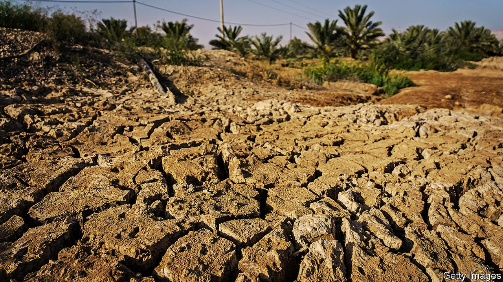
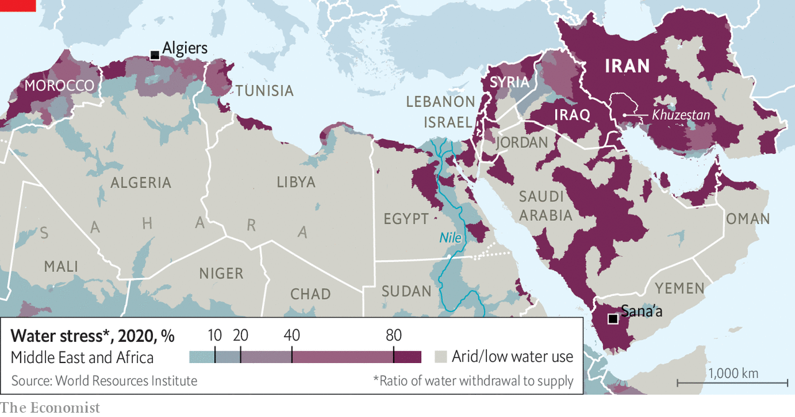

###### Dry and disorderly

# The countries of the Middle East and north Africa are parched 

##### Governments are making things worse 

 

> Jul 24th 2021 

IN THE NEIGHBOURHOOD of Algiers where the presidential palace and foreign embassies are located, some think the water pressure has increased of late. But don’t tell those living in the suburbs of Algeria’s capital, where the taps have been dry for days, as temperatures and tempers rise. Protesters have blocked main roads and railways. “If the water stops flowing, so will everything else,” says a local journalist, conveying the protesters’ mindset.

Algeria is not alone. In the past few months protests over water shortages have erupted in Iran, Iraq, Sudan and Yemen. Two protesters were shot dead in Iran on July 16th. And a lack of water is contributing to unrest elsewhere in the Middle East and north Africa.


Drought has been a feature of the region since biblical times. But now climate change is causing longer dry seasons, as well as hotter heatwaves and record-setting temperature spikes. Rainfall is expected to decline, precipitously in some places, leaving farmers to dig more wells, draining aquifers and causing potentially irreversible environmental damage. For most of the region the trend is towards a drier, hotter, more miserable future.

Some governments are dealing with the problem. Israel and the Gulf states rely on desalination plants, which can run on solar power and produce a cubic metre of freshwater (enough for 3,000 small water bottles) for as little as 50 cents. But many governments are making things worse. Protesters blame mismanagement and corruption for much of the misery. “The water sector is disintegrating,” says Hassan al-Janabi, a former water minister in Iraq. “There will be an explosion.”

 


Agriculture accounts for the overwhelming share of freshwater taken from ground or surface water sources globally (about 70%), says the World Bank. The proportion is even higher in the Middle East and north Africa (about 80%). Crops depend entirely on irrigation in the arid region and officials say that supporting agriculture stems rural migration and reduces the need to use hard currency for food imports. So Egypt, for example, allows its farmers to take water from the Nile for nothing but the cost of pumping it.

Such subsidies have long encouraged farmers in the region to waste water on a massive scale. Still, leaders like to use cheap water as a way to buy support or further their own interests. The regime in Jordan, one of the world’s driest countries, uses it to mollify farmers from powerful tribes in the Jordan valley. In Iran the Islamic Revolutionary Guard Corps rerouted a river to cool its steel mills in Isfahan. A former president, Akbar Hashemi Rafsanjani, is even said to have built a dam to water his pistachio crop.

The protests in Iran have occurred in Khuzestan, home to most of the country’s Arabs. Much of Iran’s fresh water used to flow through the province. Old-timers remember when ships bound for America sailed up the Karun river. But dozens of dams have dried up Khuzestan’s rivers and marshes. Angry residents accuse the clerical regime of diverting water to Persian cities and seeking to drive Arabs off the land in order to drill for more oil. “No to forced migration,” chant protesters.

Those in Algeria often blame corruption for their water woes. The government has spent more than $50bn on water projects over the past two decades, but much of it has evaporated. One former minister of water resources has been sentenced to jail for pilfering funds and in recent weeks two more have been arrested. Ten of the 11 desalination plants built by a state subsidiary are in disrepair. The story is much the same in Iraq, where the construction of a large desalination plant has been delayed for years as the country’s ruling factions bicker over who gets the contract.

War has made it hard for some countries to maintain water infrastructure. And water is sometimes used as a weapon. The jihadists of Islamic State tried to dam the Euphrates in order to starve their opponents in Iraq. Turkish-backed rebels in northern Syria have stopped operating a water plant that supplies the bread basket of their rivals, the Kurds. A report by the University of Sana’a estimated that 70% of the rural skirmishes in Yemen, before the civil war, began as disputes over water.

Water could even become the main cause of future conflicts. Egypt and Sudan are feuding with Ethiopia over its filling of a giant dam on the Nile. “All options are open,” says Egypt’s president, Abdel-Fattah al-Sisi, menacingly. Turkey and Iran are also building dams that will deplete the water flowing to Arab countries. Israel’s blockade of Gaza ensures that the territory does not have the means to produce enough potable water.

Other observers, though, are more sanguine. It’s cheaper to desalinate water than to fight over it, says Eran Feitelson of Israel’s Hebrew University. Still, unrest related to water could have global consequences. Yemenis, for example, are already abandoning parched villages. Without better sharing, management and investment, millions of the region’s residents risk becoming climate refugees. ■

For more coverage of climate change, register for The Climate Issue, our fortnightly , or visit our 

