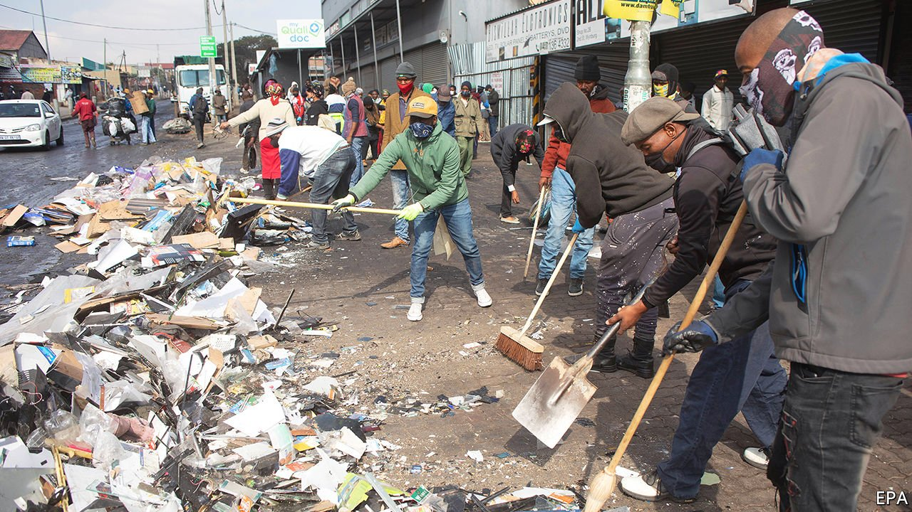
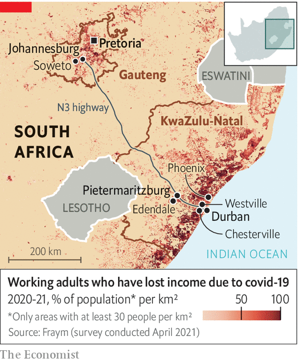
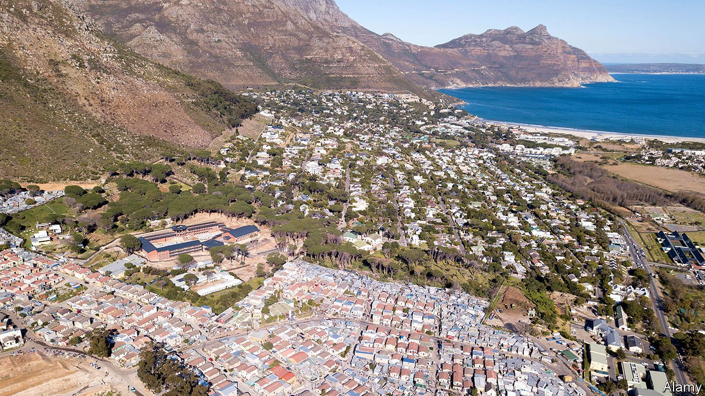

###### Amid the rubble

# Where does South Africa go from here? 

##### After a week of unprecedented unrest the country is on the brink 

 

> Jul 24th 2021 

TO TRAVEL AROUND Durban last week was to witness scenes of wholesale devastation. Shopping centres were ransacked, with nothing left but decapitated mannequins lying amid broken glass. Torched factories smouldered, the smell of burnt materials wafting on the breeze from the Indian Ocean. Not that one could escape into the water. A noxious spill, thought to be from a scorched chemical warehouse, had closed the beach.

Elsewhere a humanitarian crisis was spreading. Queues for food snaked for ever. The main motorway into the city was closed after dozens of lorries were set alight. The country’s largest factory making anti-retroviral drugs was up in smoke. Vital supplies of bread, pills and nappies had to be flown in from Johannesburg. The city that hosts one of Africa’s busiest ports looked like the site of a natural disaster.


As in the case of America’s Hurricane Katrina, the carnage revealed much about the country in which it occurred—except that in South Africa the disaster was entirely man-made. In particular, the worst violence since the end of apartheid puts a spotlight on the party of Nelson Mandela, the African National Congress (ANC). Its failure to build a properly functioning state and to deliver economic growth created the potential for chaos. Its own factional battles set the timing. The effects of the destruction will be felt for years in Africa’s most industrialised country.

The proximate cause of the unrest is clear. On July 7th Jacob Zuma began a 15-month prison sentence for defying an order by the Constitutional Court to appear at an inquiry into vast corruption during his presidency of 2009-18. Messages calling for an uprising soon spread on social media. Thousands of people in townships in the provinces of Gauteng, which contains Johannesburg, and KwaZulu-Natal (KZN), the birthplace of Mr Zuma and home to the cities of Durban and Pietermaritzburg, descended on factories, warehouses and malls. They were cheered on by those close to Mr Zuma, such as his daughter, Duduzile Zuma-Sambudla. Her twin brother, Duduzane Zuma, who has political ambitions, said people should steal “carefully” and “responsibly”. He later noted that the loss of at least 276 lives was “not an ideal situation for them and for any of us”.


And allies of Mr Zuma did more than cheer. On July 16th President Cyril Ramaphosa spoke of an “insurrection” and “nothing less than a deliberate, co-ordinated and well-planned attack on our democracy”. Three days later the government said it had arrested six of the “instigators”. On July 20th Mr Ramaphosa mentioned the use of “criminal networks” to organise looting. Though this may not have been a coup attempt, it was certainly an effort to render the country ungovernable and Mr Ramaphosa unpopular, so as to force the release of Mr Zuma and let his friends reassert control of the ANC.

Edendale, a township outside Pietermaritzburg, was among the first to explode. “Society is divided,” explains Michael Malinga, who farms chickens having recently lost his job with a local NGO. “These are the people who are envious of the good life that is being lived over there,” he said, pointing towards affluent suburbs. Although Mr Zuma’s incarceration was the “trigger”, he says, “looting didn’t take much to trigger.”

Peering at South Africa’s statistics verges on voyeurism. The unemployment rate, 33% in the first quarter of 2021, is the highest on record, perhaps the highest in the world. And it excludes those who have given up looking. Nearly half of black South Africans cannot find work or have stopped trying. Roughly 13m South Africans (22%) were hungry even before covid-19’s third wave, according to a survey.

Lockdowns have pushed people deeper into poverty. Poor workers, nearly all of whom are not white, are almost four times as likely to have lost jobs since covid-19 than higher-paid ones. The end of welfare grants introduced at the start of the virus has led to more hunger. A booze ban announced on June 27th has created “alcohol-thirsty people”, says Mr Malinga.

Desperation explains some of the horror. At a supermarket near Edendale five people died in a stampede; in a similar scene in Soweto ten perished. Other images shared on social media hint at the inequality behind the dash for goods, such as the woman who reportedly ended up with a couch worth 68,000 rand ($4,600) that was far too big to fit in her shack. “This is as close to a rebellion against inequality as SA has ever come,” argues Jonny Steinberg, a South African writer.

As more people joined in the looting, others began to feel left out. “We’ve become a joke, us people who don’t loot. People say ‘you’re stupid’”, says Kwasi Molefe, from the Chesterville township near Durban. Some people did not want to steal but feared there might be no food left in the shops, explains a grandmother.

Whatever the precise mix of conspiracy and poverty behind the violence, it was facilitated by failures of security. Police watched as people piled contraband onto pickup trucks. In downtown Pietermaritzburg one ransacked supermarket is around the corner from the main police station. Neither the criminal-intelligence branch of the police nor the domestic spy agency saw the violence coming or forewarned others in government. It took almost a week for the deployment of up to 25,000 troops to be authorised, a move that ultimately helped quell the chaos.

 


As so often, ordinary South Africans filled the gap left by the state. At night in the suburbs of Durban and Pietermaritzburg, and in smaller KZN towns, pallets, branches and barbed wire were shoved into street entrances as barricades. Residents, some armed, took turns to stand guard overnight.

In most cases these vigils were peaceful. “I’ve never felt safer,” says Wimpie De Lange at the barricade between Chesterville and Westville, a suburb on the other side of the motorway. “This is South Africa. We come together after chaos.” At a roadblock in Pietermaritzburg a group of whites and South Africans of Indian descent joked with black students entering nearby university halls of residence. In case of trouble the whites had golf clubs and the Indians cricket bats.

But tensions have risen, at times fatally. In Phoenix, an Indian township north of Durban, at least 20 deaths have been reported. In a nearby black township residents say that family members were racially profiled and shot by Indians. Police and human-rights groups are investigating.

Even in peaceful areas some are uneasy about the roadblocks. Mbali Ntuli, a member of the opposition Democratic Alliance (DA), who lives in a Durban suburb, says, “I don’t feel super comfortable as a black person with people asking me whether I live here.” She notes that it reminds her mother of apartheid, when black South Africans needed passes to enter white areas. Yet, adds Ms Ntuli, she understands the need for communities to protect themselves. “People are realising how exposed and unprotected we are.” For many, she says, “this is the final straw.”

Shades of the bad old days

It is a long cry from April 1994. Back then the world watched as South Africans queued from dawn to vote in the country’s first fully democratic election. Today the queues are for food, petrol and medicine. How did it come to this?

For most of the 20th century South Africa was a white-supremacist state. The creation of modern South Africa in 1910 established peace between Afrikaners (those of mainly Dutch descent) and British settlers at the expense of black people. The brutality of apartheid, introduced in 1948, built on colonial foundations. Under the National Party whites benefited from state largesse while non-whites were violently displaced and exploited. By the late 1980s white rule was morally and literally bankrupt. Pressure from the anti-apartheid struggle, capital flight and the end of the cold war brought about its demise.

The negotiated transition is seen by many on the left as a stitch-up. Blacks may have got the vote, goes the argument, but economic power remained with whites. “We missed the boat in 1994. We have no one to blame but ourselves,” says Important Mkhize, a leftist ANC figure, referring to his party’s apparent failings.

Such views, like mutterings about how life was better under apartheid, are overly cynical. Under Mandela (president from 1994 to 1999) and his successor, Thabo Mbeki (1999-2008), life improved for nearly all South Africans. Proper houses were built roughly ten times faster than shacks. Townships got running water and electricity. A basic welfare state was established. “Social grant” recipients rose from 2.5m to 12.4m under Mr Mbeki. His government’s sensible macroeconomic policies and a commodities boom raised growth to an average of 5% a year for four straight years for the first time since the 1960s. Unemployment went from horrific to merely awful.

Yet trouble was brewing. A corrupt arms deal in 1999, for which Mr Zuma still faces charges, set the standard for future graft. Black Economic Empowerment, a policy that incentivises firms to give equity to black investors or business to black-owned suppliers, has created a new generation of Randlords with more political acumen than entrepreneurial talent. “Cadre deployment”, whereby ANC party members get jobs on the basis of factional fealty rather than merit, has degraded the state. These appointees steer contracts towards chosen “tenderpreneurs”, who in turn donate to the party. By 2007 Kgalema Motlanthe, a party grandee, said: “This rot is across the board...Almost every project is conceived because it offers opportunities for certain people to make money.”

The blackouts that still plague the country began under Mr Mbeki, who neglected Eskom, the state power utility. His abject handling of the AIDS plague cost at least 330,000 lives, according to a Harvard study. It also contributed to his loss in a factional battle to Mr Zuma, who took over as the ANC’s president in 2007. That moment was crucial in fragmenting the party. What one ANC official called the party’s “rational centre” could no longer hold. Anarchy was loosed upon the country.

At its heart was Mr Zuma. Under him much of the progress was squandered. Corruption soared. The lure of jobs in the party led to scores of assassinations, most of them in KZN, where Mr Zuma’s fellow Zulus predominate. Agencies meant to stop crime ran smear campaigns on political enemies. Government came to resemble an organised-crime gang.

The economy was not helped by the global financial crisis and the end of the commodities boom. But “state capture” made things worse by deterring investment. Though growth slowed, the government kept on spending, more than doubling the share of debt to GDP during Mr Zuma’s reign. Much of this was directed to looted state-owned enterprises and wage rises for existing public-sector workers. To try to keep finances in check, the Treasury increased regressive taxes and ministries slowed the hiring of teachers, nurses and police. The result, writes Michael Sachs, a former Treasury official, is that “the real value of public services—particularly to the poor—has fallen.”

A year after bruising local-election results in 2016, the party rejected Mr Zuma and his preferred successor (an ex-wife). They turned instead to Mr Ramaphosa, who promised more jobs and less graft. His approach has been to lead from behind, appointing people to key jobs and leaving them alone. But he has not gone far enough. The “security cluster”, especially police and spies, is ineffectual. His cabinet remains replete with incompetents. Mr Ramaphosa’s defenders argue that he has to tread carefully because he needs to win internal ANC elections to stay in power. Yet South Africans are frustrated that he puts party before country.

The result of ANC misrule has been the entrenchment of two South Africas. In one, a multi-racial, but still disproportionately white, minority lives in a privatised bubble: private security, private schools, private health care and, increasingly, private (solar or generator) electricity and (borehole) water, too. In the other live most black and mixed-race (“coloured”) South Africans, with shoddy services, joblessness and hungry stomachs.

Before the unrest, NGOs working in townships warned of simmering tensions taken to boiling point by covid-19. The South African Human Rights Commission recently called Alexandra, a Johannesburg township, a “ticking time bomb”. The Pietermaritzburg Economic Justice and Dignity Group said on June 30th, with devastating prescience, that “high food prices and no jobs could lead to social disorder and social instability.”

After the failure to heed those warnings, South Africa’s future is uncertain. The violence has damaged an already fragile economy. Gauteng and KZN account for half of the country’s GDP. Roughly 200 shopping centres and 3,000 shops were ransacked. Several small towns in KZN lost nearly all of their shops. In townships the economic self-harm has flabbergasted some residents. “We destroyed the amenities we had fought so hard for,” says Richard Yangaphi of Alexandra.

In KZN alone 150,000 jobs may be at risk. One supermarket employee, Mike Nkwana, has not worked since rioting destroyed his workplace, so has been unable to feed his children. He brings up the added impact of “the black tax”: on average one South African wage supports the livelihoods of 4.3 people, a burden disproportionately shouldered by black employees. “I don’t only look after my family,” he says.

Guns n’ hoses

Firms will ponder the risk of further unrest when making investment decisions. Toyota, which has a plant in Durban, told the municipality that it was “feeling very uncertain about the future of our business in KwaZulu-Natal”. Traders who rely on the port may look to alternatives such as Dar es Salaam in Tanzania. Emigration enquiries have reportedly soared.

Those who stay may take extra precautions. Denzil Smith, a B&amp;B owner in Pietermaritzburg with a fondness for Victorian knick-knacks, is not your natural vigilante. “But after this I’m definitely getting a gun,” he says. South Africa’s “enclave society”, as Frans Cronje, a political analyst, calls it, may take deeper root.

There will be political effects, too. If Mr Ramaphosa does not push Zuma-era figures out of the party, they may jump. “The violence, looting and arson of the past week will change the ANC for ever,” argues William Gumede, a former anti-apartheid activist and commentator. “It has hastened the [Zuma] faction’s own departure from the ANC.” If Mr Zuma’s supporters flee the party, that would probably mean losses for the ANC in KZN at local elections scheduled for October (though they may be delayed by covid-19). Whether it would cause losses elsewhere is less clear. “People don’t feel they have a lot of options,” notes Ms Ntuli.

Even so, the unrest may speed the ANC’s secular decline. Polling suggests that fewer than half of 15- to 50-year-olds support the party. Its voters are increasingly old and rural in a young and urban country. The ANC looks ever more like Zimbabwe’s Zanu-PF and other “liberation” parties in southern Africa, which depend on rural voters (and rigging) to win elections. Mr Ramaphosa may be the last ANC leader with a national majority. That could mean a coalition of moderate elements from the ANC and DA. But it could also pave the way for the entry of left-wing populism exploiting the country’s poverty, or a right-wing version playing on fears of crime and xenophobia.

 


Is there reason for optimism? South Africa has defied the odds before. It did not descend into violence, as some feared, after 1994. Desmond Tutu’s commission brought some truth and a little reconciliation. Just 18% of South Africans feel there has been no progress at reconciliation since the end of apartheid, according to a survey in 2019. “A vast majority of South Africans are proud to be South African,” it concluded. An imaginative politician could galvanise the country’s pragmatism and patriotism.

Such spirit was on show in townships after the chaos subsided. In Alexandra two young residents joined hundreds in a clean-up. Talia Mogano, 17, says of the looters: “Life isn’t fair, yes, but what they did wasn’t right either. They should have had a protest but what they did was a crime.” Her friend, Thabang Kanetsi, is buoyed by the many who have risen at dawn to collect brooms and bin bags. “Everything is going to go back to normal,” he says. “I have faith in this community and this country.” But South Africa’s problem is that going back to normal may not be enough. ■

