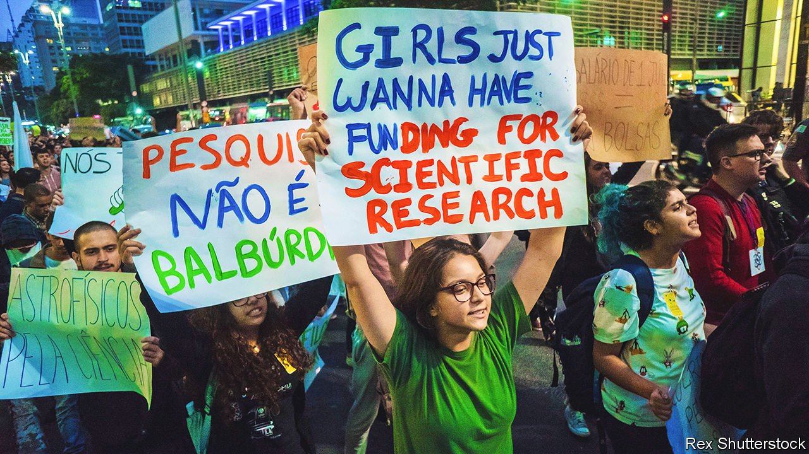

###### Out the door

# Brazil’s brain drain is getting worse 

##### Political instability and a shortage of funds are pushing scientists abroad 

 

> Jul 24th 2021 

BARBARA GOMES has almost completed her doctorate in biomedicine at the Federal University of Rio de Janeiro (UFRJ), one of the best in Brazil. Jobs are scarce and the best she has been able to find is a substitute teaching position at the university that pays around 4,000 reais ($760) a month. For her experiments on a protein associated with mad-cow disease, however, she needs reagents that that university cannot always afford and that cost more than her salary. As a result she, like many of her cohort, wants to leave Brazil. Her plan to move to France was scuppered by the pandemic, but when she finishes her doctorate, she will go: “If I want to work in science, I must leave the country.”

Brazilian emigration to OECD countries has been rising for years, but took off especially in 2017, growing by 24% from the previous year. Nearly 30% of all Brazilians living in OECD countries have a university education. In the past two years, applications by Brazilian skilled workers for permanent visas in the United States, the main destination for those leaving Brazil, rose by 30% to the highest level in at least ten years.


The exodus is mainly the result of economic instability left over from the recession of 2014-16. But it has been worsened by the populist president, Jair Bolsonaro, who sees academics as enemies. His guru, Olavo de Carvalho, has said that Brazil’s universities are hives of drugs, orgies and communist propaganda. The federal science-funding agency’s budget has dropped by nearly half since 2000, while the government is pouring money into sending members of the armed forces, often supporters of Mr Bolsonaro, to study abroad.

The UFRJ has enough money to keep its doors open only until September; after that it may have to close labs and restrict some classes to online. At least six professors who criticised the president’s actions during the pandemic, which has so far killed more than 540,000 Brazilians, were investigated by the government.

“Being in a country that has daily attacks on science is very discouraging,” says Ana Carneiro, a professor who studies the Brazilian diaspora at UNICAMP, a university in the state of São Paulo. But it is not new. During the dictatorship of 1964-85, for which Mr Bolsonaro is nostalgic, academics were among the thousands exiled. The military government had a slogan: “Brazil: love it or leave it.”

After starting to trim the bloated public-pension system in 2019, Mr Bolsonaro has abandoned attempts at the economic reforms required for a return to growth. The country was still struggling from the recession when the pandemic hit. With only 17% of Brazilians fully vaccinated, economic normality still seems distant. Despite a generous public financial-aid programme last year, poverty tripled. GDP in the first quarter exceeded expectations, but Brazil must still tackle unemployment at 14.7%, a record high. Half of all young people say they would leave if they could.

It is not long ago that Brazil offered young researchers fairer prospects. Between 2003 and 2016 successive governments led by the Workers’ Party, under Luiz Inácio Lula da Silva and Dilma Rousseff, set up 18 new universities (some from satellite campuses of existing institutions). In 2015 Brazil outpaced countries like Russia and Mexico in its spending on science, technology and innovation.

Yet even when Brazil was investing in education, there were snags. The Ciência Sem Fronteiras (“Science without Borders”) programme inaugurated in 2011 by Ms Rousseff, then president, sent almost 100,000 Brazilians to study in more than 30 countries over six years. But when they returned, there was no policy for what to do with them, says Ms Carneiro. When the programme was still running, a quarter of scholarship recipients said they intended to pursue a career outside Brazil.

By exporting scientists and their innovations, Brazil is losing the chance to build technological heft at home. More than a quarter of GDP still comes from agriculture. Cuts in scholarships that began under Ms Rousseff’s successor, Michel Temer, have deepened under Mr Bolsonaro. After Ms Rousseff’s disastrous stewardship of the economy led to recession, the newer government-funded universities saw their budgets slashed. The Federal University of Cariri in the state of Ceará, in the poor north-west, was founded in 2013, but has lost more than 80% of its government research grants in the past four years.

The foreign ministry recently set up a programme called Innovation Diplomacy to try to link Brazilians abroad with the mother country, in order to boost trade and investment back home. But its goals are ill-defined. And many of those planning to leave are likely to stay away until the situation in Brazil improves. “I wish I didn’t have to go,” says Ms Gomes. “But there’s nothing here for me.” ■

