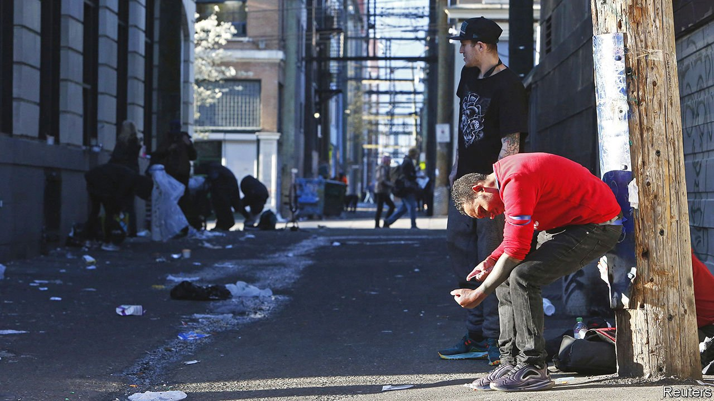

###### High stakes

# Vancouver wants to decriminalise possession of many hard drugs 

##### But how to supervise such a policy? 

 

> Jul 24th 2021 

AS A STUNT, it took some beating. A Vancouver city councillor joined activists outside a police station on July 14th to distribute free heroin, meth and cocaine. These “safe” samples of illicit drugs, the councillor tweeted, could save users from a poisoned street supply that has caused an overdose crisis on Canada’s west coast.

If the measure seems desperate, it suits the moment. The health officer of British Columbia (BC), where Vancouver is located, declared an emergency over deaths from drug overdoses five years ago. Dealers were lacing street drugs with lethal levels of fentanyl, a cheap and potent opioid. BC’s rate of illicit-drug deaths has more than doubled since then, with around 2,000 people dying from overdoses in the year to May—more than those killed by covid-19. “It’s really stretched all our traditional policy responses,” says Kennedy Stewart, Vancouver’s mayor. The pandemic appears to have worsened the crisis, since deaths are more likely if users inject alone.


So in May, Vancouver submitted a proposal to exempt it from Canada’s drug laws. It would decriminalise possession up to defined personal limits: two grams of heroin; three of cocaine; ten rocks of crack, for example. Drug prohibition deters addicts from seeking treatment, the request says, and criminal records make it hard to get a job. The proposal would also allow possession of drugs prescribed legally but sold on the black market, and of “party drugs” like LSD, MDMA and psilocybin mushrooms. It’s an all-or-nothing approach: decriminalising only the most harmful substances risks making users of other drugs turn to these more dangerous ones.

There are precedents for decriminalisation. Portugal is an example. This year Oregon became the first American state to stop making arrests for possession of small quantities of all drugs. But most such places still issue fines, confiscate drugs or impose mandatory treatment, whereas the Vancouver model proposes no penalty.

For decades, Vancouver has led Canada towards a drug policy that emphasises harm reduction. The country’s first supervised injection site for drug users opened there in 2003. Dozens of similar sites now operate across the country, even while they remain banned in America. The Canadian government has funded programmes—known as “safe supply”—that give users access to alternative opioids such as hydromorphone. Some clinics in the Vancouver area prescribe untainted, medical-grade heroin to the severely addicted.

The city’s submission includes letters of support from organisations of indigenous people in British Columbia. They died from overdoses last year at five times the rate of the rest of the population. But some advocacy groups think the proposal does not go far enough. Garth Mullins of the Vancouver Area Network of Drug Users (VANDU) says the proposed possession limits are too low and that the city has deferred too much to its police department.

The mayor says it was politically important to get the police onside. He is hoping for a government decision within weeks. “This is the prime minister who legalised cannabis,” he says of Justin Trudeau. “I think there’s a willingness to experiment with approaches that will save lives.”

But not everyone is convinced that decriminalisation alone will save lives. “In practice, it’s not going to be particularly effective in the short term,” says Scott Bernstein of the Canadian Drug Policy Coalition. Suppliers will continue to poison the west coast’s heroin with fentanyl, and only a small portion of users will have access to safe-supply programmes.

And safe-supply schemes, too, have shortcomings if not managed properly. Like many addiction-medicine specialists, Lori Regenstreif, a physician at McMaster University in Ontario, says she is worried that the government is encouraging the “overprovision of prescription-opioid consumption, without proper supervision” under the safe-supply scheme.

She knows of many people who take the easily obtained hand-outs of hydromorphone tablets, sell them on the street because they are not strong enough, and buy fentanyl on the black market. This, she says, means the government may be worsening the problem, not solving it. ■

