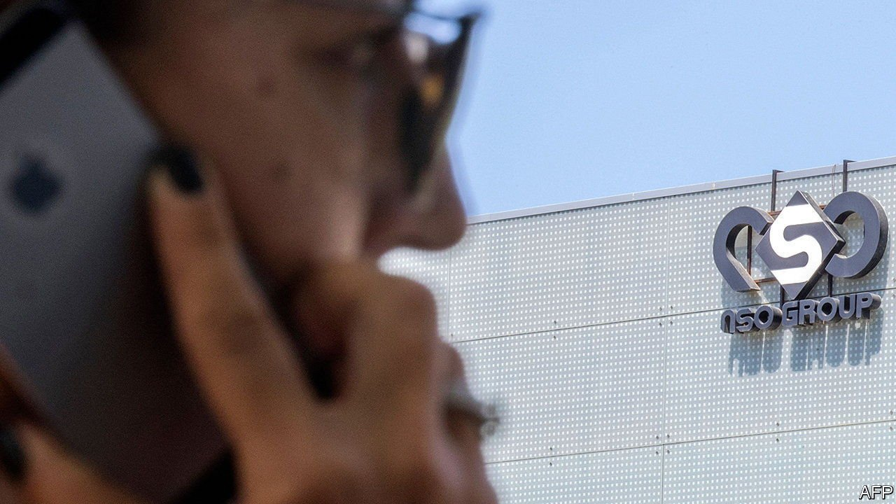
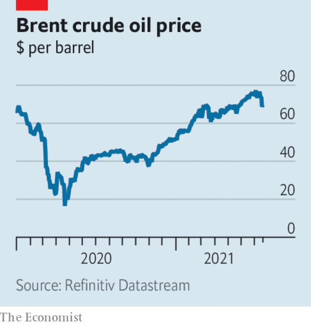

###### 

# Business this week 

#####  

 

> Jul 24th 2021 

A report by a group of investigative journalists and Amnesty International claimed that the phone numbers of human-rights activists, journalists and politicians were on a list of 50,000 potential targets of unscrupulous governments for hacking using Pegasus software, which is made by NSO, an Israeli spyware firm. Emmanuel Macron, Cyril Ramaphosa and Imran Khan, the leaders of France, South Africa and Pakistan, were reportedly on the list, along with the wife of Jamal Khashoggi, a journalist murdered by agents of the Saudi regime. NSO said the report was based on a misleading interpretation of the data, and that it sold its software only to law-enforcement agencies of “vetted governments” for the prevention of crime and terror acts.

The diplomatic gloves are off


The Biden administration accused the Chinese government of being directly behind the , which compromised the communications networks of companies around the world. Using blunt language, Antony Blinken, the secretary of state, said China had “fostered an ecosystem” of cyber-criminals who work for the state as well as personal gain. But he did not announce any sanctions as retribution.

Jonathan Kanter was nominated by Joe Biden to head the Justice Department’s antitrust division. Like Lina Khan at the Federal Trade Commission, Mr Kanter is a critic of Big Tech, founding a law firm that represents smaller rivals to Amazon, Apple, Facebook and Google.

Bill Ackman scrapped a plan to buy 10% of Universal Music through his special-purpose acquisition company. At over $4bn, it was one of the most complex SPAC deals so far. Mr Ackman will instead acquire the stake through his investment fund, Pershing Square.

America’s pandemic recession lasted only two months, between February and April 2020, according to the National Bureau of Economic Research. It was the shortest American recession on record, but also one of the most severe.

Ben &amp; Jerry’s announced that it would stop selling ice cream in Israeli settlements in the occupied Palestinian territories. The settlements are illegal under international law. Israel’s prime minister, Naftali Bennett, warned the firm’s parent company, Unilever, that there would be consequences for the move.

 


Members of OPEC+, which includes Russia, reached an agreement to increase oil output. With the aim of curbing soaring prices, a factor behind recent inflationary pressures, the cartel will start pumping out more oil next month, and gradually expand production further. The United Arab Emirates threw its support behind the pact when it secured a change to the way its output quota is calculated. News of the deal took some of the heat out of oil prices.

Robinhood filed for an IPO that could see it valued at up to $35bn. The app-based brokerage came to prominence earlier this year when small investors used it to trade heavily in “meme” stocks.

 gained 1.5m subscribers in the second quarter, far below the 10.1m who joined in the same quarter last year, when lockdowns bit. In North America, where competition for video-streaming services is intense, Netflix lost 400,000 customers. The company is looking at adding games to its platform to boost its user base.

Also looking for post-pandemic sources of growth, Zoom struck a deal to buy Five9 for $14.7bn. Five9 provides cloud-computing for customer contact centres, work that has been mostly completed from employees’ homes recently.

Johnson &amp; Johnson and three drug distributors reached a $26bn settlement with representatives of American states and local governments that resolves thousands of lawsuits related to the opioid crisis. The $26bn will be paid out over several years, if all the states involved agree to the deal.

Don’t fly with me

The World Tourism Organisation said that between January and May, international tourist arrivals were 85% below 2019 levels, and 65% down on 2020. Strict curbs on international passengers remain in force in many countries. Airlines are pleading with the American government to allow transatlantic travel to re-open fully.

Ticket sales for future passenger  are nearing $100m, said Jeff Bezos, after he joined the space-tourism firm’s first crewed flight. Lifted by a reusable rocket, the unpiloted capsule reached an altitude of 107km (66 miles) before descending to a soft landing in west Texas. Mr Bezos believes ventures like his will eventually help solve climate change by moving polluting industries into space. Critics contend they are nothing more than vanity pursuits for the super-rich.

