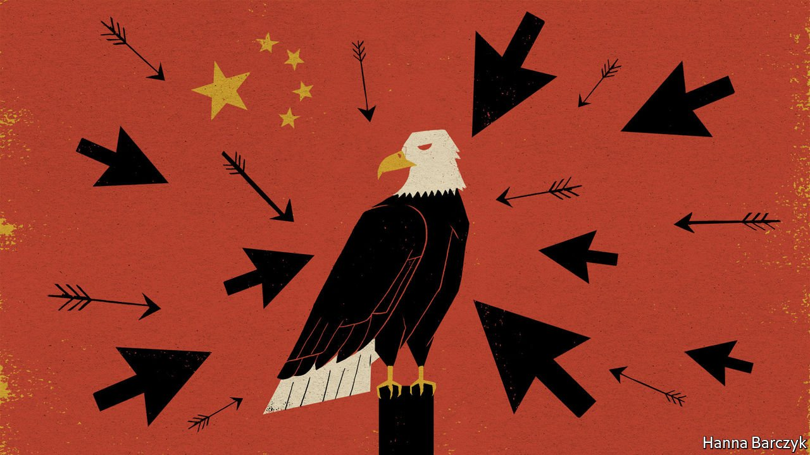

###### Ctrl-alt-denounce

# After failing to dissuade cyber-attacks, America looks to its friends for help 

##### Time to try collective defence 

 

> Jul 20th 2021 

BACK IN 2014 then-President Barack Obama tried to get serious about China’s  of American companies, which was already seen as a long-running problem. That year the Justice Department indicted, in absentia, five members of the People’s Liberation Army for hacking commercial secrets. A year later Mr Obama and Xi Jinping, China’s president, both pledged that their cyber-armies would lay off the private corporations and trade secrets of each other’s country.

That is not what happened. On July 19th the Biden administration identified China’s Ministry of State Security (MSS) as the perpetrator of an attack in March on Microsoft’s Exchange email server, giving China’s hackers access to tens of thousands of networks around the world. The administration also accused the MSS of contracting with criminal hackers who have conducted  attacks seeking millions of dollars, including “a large ransom request made to an American company”.


The government issued an advisory calling China’s hacking a “major threat” to the security of America and its allies. Unusually, America recruited those allies to admonish China by name, something they had been loth to do. NATO joined America for the first time in condemning China for state-sponsored hacking; the European Union, Britain, Canada, Japan, Australia and New Zealand issued statements calling on China to end such activity. (In one characteristic response, the Chinese embassy in New Zealand called the accusations a “malicious smear”.)

The tough words come without any sanctions like those imposed by America in April on Russia, after the administration accused a Russian intelligence agency of masterminding the SolarWinds hack that breached the networks of at least nine federal government agencies and more than 100 companies. In China’s case America could have sanctioned firms affiliated with the MSS, or those that have benefited from espionage. Perhaps it will yet do so.

Senior officials hope to persuade allies to join America in taking some form of action collectively, on the argument that unilateral steps have little effect on China's behaviour. Multiple indictments since the first in 2014 appear to have done nothing to slow China’s state-sponsored attacks. For all the attention devoted to the Taiwan Strait and trade tariffs, cyber-espionage may be the most active mode of conflict between China and America—and America’s allies—for years to come.


Administration officials offered few details about the recent attacks. But the federal government has made public two unrelated prosecutions that show a particular interest by China in maritime military know-how. On July 19th the Justice Department released an indictment, filed under seal in May, that charged three Chinese state-security agents and a computer hacker in absentia with conspiracy to commit economic espionage, documenting the hacking of American companies, universities and government institutions over seven years. Prosecutors allege the agents used a front company to disguise their connection to the Chinese government while stealing technology in fields ranging from Ebola research to submersibles. On July 16th a Chinese national was sentenced to three-and-a-half years in federal prison for his role in a conspiracy to illegally export “raiding craft” that can be launched from submarines and which use a special type of engine not manufactured in China.

Such prosecutions are becoming a regular occurrence. The Centre for Strategic and International Studies (CSIS), a Washington think-tank, has compiled a list of more than 150 publicly reported cases of Chinese espionage directed at America from 2000 to 2020. There were three times as many incidents in the second decade as in the first. The hackers often sought commercial or military technology.

“Cybersecurity is the arena for strategic conflict in the 21st century,” says James Lewis of CSIS. Joe Biden, he says, “takes it much more seriously than any of his predecessors”. Such defensive measures will probably represent the best course the Biden administration can take to slow the onslaught of state-sponsored hacks. Which is no guarantee it will work. ■

 This article has been corrected to clarify that three Chinese state security agents were charged in May. They, and a computer hacker, were charged with conspiracy to commit economic espionage, not economic espionage.

