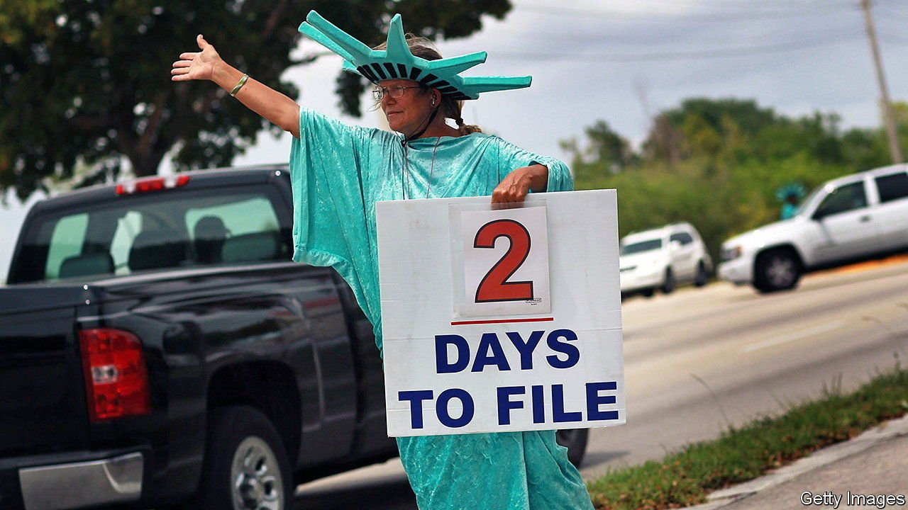

###### Seeking revenue

# Should the IRS be given more money to find money? 

##### Auditing a beleaguered agency 

 

> Jul 24th 2021 

WHAT IS THE most important financial entity in the United States? The Federal Reserve sets the beat of global financial markets with its interest-rate decisions. JP Morgan, a bank, has a $3.7trn balance sheet. Some argue the United States Mint could help circumvent the ceiling Congress sets on the national debt by minting a trillion-dollar coin.

And yet it is arguable that the crown belongs to the Internal Revenue Service (irs), whose massive $3.5trn in receipts is more than six times the revenues of the largest private company. Its ancillary assignments alone are vast, including the supervision of private pensions, determination of which institutions deserve tax-exempt status, and provision of payments for numerous government subsidies including $800bn in covid-19-related assistance paid to 160m people. All of these, despite their enormity, pale in comparison to its main assignment: collecting 95% of federal revenues.


For the 56% of American adults who pay taxes, the IRS serves as the primary face of the American government with a right to probe their most intimate financial affairs. It is a scrutiny that may become demonstrably sharper as the Biden administration, in search of revenue to fund large spending plans, wants more money to enhance the agency’s enforcement, in the hope of flushing out hidden troves.

Support for the effort comes from a report published in July 2020 by the Congressional Budget Office (CBO) estimating the “tax gap”—the difference between the amount owed and paid—between 2011 and 2013 to have been 14% of revenues. By adding $20bn over the next decade to enforcement (an annual increase of 40% over current levels), the CBO estimates collections would increase by $61bn. By adding $40bn, collections would increase by $103bn. Additional collections, the CBO posits, would come as the indirect consequence of potential avoiders understanding their increased risk of being caught.

 


Increasing funds for the IRS would be a turnabout from a decade-long freeze (see chart). In the intervening years, the number of employees in the IRS’s enforcement agency has dropped by 30%, audits of individual returns declined from 1.1% in 2010 to 0.6% in 2018, and audits of returns for incomes in excess of $1m have fallen from 12% to 3%. All this reflects a problem that extends beyond money lost. “Nothing is more destructive of respect for the government and the law of the land than passing laws which cannot be enforced”, Albert Einstein is reputed to have said.

Yet if the proposal faces opposition, it is not merely because of the threat of increased harassment by tax authorities, but also suspicion that the enhanced spending on a more intrusive agency may miss the cause of shortfalls. Taxpayers, according to the American Action Forum, a think-tank, spend on average 17 hours on preparation; more than half pay for professional help. Polling reliably finds that Americans dislike the process. Confusion looms.

Only 3% of the 85m calls to the primary assistance number for individuals baffled by their returns reached a person during the most recent tax year, says Nina Olson, a former IRS employee who now runs the Centre for Taxpayer Rights. Confidence in the IRS has been damaged by asking the agency to decide which groups should be tax-exempt, which quickly becomes political. A decade ago the IRS removed the tax-exempt status of various Tea Party groups. Lois Lerner, who headed the relevant IRS department, was held in contempt of Congress for refusing to answer questions about this. Then John Koskinen, a lawyer brought in by the Obama administration to run the agency after the scandal, was censured by Congress too.

Republicans seethed and many concluded that expanding enforcement activity was suicidal. In June IRS tax returns from some of America’s richest citizens were leaked to ProPublica, a group of investigative journalists, with the intention of influencing the debate over tax policy. The result was scintillating reading and a further blow to the agency’s neutrality.

Expectations are that the enforcement money will come from a spending bill passed by the Democrats along party lines. Better, perhaps, might be a broad reorganisation to peel off ancillary activities—and a simpler tax code. Neither of these things, however, is being discussed.■

