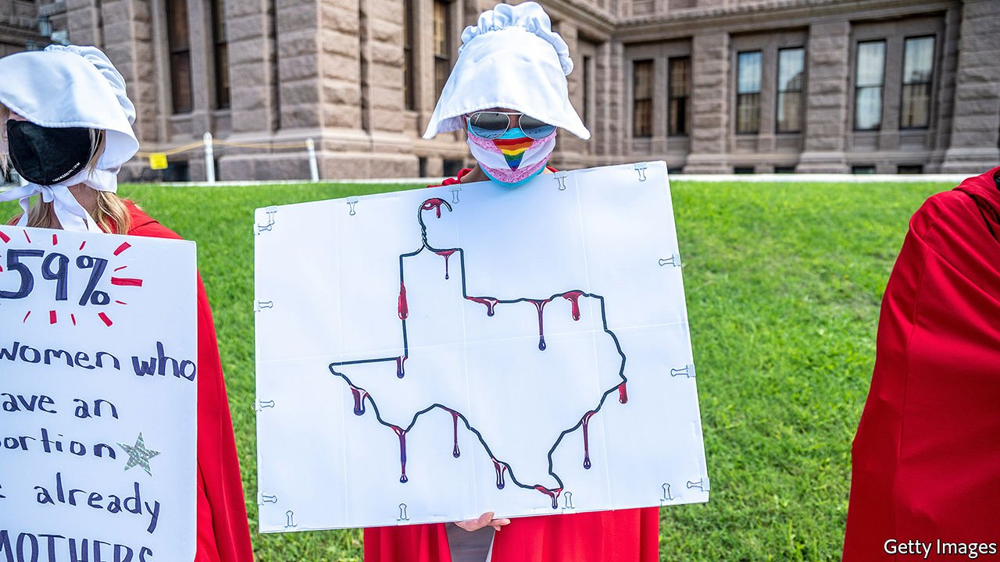

###### Lubbock or leave it

# Texas’s new proposal shows why abortion law is a mess in America 

##### The US combines some of the most libertarian abortion laws with some of the most restrictive practices 

 

> Jul 24th 2021 

IN THE HALF-CENTURY since the Supreme Court ruled on Roe v Wade, lawmakers in conservative states have passed hundreds of laws designed to make it harder for women to have abortions. None has been as punitive as the one recently passed in Texas. From September, unless it is blocked, the law will authorise private citizens to sue anyone who “aids or abets” the abortion of a fetus with a heartbeat, that is, from some six weeks’ gestation. For every case that is successful, it authorises “damages”—in effect a bounty—of $10,000.

The law could ensnare innumerable people, from employees of insurance companies to pregnancy counsellors and friends and relatives. A lawsuit that seeks to block the law, filed in a federal district court in Austin on July 13th by clinic operators and groups that help poor women pay for terminations, also includes pastors who worry that counselling a pregnant woman who then goes on to have an abortion could put them in legal jeopardy.


Early-abortion bans are straightforwardly unlawful. Roe and subsequent Supreme Court rulings say abortion on demand (that is, for any reason) should be accessible until a baby is viable (from around 24 weeks). Over the past couple of years, as around a dozen states have introduced “heartbeat” bills, courts have blocked them, sometimes within days.

But Texas’s new law has been designed to sidestep this process. Usually, opponents of laws that restrict abortion access sue state officials who would enforce them. Because Texas’s heartbeat law would be enforced by private civil action alone, there is no obvious party to sue. Instead, its challengers are suing a broad range of defendants who could be involved in enforcement, including trial judges, county clerks and health officials.

It is not clear how this legal strategy will work. Julie Murray, a lawyer with Planned Parenthood, the biggest provider of abortions in America, says it is hard to imagine federal judges allowing an unconstitutional law to take effect. Some clinic operators say they worry that, for a court to block it, they will have to wait until the law comes into force and someone sues.

In the meantime, they say, the law is causing great distress. Amy Hagstrom Miller, the founder and chief executive of Whole Women’s Health, which runs four abortion clinics in Texas, says staff are having to reassure patients that abortion is still legal in the state. The workers themselves are terrified, she adds, that from September they could be sued for doing their jobs. People who work in clinics do not find it difficult to imagine protesters who yell at women as they arrive for abortions turning into furious litigators.

Most Texans, like most Americans, do not want to ban abortions early in pregnancy. Few, presumably, would want to see this right shot down via private lawsuit. That a law encouraging such a thing should have been passed reflects in part the rightward lurch taken by Texas’s legislature. It also suggests that as the state becomes younger and more liberal there remain pockets of strong support for extreme anti-abortion measures. In May voters in Lubbock, a city in a solidly Republican county, approved a “sanctuary city for the unborn” ordinance giving individuals the ability to sue to enforce an abortion ban. In June, after Planned Parenthood, which has a clinic in Lubbock, sued, a federal judge dismissed the case. Planned Parenthood has since stopped performing abortions in the city. It continues to litigate the case.

Texas’s new law is also part of a mounting push to impose stringent abortion restrictions across America. Emboldened by the Supreme Court’s conservative super-majority, which seems more likely to uphold restrictive abortion regulations, pro-life lawmakers have passed a record number so far this year. The Guttmacher Institute, an abortion-rights group that tracks state-level regulations, says 90 abortion restrictions have come into force in the first six months of 2021, compared with the previous record of 89 in the whole of 2011.

The result of all this is a broken system. America has one of the most permissive national abortion laws in the world: of 59 countries that allow abortion on demand, it is one of only seven that allow it after 20 weeks of pregnancy. Yet six states have only one clinic left and in a handful more women must travel hundreds of miles to find a clinic. This seems to intensify polarisation on the issue. Pro-life activists, who believe abortion is murder, focus on the regulations that the courts did not uphold. “People are frustrated…they’re trying to show the courts they’ve had enough,” says Joe Pojman, founder of Texas Alliance for Life. Abortion-rights activists and progressive lawmakers, meanwhile, are pushing hard in the opposite direction. At least seven states now have no laws governing when or for what reason a woman may have an abortion.

Meanwhile, campaigners on both sides are watching the Supreme Court. In May it said it would review a law in Mississippi that would ban most abortions after 15 weeks of pregnancy and examine whether “all pre-viability prohibitions on elective abortions are unconstitutional”. This suggests the court could substantially weaken Roe. If it does, it could be up to states to make their own laws: days after the justices’ announcement, Texas passed a law that would ban all abortions if that happened. It is one of more than ten states to have such a “trigger law”. Whatever the court decides, the gulf between conservative and progressive states seems certain to widen. ■

