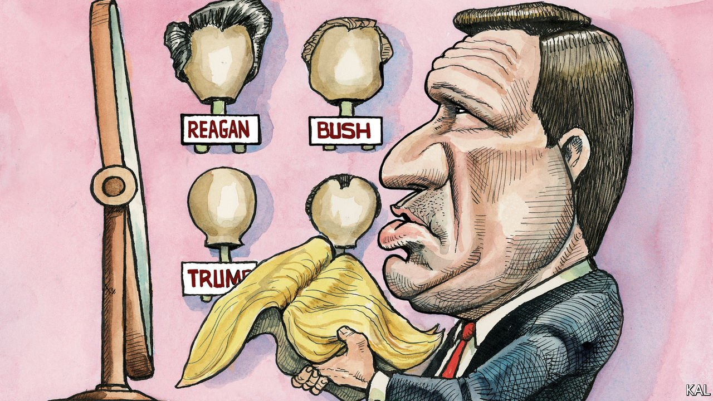

###### Lexington

# The rise of Ron DeSantis 

##### Florida’s governor offers a more efficient style of Trumpism. That does not seem reassuring 

 

> Jul 24th 2021 

RONALD REAGAN’s tub-thumper for Barry Goldwater in 1964, Barack Obama’s silky-smooth Democratic Convention speech of 2004: the political annals are replete with moments when a significant new talent announced itself. Could it be that in February Ron DeSantis of Florida produced another? The scene was a press conference in Tallahassee. The subject under discussion was the Republican governor’s view that conservatives are discriminated against by social and mainstream media companies. Don’t say it isn’t so, he told the assembled reporters: “You can whiz on my leg, but don’t tell me it’s raining.”

Mr DeSantis’s phrase, now available on a range of conservative merchandise, expressed the dominant Republican view of big tech and the media: both knowing and dismissive. And he was able to utter it with rare authority. Mr DeSantis, who is second only to Donald Trump in popularity among Republicans, owes his rise not only to his record of sticking it to the liberal media but also, more impressively, to his knack of being vindicated almost whenever he has done so.


Having entered the Republican gubernatorial primary as a little-known House member, he launched a campaign so sycophantically pro-Trump that he became a figure of fun for the national media. He proceeded to win the former president’s endorsement and the primary. That put him in a fight against Andrew Gillum which the polls gave him little chance of winning, especially after he was accused of making a racist dig at his black opponent. He denied the charge and won that one, too. Whereupon, instead of becoming the divisive, ineffective governor he was predicted to be (including by some of his former congressional colleagues), he swung amenably to the centre. He raised teachers’ salaries, launched an effort to protect the Everglades, took a relaxed view of medical marijuana—and watched his ratings climb. When covid-19 struck last year, Mr DeSantis was one of the most popular governors in the country, an impressive feat in one of America’s most polarised states.

His management of the pandemic has since cost him much of his non-Republican support. Defying the public-health experts in his own administration, he refused to introduce a state-wide mask mandate and, after an initial month-long lockdown, pushed for Florida’s businesses and schools to get back to normal even as the virus raged through the state. Retreating into a kitchen cabinet dominated by his chief-of-staff and his wife, Casey DeSantis, a popular former television journalist who oozes the charisma that the bullocking governor lacks, he was said to have shunned the experts entirely. He was widely criticised (including in this column). Yet it must be acknowledged that, again bucking his critics, he got most of the big calls right.

He did a better job of protecting care-homes than several of his media-beloved Democratic counterparts, including Andrew Cuomo of New York. He was dead right on schools. The mask mandates imposed by Florida’s local authorities largely compensated for his own reticence on the issue. No doubt Florida’s outdoors lifestyle helped, too. Yet the net result is a death toll that puts the state in the middle of the national pack and, after the haranguing Mr DeSantis received, this has been interpreted on the right as his greatest, media-crushing vindication yet. “It’s cocaine to the base,” says a grudging Republican admirer of the governor. In the event that Mr Trump does not run for re-election in 2024, 40% of Republicans say they would pick Mr DeSantis instead.

This has got conservative donors excited. Many loathe Mr Trump but fear that their preferred alternatives—including Mike Pence, Nikki Haley or just about anyone—could not retain the former president’s diehard followers. Mr DeSantis, whose presidential ambition is no secret, is the first alternative to hint that he could. His name is being cheered raucously at right-wing populist gatherings even as Mr Pence’s is jeered and the politically discombobulated Ms Haley goes unmentioned. If—as that and much else suggests—conservatives are still committed to Trump-style populism, Republican elites are beginning to hope that Mr DeSantis might be the man to smooth its rougher edges.

That at least seems plausible. His string of unheralded successes suggests he is an astute politician. He is plainly intelligent. Most of the right’s faux populists (a group that also includes Tom Cotton, Ted Cruz, Josh Hawley and the debutant J.D. Vance) are alumni of Harvard or Yale; Mr DeSantis has degrees from both. Admiring former acolytes of the governor (a small band—he has a reputation for being beastly to his staff) say he made his decisions on the pandemic after immersing himself in public-health policy, as well as politics. He would surely be better than Mr Trump.

A less optimistic Republican Ronald

That is setting the bar pretty low, however. And the beguiling idea of Mr DeSantis as a shy pragmatist and secret wonk could also soon seem out-of-date. An anti-government wrecker in the House, turned Trump populist, turned moderate governor, whose re-election campaign is now hawking “Don’t Fauci my Florida” mugs, the governor appears to have no firm convictions of any kind. This makes it hard to imagine him channelling the wild enthusiasms of Mr Trump’s supporters in a productive way.

Indeed, the closer he gets to national power, the more he is pandering to them. He has in recent months engineered a series of dire state laws, including bans on mask mandates, vaccine passports, critical race theory, the right of social media companies to suspend politicians and certain kinds of political protest. It remains to be seen how many of these measures will survive legal scrutiny. But even if none does, they constitute the record he wants to run on. The governor is an able politician and so far a winning one. But his rise does not augur an improved version of Trump populism so much as its triumph.■

