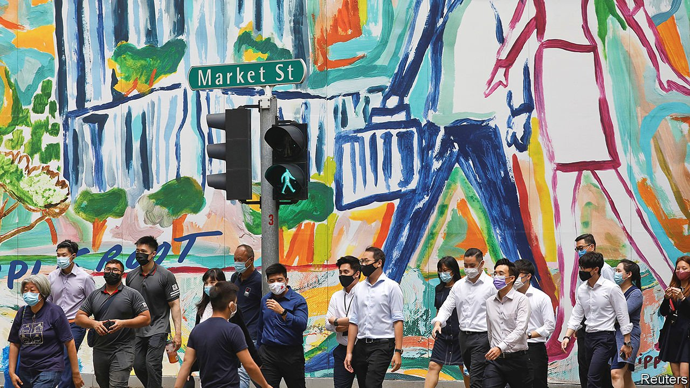

###### Imperfect harmony

# Racial prejudice rears its head in Singapore 

##### The city state is less racially harmonious than its government likes to think 

 

> Jul 29th 2021 

DAVE PARKASH and his girlfriend were strolling down the street one evening in June when an irate man accosted them. Tan Boon Lee accused Mr Parkash of “preying” on his girlfriend, whom Mr Tan, a Chinese-Singaporean, believed was also Chinese, unlike Mr Parkash, who is ethnic Indian-Filipino. He urged the couple to date “people of our own race”. A video of the confrontation went viral and made Singaporeans uneasy. For the country is diverse—nearly three-quarters of Singapore’s residents are ethnic Chinese, 13.5% are Malay, and 9% Indian. It prides itself on how well everybody gets along.

Yet over the past few months several racist incidents have seized public attention. The rising tide of ugliness has provoked a reckoning over race—until recently a taboo subject—which has penetrated even the halls of power. After the episode involving Mr Parkash, a cabinet minister said he was “not so sure any more” that Singapore is “moving in the right direction on racial tolerance and harmony”.


His comment caused a stir. The ruling party sees itself as the guardian of “racial harmony”. It stepped into that role in the 1960s, when deadly riots pitting Chinese against Malays threatened to destabilise the fledgling nation. The city-state’s founding fathers became convinced that they must intervene to defuse tensions. They criminalised racism and anything that would stir up hatred between the races, and designated Chinese, Tamil, English and Malay the four official languages.

They also began funnelling Singaporeans into four categories: Chinese, Malay, Indian or “Other”, depending on the race of their parents. The government was worried about racial enclaves forming in public housing, where some 80% of Singaporeans live. This classification system enabled it to set ethnic quotas in public housing and calibrate the racial make-up of Parliament and even, by controlling immigration, society as a whole.

On one level, the government’s assiduous management of race relations has worked. Racial violence is rare; so too is overt discrimination. Nine in ten Singaporeans surveyed in 2018 by the Institute of Policy Studies, a local think-tank, reported that the level of racial harmony in the city-state was moderate to very high.

Yet tensions between the races have simmered for decades. Chinese chauvinism has deep roots in Singapore, watered by Lee Kuan Yew, Singapore’s first prime minister who remained influential until his death in 2015. He believed that Chinese were physically and mentally superior to Indians and Malays. He tried to make Chinese Singaporeans more Chinese, by encouraging people to speak Mandarin and insisting all ethnic Chinese study it at school (though almost all their parents spoke other dialects as their first language). The government opened numerous elite Chinese-medium schools, which were given much more government funding than other public schools. Mr Lee’s Sinicisation programme was intended for ethnic Chinese, but minorities felt pressure to espouse “Chinese” values too, according to Michael Barr, a historian of Singapore.

His successors tread more carefully. Yet they have sustained Chinese privilege. All three prime ministers since independence have been Chinese, and in 2019 a leading politician insisted that is unlikely to change because, he said, older generations are not ready for an ethnic-minority prime minister. The government regulates immigration to ensure that the racial make-up remains stable, which has the effect of maintaining ethnic-Chinese dominance.

For generations, Chinese Singaporeans have been told that they are special, says Mr Barr. “That element has been internalised by a lot of people,” including minorities. Sharvesh Leatchmanan, a 24-year-old student and co-founder of Minority Voices, a website, is ethnic Tamil but grew up wishing he were Chinese. “I changed the way I spoke, I changed the way I dressed, I never had Indian friends, I never spoke Tamil,” he says. He would tell new friends he was mixed-race “so I could say I was ethnically ambiguous, to be included”.

Mr Leatchmanan’s discomfort in his own skin stemmed in part from his experience of being discriminated against as a Tamil. Many minorities say they are treated unfairly. Almost half of Indians and a third of Malays surveyed in 2019 said they faced discrimination when renting a property. More than a third of Malays and Indians polled in 2018 encountered prejudice at work “sometimes” or “often”. Job adverts often solicit applications exclusively from people who speak Mandarin.

Malays, in particular, are marginalised. According to the census of 2020, just 11% went to university, compared with 35% of Chinese and 41% of Indians. The median Malay household income is S$5,700 ($4,200), compared with S$8,000 for Chinese and S$8,500 for Indians.

Stereotypes of Malays as lazy may play a role. In 2019 Peter Chew of James Cook University found that Chinese Singaporean undergraduates rated Malay job applicants as less competent than equally qualified Chinese applicants, and recommended lower salaries. Mr Lee believed that racial differences in performance at school were genetic—an attitude that has lingered, writes Cherian George, a Singaporean scholar at Hong Kong Baptist University.

The government admits that racial harmony is a work in progress but insists that it has protected minorities and improved their lot in life. They are guaranteed representation in Parliament and, periodically, the largely ceremonial presidency (the current occupant, Halimah Yacob, is of Indian and Malay descent). “Self-help” organisations—one for each race—assist needy members of their communities; these groups are chaired by cabinet ministers and partially funded by the government (the rest is paid with contributions automatically deducted from the monthly salaries of working adults). The current soul-searching over racism in itself is a sign of progress; such discussion was verboten until recently.

However, enthusiasm for celebrating cultural differences sometimes wanes where Malays are concerned. Malays share the same ethnicity and religion (Islam) as the majority races in Malaysia and Indonesia, neighbours with whom Singapore has sometimes had testy relations. Until 1977 Malays were excluded from serving in the military because Mr Lee doubted that their loyalty could be relied upon should they fight a war against Malaysia. Today Muslim women in certain public-sector jobs are not allowed to wear headscarves, though Sikh men in the same roles can wear turbans. A Malay-Muslim nurse wonders why this kind of discrimination is needed. She suffers spiritual turmoil each time she removes her veil before starting a shift: “I try to reassure myself that I’m not doing something wrong.”

Far from soothing racial inflammations, the government’s methods may exacerbate them. It is not just that its policies put Chinese on a pedestal. The racial classification system “encourages us to think along those communitarian lines,” says Laavanya Kathiravelu, a sociologist. The nurse, for example, sees herself not as Singaporean but as Malay. In a country where minorities feel belittled by the majority, that’s a recipe for discord, not harmony. ■

