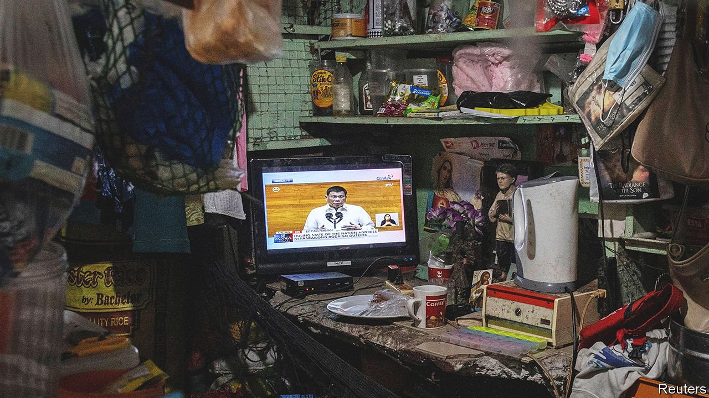

###### Going, but not yet gone

# Rodrigo Duterte hopes to outlast his term as Philippine president 

##### He stands down next year, but will be no lame duck waddling quietly off 

 

> Jul 26th 2021 

RODRIGO DUTERTE seemed determined not to appear like a man about to retire. “This is by no means my swansong,” the Philippine president told Congress in his final speech on the state of the nation on July 26th, presenting legislators with a list of laws to pass in the remaining 11 months of his six-year term.

Despite his protestations, the president may struggle to prevent a descent into lame-duckery. Opinion surveys indicate that the tough-talking Mr Duterte is the most popular president since the overthrow in 1986 of the despotic Ferdinand Marcos. But if legislators come to believe that he will retire once his successor is elected next year, his authority may quickly evaporate. To retain it, Mr Duterte needs to show that he will somehow still wield political influence once he has left the presidential palace. That may require some Marcos-style scheming.


There are four areas in which Mr Duterte must consolidate his influence. Grappling with a looming third wave of covid-19 and ensuring that Filipinos can return to work and to school will require persistence from his government as well as the next one. Jihadists affiliated with Islamic State, pushed back after they seized the southern city of Marawi in 2017, must be kept at bay. In the South China Sea he must curb Chinese encroachment on Philippine claims without risking a suicidal conflict. And he must ensure that he remains shielded from legal consequences for the killing of thousands of Filipinos in his campaign against the trade in illegal drugs.

Mr Duterte’s main source of power has been his popularity. The Philippine constitution, drafted in 1986 with a view to preventing a despot in the Marcos mould from ever again clinging to power, limits the presidency to one term. But it failed to restore the two-party system that Marcos demolished. Today weak political parties tend to coalesce not around sets of policies, which stir little debate, but around leaders with vivid personalities, who win elections. Thus Mr Duterte’s Partido Demokratiko Pilipino-Lakas ng Bayan (“people’s power”) is at the centre of a loose pro-government coalition which dominates Congress because voters like Mr Duterte’s tough-guy act. Lawmakers expect their support for him to benefit them at the ballot box.

This arrangement is in danger of fraying in Mr Duterte’s final year as president. Members of Congress, unlike the president, can serve more than one term. Many will switch their allegiance to whichever candidate shows a personality compelling enough to win the next election. One way to maintain political influence might have been for Mr Duterte to get Congress to change the constitution. But his attempt to have the unitary state replaced with a federation was frustrated by lawmakers, who suspected that his real purpose was to extend his grip on power.

Mr Duterte could enlist his daughter, Sara Duterte, mayor of his home town in the south, to run for president. An early opinion poll indicated that she would win more votes than any other presumed candidate. She says she will consider running. Although Mr Duterte has officially expressed disapproval, his spokesman has said that he secretly approves.

Alternatively, Mr Duterte could run for the vice-presidency, as he has said he plans to, possibly in the hope that holding the office would give him immunity from prosecution for the killings in his war against the drug trade. The vice-president has no function unless the president resigns, dies or becomes incapacitated. But sympathetic top dogs sometimes throw their deputies a bone in the form of a more substantial government job.

Mr Duterte’s best bet, however, may be to endorse whomever he expects to succeed him as president, in the hope that his own popularity would give that candidate a boost. If the ploy worked, Mr Duterte might have the ear of the new president.

For any of these strategies to succeed, voters must elect a presidential candidate amenable to the influence of Mr Duterte. There is no guarantee that they will. Even if they do, the new president may turn out to be less friendly than Mr Duterte may hope. Either way, it is safe to assume that he will not waddle off quietly. ■

