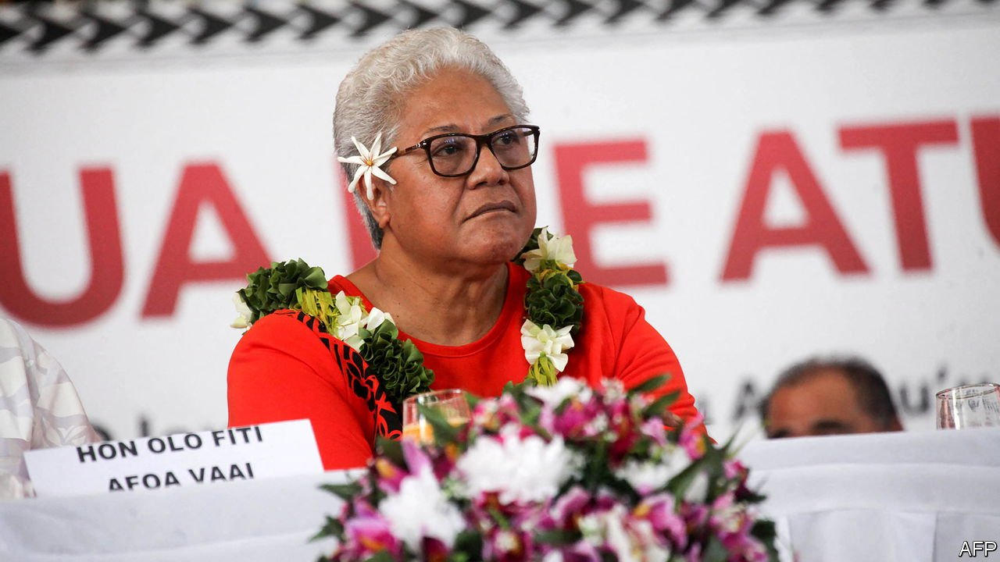

###### Slow ride to FAST rule

# Samoa’s rightful government takes office at last 

##### The incumbent prime minister concedes defeat three and a half months after losing an election 

 

> Jul 31st 2021 

IT TOOK THREE and a half months and a constitutional crisis, but Samoa at last has its first change of governing party in 33 years, as well as its first female prime minister. On July 23rd the country’s court of appeal ruled that Fiame Naomi Mata’afa’s FAST party, which narrowly won an election in April, was the legitimate government of Samoa, an island nation of 200,000 people 2,900 km north-east of New Zealand. The judges emphatically rejected the protracted efforts by Tuilaepa Sailele Malielegaoi, the outgoing prime minister, and the O le Ao o le Malo, Samoa’s head of state, to thwart the election outcome. On July 26th Mr Tuilaepa at last conceded defeat.

That the saga has at last ended and the opposition has been able to form a government is no thanks to him, but to the judiciary, one of the few state institutions that he had not managed to compromise during his lengthy stint in office. In power since 1988, Mr Tuilaepa’s Human Rights Protection Party (HRPP) had become too accustomed to the trappings of government. So had Mr Tuilaepa himself, who had been prime minister since 1998 and claimed to have been chosen by God.


His purported divine mandate inspired him to dominate vast parts of the state apparatus, as is apparent from the number of institutions affected by recent court rulings. After Mr Tuilaepa’s party lost the election in April, the electoral commissioner sought to manufacture an extra parliamentary seat for the HRPP by arguing that the composition of Parliament failed to meet the country’s minimum 10% quota for women legislators. The attempt was declared unlawful by the Supreme Court. When the former speaker locked the doors of Parliament in May to prevent the new government from being sworn in, he too was rebuked by the court.

The O le Ao o le Malo at first obeyed a court order to call Parliament to sit, but then revoked it for reasons he never explained. He has belatedly accepted the new government, but still maintains that the judges usurped his role in convening Parliament. The judges point out that the O le Ao o le Malo forfeited those powers after failing to do so within 45 days after a general election, as the constitution requires.

The new administration faces several immediate challenges. For a start, the prime minister needs an emergency budget to replace the potentially unlawful one passed by the caretaker administration in June. Ms Mata’afa has suggested a constitutional review to close some of the loopholes exposed by the recent political crisis. She resigned as deputy prime minister, left the HRPP and joined the new FAST party as its leader because of a schism in the HRPP caused by disagreement over proposed legal changes curbing the power of the Supreme Court. These reforms are now likely to be ditched. Plans for a $100m port paid for by China but disliked by Australia will probably be shelved as well.

Other changes may prove trickier. Ms Mata’afa may be inclined to remove the deeply compromised O le Ao o le Malo from office. He can potentially be dislodged by Parliament, though it may be easier to allow him to serve out his first five-year term, which expires in 2022. Even then, replacing him would be a delicate matter, as he is the holder of one of Samoa’s four much-venerated paramount Tama a ‘Agai chiefly titles. It may help that Ms Mata’afa holds one, too.

Ms Mata’afa is likely to reinforce Samoa’s close relations with New Zealand and Australia and remain a strong advocate for the rule of law. But those who expect radical change are likely to be disappointed. Despite her recent switch to the opposition, the new prime minister spent many years as a loyal HRPP politician, and five years as Mr Tuilaepa’s deputy.

Still, she won partly thanks to spirited campaigning by the Congregational Christian Church of Samoa on behalf of the opposition. On the off-chance that she feels imbued with a divine mandate, she may be inclined to interpret it less expansively than her predecessor did. ■

