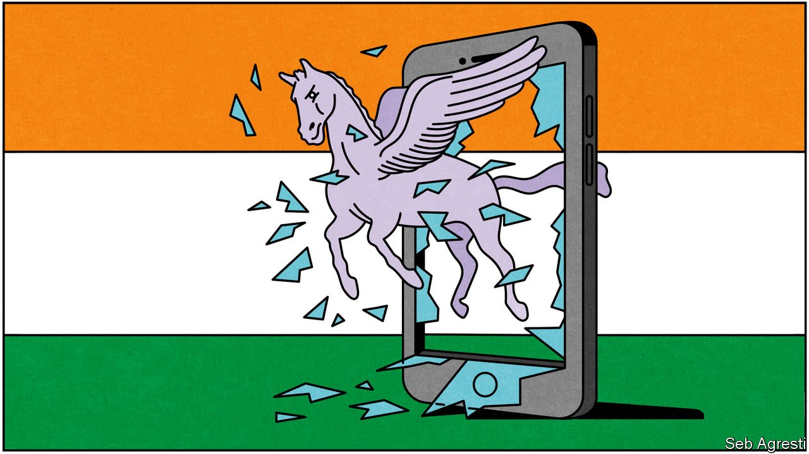

###### Seven-headed scandal

# The Pegasus revelations cast doubt on the health of Indian democracy 

##### The inclusion of prominent critics on a list of hacking targets embarrasses the government 

 

> Jul 31st 2021 

IN ANCIENT HINDU lore a winged horse emerges from the milky churn of primeval oceans to become the trusted mount of Indra, king of the heavens. A later tradition says it was instead Mahabali, lord of the demons, who rode the fabulous stallion. Both versions picture a creature strikingly like Pegasus, the flying horse of Greek myth, except that the Indian model is fancier. It sports not one but seven heads.

Contemporary India’s most powerful men could have used those extra heads. Relying on Pegasus—not the mythical horse but a very modern brand of electronic spyware—they seem to have ridden recklessly into danger. A global investigation by a clutch of newspapers and NGOs, triggered by the leak of some 50,000 phone numbers in ten countries, casts the government of Narendra Modi in an ugly light as a presumed client of Pegasus’s Israeli creator, the NSO Group.


The evidence strongly suggests that Indian spooks may have slipped the eavesdropping software into the mobile phones of hundreds of unsuspecting fellow citizens. The problem is not just that the government may have broken Indian law to do so, or that it may have used the tool to pry on intimate private relations. Most disturbing, if true, is the choice of targets.

The leaked Pegasus file contains some 1,000 Indian numbers, around 150 of which have so far been identified. Only a handful belong to people who might conceivably endanger the state, such as activists in ethnic separatist groups. The list includes numbers used by some 40 journalists who share nothing but a critical stance towards Mr Modi’s government. Some belong to Rahul Gandhi, leader of the opposition Congress party, and his personal friends. Others belong to a political consultant credited with state-level wins against Mr Modi’s Bharatiya Janata party (BJP), and to a former top election official who had recommended penalising Mr Modi for flouting rules during the 2019 general election, as well as to members of his family. Figures from inside the government may have been targeted, too, among them at least two BJP ministers, senior civil servants and a number of senior security officers.

In another democracy, such a scandal could topple a government. Richard Nixon was disgraced for transgressions that are puny compared with what Pegasus is capable of and may already have been used for. But in Mr Modi’s India things are not so simple.

For sure, the liberal commentariat has erupted in predictable outrage, decrying the alleged snooping as a further lurch into dictatorship. Congress wants Amit Shah, the home minister, to resign. United for a change, opposition MPs have disrupted the lower house of Parliament for more than a week with calls for a debate and an investigation of Pegasus. Petitions have been submitted to the Supreme Court demanding an inquiry. One opposition-ruled state, West Bengal, has opened one of its own.

But the government, snug in its parliamentary majority, has so far refused any debate. Mr Modi as usual remains aloof, leaving it to spokesmen to deny any link to Pegasus. BJP attack dogs dismiss the affair as a malicious hoax. Most of India’s press, beholden in one way or another to government influence, has obediently played the story down.

No wonder they stayed in line. Dainik Bhaskar is a media group with newspapers widely read in the Hindi-speaking heartlands where the BJP dominates and which have recently been critical of the government’s handling of covid-19. After they put the scandal on the front page, tax inspectors raided the company.

Perhaps, as so often in Mr Modi’s seven-year tenure, cries for accountability will be drowned in India’s turbulent public life. Attention has indeed already shifted to new dramas, such as a land dispute between two BJP-ruled states that erupted into shooting on July 26th, leaving five policemen dead. But it would be sad for India to miss this chance to patch some of the holes in its democracy.

India’s spooks have operated behind an unusually thick veil of secrecy since long before Mr Modi began to gather undue executive powers. The Intelligence Bureau, one of several security agencies, was created in 1887 to snuff out opposition to the British Raj. Its functions seem to have scarcely changed. It is cocooned from democratic oversight.

Alas, in the age of Mr Modi, to call for greater public scrutiny, if only by empowering a parliamentary committee to monitor intelligence officials, seems as fanciful as to dream of winged horses.

