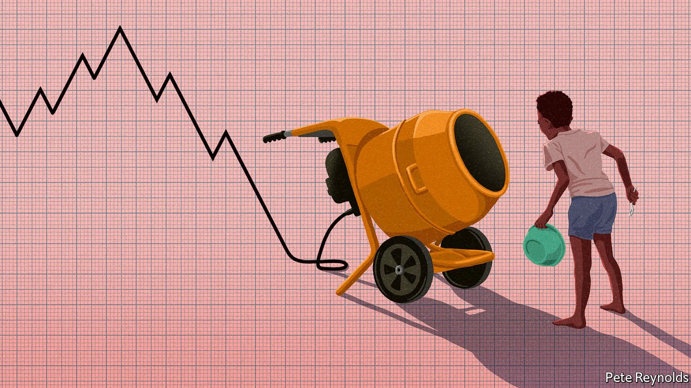

###### A mixed-up slowdown

# The prospects for developing countries are not what they once were 

##### Twenty years on, growth in the BRICs has slowed 

 

> Jul 31st 2021 

IN 2000 THIS newspaper wrote that “the most pressing moral, political and economic issue of our time is third-world poverty.” At the time, 28% of the world’s population lived in extreme poverty, which is to say on incomes of $1.90 a day or less. Nearly one billion of those 1.7bn people lived in India and China.

Just a year later, Jim O’Neill, then the chief economist for Goldman Sachs, a bank, grouped those two countries, along with Brazil and Russia, into one of the defining acronyms of the 2000s: the BRICs. Though at the time the quartet accounted for only 8% of global economic output, Mr O’Neill argued that, given their population, even modest growth in their output per person would increase that share significantly, and that such growth looked likely. Investors were urged to take note. So were policymakers.


By 2003 Goldman Sachs’s researchers were forecasting that the BRIC economies would, by 2025, have a combined GDP at least half that of the G6 (America, Britain, France, Germany, Italy and Japan). By 2040 they expected the BRICs to have pulled ahead. A dramatically different world was on its way, one in which the big emerging economies had pretty much caught up with the developed economies of the North in economic heft if not in terms of income per person.

The first prediction was too conservative. From 2000 to 2011, the BRICs grew on average by a startling 17% per year, in nominal US dollars at market-exchange rates, while the G6 grew at just 4%. They reached half the G6’s GDP by 2017, not 2025. In 2021, the IMF projects, BRIC GDP will be worth about 57% of the G6’s (see chart 1). Last year China announced that it had eradicated extreme poverty. As of 2018 the number of people living in extreme poverty in India had fallen below the estimated 99m people living in extreme poverty in Nigeria. It is a historic achievement.

 


The 2040 prediction looks more troubled. Growth in advanced economies and developing ones slowed a lot in the 2010s. From 2011 to 2019, G6 growth fell by more than half to below 2% per year. Growth across the BRICs, on the other hand, dropped by nearly 70%, to just 5% per year.

The picture across other low- and middle-income countries looks broadly similar. From 2000 to 2011, the weighted average annual growth rate of GDP, in US dollar terms, was a robust 9% for emerging economies when the BRICs were excluded. Real income per person in developing countries as a fraction of real incomes in America (generally considered the ne plus ultra in economics) was 12.1% in 2001. By 2011 it was almost half again as much: 17.8% (see chart 2).

 


But by the time that measure reached its peak—18.4% in 2013—incomes in the Middle East, Central Asia and Latin America were already in decline relative to those in the United States. By the next year incomes in Africa were dropping further behind those in America, too. Only South and East Asia and the emerging parts of Europe have kept gaining on American incomes. For the developing world as a whole, real income per person has fallen back to 18.1% of what it is in America; not a terrible reverse, but definitely a stagnation.

Playing catch-up

The 2010s were hardly a terrible decade. Indeed in terms of emerging-market growth they were the second-best decade in history. The problem is that the 2000s were so much better. In terms of the impact on human lives, there can be few bigger questions than whether growth in the 2020s will return to the heights of the startling 2000s, hang around the levels seen in the adequate 2010s, or continue its downward trend. Such a trajectory would make talk of any significant part of the developing world “catching up” with the advanced economies look increasingly foolish.

Economists once thought that poorer countries ought naturally to catch up with richer ones. Becoming rich seemed little more than a matter of borrowing technologies from more mature economies and equipping workers with more capital, of both the physical and human sort.

Yet in the aftermath of the second world war joining the ranks of the rich was revealed to be harder for the previously colonised world than had been thought. Investors occasionally grew enthusiastic about the prospects for poorer countries, as in 1981, when a World Bank employee named Antoine van Agtmael coined “emerging markets” as an eye- (and money-)catching name for a new third-world investment fund. But only a few countries made the leap from poor to rich over the latter decades of the 20th century: a South Korea here and a Taiwan there.

It was against this background that the rise of the BRICs seemed truly startling. But it was hardly an overnight success. In the late 1970s China began a long process of economic liberalisation; India started relaxing state control over its economy in 1991. Debt and financial crises which had dealt devastating setbacks to growth from the 1970s saw a broad-based shift in policy across the developing world towards what is often referred to as the “Washington consensus”: becoming more open to trade and keeping government borrowing and inflation in check.

To this already healthy soil three further fertilisers were added. One was the arrival of persistently low interest rates and globalised finance, which provided a lot of money willing to seek out opportunities in emerging markets judged to be more stable than they had been. Another was a broad and sustained rise in commodity prices, which boosted the fortunes of many developing-world economies.

The third was explosive growth in trade. Manufacturing for export, a time-tested route to catching up, had once required the slow and difficult process of building up an indigenous industrial base. But as production processes once contained within a single plant or country spread out along global supply chains it became possible for poorer economies to begin producing for export by grabbing hold of small pieces of production networks, rather than recapitulating everything.

As a share of global GDP, trade rose from 39% in 1990 to 51% in 2000, eventually reaching a peak of 61% in 2008. China, through which most of the new supply chains ran, saw its share of global exports rise from about 2% to 9% over the same period. Its share of global GDP rose from 4% to 12%.

The added effects of two of the three fertilisers, the commodities boom and the boom in trade, both wore off in the 2010s. The IMF’s index of commodity prices roughly tripled from 2000 to 2011. After that it began to fall, and in doing so exposed those economies which had enjoyed a superficial boom built on higher prices for their resource exports and easy credit.

 


Trade growth also slowed. Having recovered encouragingly after the global financial crisis of 2007-09, in the mid 2010s trade began to decline slightly as a share of global GDP (see chart 3). There were a number of reasons for this, but an important one was a decisive shift in Chinese policy. The pace of reform slackened; state intervention increased as the government made a push for self-sufficiency.

Slowdown boat to China

The Communist Party’s interest in reducing the role of state-owned enterprises, key to the dramatic increase in the size and importance of privately owned firms during the boom years, waned in the 2010s. Such firms generate lower returns on their assets than their private cousins while carrying higher levels of debt.

China’s failure to go on liberalising has slowed traffic on the most desirable path to development for the rest of the emerging world. If China had grown more and its consumption patterns had converged with those of advanced economies it would have become an ever greater market for other developing countries. But insufficient reform has also left consumption well short of the level common in economies with comparable incomes (like Mexico and Thailand), to say nothing of those in the rich world.

China’s domestic market, while still enormous, is thus substantially less massive than it might have been, and its imports a lot less than they could have been. To exacerbate matters China remains much more dependent on manufacturing than many comparably rich economies. Countries typically begin to shed some industrial production as incomes rise and producers seek out low-wage workers elsewhere. But China has resisted this trend, thanks partly to its stalled progress on reform and partly to a deliberate effort to become more self-sufficient.

An analysis by Shoumitro Chatterjee of Pennsylvania State University and Arvind Subramanian of the Centre for Global Development notes that, though China has not given up ground in terms of manufacturing exports in aggregate, it has ceded some market space in particularly labour-intensive manufacturing industries such as production of footwear, clothing and furniture. And yet its losses have, on the whole, been quite small, and have led to limited and concentrated gains in export-market share for other economies. China’s share of global footwear exports declined from 40% to 32.5% between 2008 and 2018, for example; Vietnam—the biggest beneficiary of changes in China’s export profile—captured 5.9 of the 7.5 percentage points in export space vacated by China.

China’s failure to import manufactured goods on the scale that might have been expected exacerbates what Dani Rodrik of Harvard University has dubbed premature de-industrialisation. Producing goods for export no longer seems able to propel a developing economy as far down the road towards rich-world incomes as was once the case. Low Chinese demand is far from the only factor. Greater manufacturing productivity has pushed the global price of manufactured goods down. It is increasingly common for even low-income countries to import them rather than learn to make them for others.

Very poor countries in Africa could still enjoy a big boost to productivity and incomes by increasing the role of manufacturing in their economies. But as Mr Subramanian notes, the development of machines which can handle ever more of the tasks now done by human workers at ever lower costs cannot help but limit the scope for convergence via industrialisation.

With the boosting effects of commodity prices and trade growth in abeyance, what of the third factor that kicked off the glory years of the 2000s: interest rates? They remain low. But a post-covid-19 rich-world boom, which would in general be a good thing for developing countries, carries some risks on that front. Some economists warn that big spending in America threatens to unleash inflation in a way which could force the Federal Reserve to raise interest rates earlier, and perhaps more sharply, than currently expected. The spread of high interest rates could wreak havoc, leading to crashing asset prices and drawing a lot of capital away from the emerging world.

Even a modest rise in American interest rates in coming years, prompted by healthy growth and falling unemployment, could catch out some overstretched governments, much as the Fed’s decision to stop stimulating the economy by buying assets led to acute discomfort for a “fragile five” nations (Brazil, India, Indonesia, South Africa and Turkey) in 2013.

But for now the risk of calamity seems to be low. Interest rates are an unreliable guide to future inflation, but yields on American government bonds have actually declined in recent weeks at all maturities. A robust recovery across advanced economies without a long-term shift towards higher interest rates is quite plausible as well as highly desirable.

Delta blues

If the effects of covid-19 are not felt in the form of developed-world monetary policy, though, they will still be devastating. In 2020 output across the emerging world fell by 2.1%. That average is skewed upwards, however, by the fact that China, having managed to contain its initial outbreak, actually saw its economy expand. Other major emerging markets fared far worse. India’s economy shrank by 7.3%, Brazil’s by 4.1%, South Africa’s by 7%. The World Bank estimates that the ranks of those living in extreme poverty are likely to have swollen by 150m.

Hopes for a robust turnaround in 2021 have foundered on the spread of the Delta variant and the slow pace of vaccination outside rich countries; more than half the developing-world population may still not be vaccinated by the end of this year. On July 27th the IMF, which in April had expected India to grow by more than 12% this year, cut that estimate to 9.5%. Across the emerging world as a whole it expects 6.3% growth this year and 5.2% in 2022.

And the effects will linger. One of the conditions for catching up is investment in human capital; that has been badly hit by the pandemic. Although students around the world lost schooling time to the interruptions caused by the pandemic, those in the poorest nations suffered most. While children in advanced economies missed the equivalent of 15 or so days of instruction on average in 2020, those in emerging markets missed about 45 and children in low-income countries 70. Poor economies can scarcely avoid educational setbacks. The pandemic has also exacerbated problems of governance and .

 


In the 1990s and 2000s, rapid growth in trade and output was associated with a decline in inequality between countries but a rise in inequality within them, emerging markets very much included. When growth slowed in the 2010s, the distribution of economic gains within economies became relatively more important in determining whether living standards continued to improve, stagnated or fell. A more fractious politics became the norm around the world, and countries slid either towards or further into autocracy. The democracy index produced by The Economist Intelligence Unit, a sister company, has declined every year from 2015 to 2020.

Politicians from the political fringes have enjoyed surprising success, often on the back of unrealistic promises. The policies they have pursued frequently undermine growth, from the surprisingly abstemious fiscal policy of Mexico’s Andrés Manuel López Obrador to the unexpected enthusiasm for welfare spending on the part of India’s Narendra Modi. Mr Subramanian sees increasing evidence that slower growth contributes to political instability, feeding a vicious cycle.

The costs of instability are likely to rise further before they fall. Unrest will in some cases limit governments’ ability to tackle pressing policy problems and could deter foreign investment. Reforms aimed at business at home, which have already declined, may become yet more rare. Across low- and middle-income countries, the cost of starting a new business, as a share of income per person, declined steadily in the 2000s, according to the World Bank’s Ease of Doing Business report. But it bottomed out in the 2010s well above that in rich economies and has not shifted since.

Should global financial markets turn on stressed economies, an absence of social consensus could prevent leaders from taking the macroeconomic steps needed to fend off a crisis. In the worst cases, political instability could deteriorate into internal or even interstate violence.

And this is before one accounts for climate change. Its economic costs are already detectable, will only grow, and are generally felt most heavily in poor countries. Emerging-market governments will face loss and damage, the fiscal burden of adaptation and, often, refugee flows. Both political instability and interstate tensions may well increase.

The winds of climate change

The first two decades of the millennium demonstrated that sustained, broad-based growth in developing economies was possible—a big surprise to some, and a boon for hundreds of millions. In the absence of the particular boosts it received in the 2000s, growth has slowed, and it now faces both the stumbling block of the pandemic and the persistent headwinds of climate change. But the last of those only serves to stress the moral case for the world as a whole to try to do better; development is at the heart of adaptation.

The catch-up pace of the 2000s may never be seen again. But if things do not worsen further it is still possible for the BRICs to match the output of the G6 by 2040 and for associated growth to spread out quite widely. The gate which was opened at the end of the 20th century has narrowed, but it has not shut. The challenges of passing through it, though, are undeniably greater than they were.■

