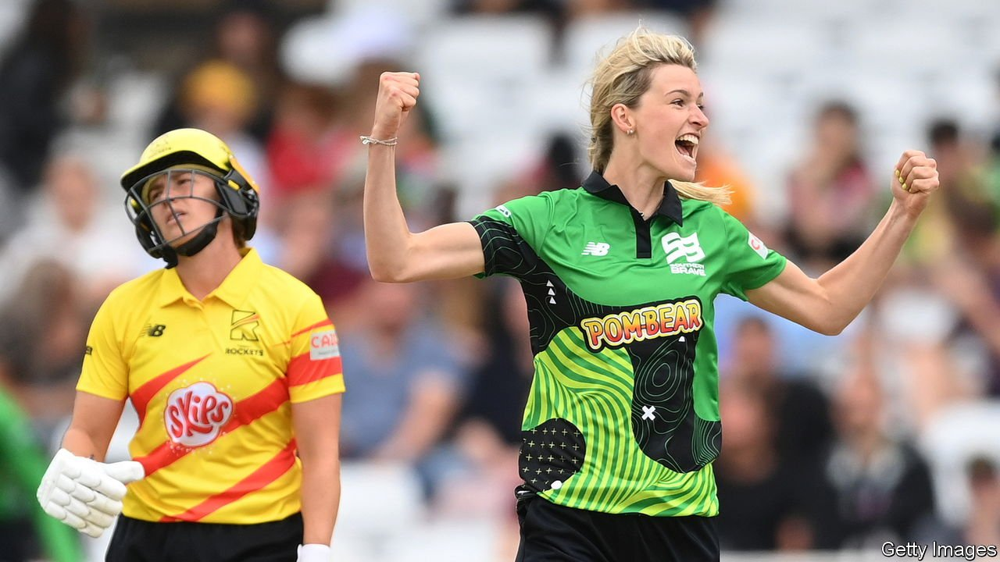

###### Cricket

# A conservative sport gets a glitzy makeover 

##### Will The Hundred help bring in new fans? 

 

> Jul 31st 2021 

A  THICK OUTSIDE edge off Dané van Niekerk’s bat sends the ball flying past the wicket-keeper for the winning runs, ending the inaugural match of cricket’s latest iteration, The Hundred. The Oval Invincibles women’s team has beaten the Manchester Originals by five wickets (the men faced off the next day). Fans roar, turrets of fire blaze; pop music blares. One spectator turns to your correspondent and says: “I always thought ‘fun’ and ‘cricket’ were meant to be a contradiction in terms.”

Such sentiments should cheer Sanjay Patel, chief commercial officer of the English &amp; Welsh Cricket Board (ECB). It is nearly four years since the former strategist at Heineken, a lager brand, pitched England’s cricket chiefs with the notion of a 100-ball-per-innings game that could be played in two-and-a-half hours.


Cricket seems designed to resist such modernisation. Its rules are stern on the spirit of fair play, but comparatively silent on matters that you might think would be of central importance, such as the size of the playing field. If you have never played yourself, try spotting an LBW (leg before wicket), by which a batsman is ruled “out” if his body is deemed to have blocked the ball from hitting the stumps.

Such quirks delight aficionados, but make the game seem aristocratic and unintelligible to everyone else. According to Sport England, an official body, 30m sports fans in England and Wales do not follow cricket. Of the 1.1m who attended a match between 2015 and 2018, 94% were white, 82% male and 65% in higher income groups. Their average age was 50.

It was to data that Mr Patel turned while plotting a route to broader popularity. Three-quarters of fans, he found, became hooked before turning 16, and though South Asians accounted for just 3% of ticket sales, they made up 30% of recreational players. The Hundred was designed, therefore, to appeal to youthful and subcontinental sensibilities. It is shorter than County Championship matches (which last four days) and One-Day Cup matches (which last eight hours). Whereas all other formats involve bowlers bowling six balls at a time (known as an “over”) to one of two batsmen, bowlers in the Hundred bowl ten sets of ten balls. Overseas players have been recruited and timeouts borrowed from the Indian Premier League.

In some respects, the new format resembles Twenty20 (T20), a three-hour format launched by the ECB in 2003. But it has more commercial appeal. The BBC and Sky broadcast games in Britain; global deals have been struck, too. BBC Music Introducing, a talent-spotting arm of the national broadcaster, provides performers and DJs. Greg James, a Radio 1 presenter, explains the rules. Lego, a toymaker, made an animated trailer; Topps, which sells cards for children’s trading games, has brought out a Hundred series.

The biggest change, however, is that The Hundred is not played by the 18 historic county clubs, but by eight new franchises owned by the ECB. All are based in cities. Critics think they will play a parasitic role in the cricketing ecosystem. Andy Nash, a former chairman of Somerset, says the new franchises will piggyback on the training offered by counties, and that the new format could split and bankrupt the game.

But others are focused on the opportunity to bring cricket nearer to potential fans. Warwickshire County Cricket Club is now home to The Hundred’s Birmingham Phoenix side. The city has a large ethnic Pakistani population. Few young people feel an affinity with the county, which no longer includes Birmingham, says Craig Flindall, the chief operating officer. He hopes that drafting players like Moeen Ali (who usually plays for Worcestershire) and Abtaha Maqsood (a Scottish woman who wears a hijab) will win them over.

The ECB spent £40m ($56m) on the inaugural tournament, three-fifths of which will go on staff, venues and so on. It expects to make a £10m profit. More than 8m viewers have tuned in, 3.3m of whom watched no other ECB cricket this year, and nearly 500,000 tickets have been sold so far, 83% of those available. Each county (and Marylebone Cricket Club) has a 19th share in the format. If an investor wanted to buy a team, all would profit. ■

