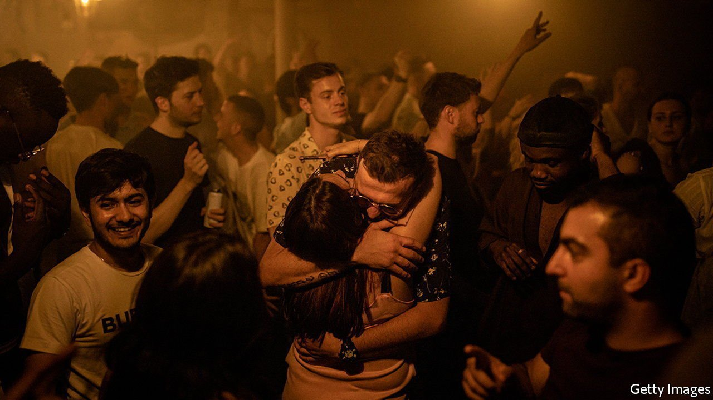
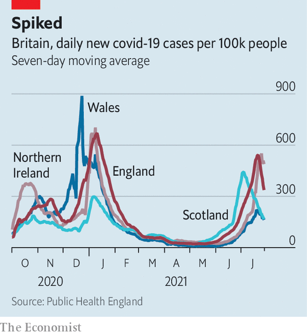

###### Taking liberties

# Boris Johnson’s gamble looks like it will pay off 

##### An air of disbelief greets plunging covid-19 cases 

 

> Jul 31st 2021 

ON JULY 19TH, as the prime minister, Boris Johnson, removed pandemic restrictions, Britain recorded nearly 50,000 covid-19 cases. Many observers predicted disaster. Even Sajid Javid, the health secretary, said there was a good chance cases would hit 100,000 a day. Vaccinations would keep deaths down, but it was not clear if they would save the health service.

Now ministers are less nervous. More than a week of liberty in England, without masks and with clubbing, has not been enough to stop cases falling. Indeed, daily case counts have roughly halved since the rules were relaxed. As things began to turn, sceptics wondered whether something else was going on—perhaps, say, a shortage of tests distorting reality.


That now looks unlikely. England, Wales and Northern Ireland seem to be following the path of Scotland, where cases began to drop earlier, albeit not as steeply (see chart), and where falling cases have been reassuringly followed by falling hospital admissions. Slightly fewer tests are being carried out in England, but positive results are falling much faster, and growth in hospital admissions is slowing.

 


Cases had been concentrated among men, as they crowded into pubs and living rooms to watch the Euros. Not only is the football now over, but a spell of good weather in an otherwise miserable summer will have lured people outside. Meanwhile mobile-phone data suggest that people became more cautious as case counts rose, despite relaxed rules.

There is also the matter of rising immunity. Since the start of the Euros, 8.4m people have received a second jab and 1.2m people have acquired protection by catching the disease. According to the Office for National Statistics, 92% of people in England now possess antibodies, leaving fewer hosts for the virus.

There are no guarantees that cases will continue on an uninterrupted downward path. The weather is worsening; the first weekend of clubbing is not yet visible in the data. But a surge that sees the health service overwhelmed is not a realistic scenario, reckons Francois Balloux, a computational biologist at University College London. It increasingly looks as though Mr Johnson’s gamble will pay off.

Dig deeper

All our stories relating to the pandemic and the vaccines can be found on our . You can also find trackers showing ,  and the virus’s spread across  and .

