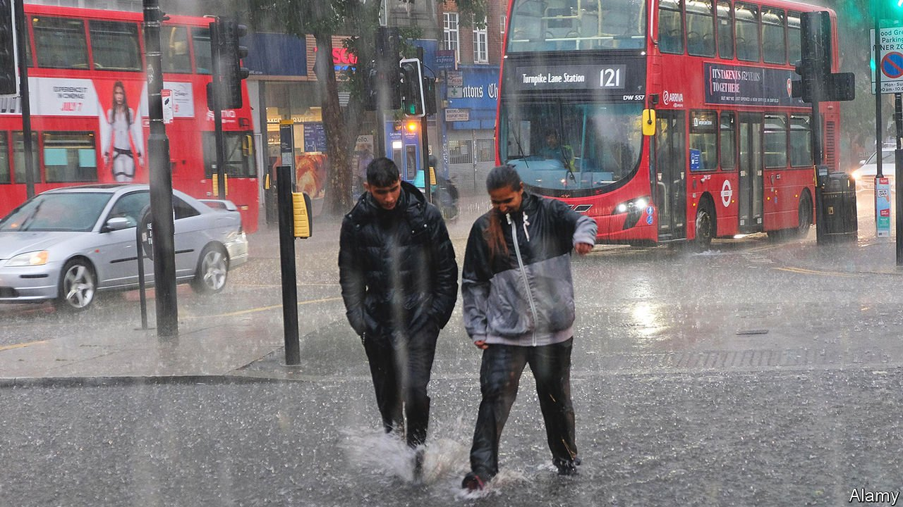

###### Live by the river

# London’s flooding is sure to worsen 

##### Development means flood plains are being covered by concrete 

 

> Jul 31st 2021 

LONDONERS LIKE to remind visitors that, despite their city’s reputation for dreary weather, rain is in fact less common than in some sunnier climes. Rome gets more total precipitation each year; New York City gets almost twice as much, and has far more rainy days. In general, Britain’s capital is grey but fairly dry, with predictable and moderate weather.

That may be changing. On July 25th parts of the city saw over 5cm of rain in just a few hours, an amount that would normally take an entire month to fall. The result was flash flooding. In east London two hospitals told patients to stay away; one, Whipps Cross, had to evacuate around 100 patients after a power cut. Hundreds of cars were stranded on roads that suddenly became rivers, while a dozen Tube stations were forced to close. Pudding Mill Lane station, on the Docklands Light Railway, looked like a swimming pool, with several feet of water washing around the ticket barriers. Even in areas far from rivers and flood plains, such as Hampstead, a pretty suburb of north London, shopkeepers had to bail out rain water into the streets.


Unlike the destruction caused by the floods that hit parts of Germany earlier in July, this damage will not be lasting. Most of the railway stations that were closed reopened the next day; so did the hospitals. Yet such incidents are likely to become more common in the capital. Even if global warming is limited to 1.5°C, an international goal that looks increasingly likely to be missed, winter rainfall could increase by 59%, according to a government study of the Thames Estuary flooding risk published in February. A particular issue is the Thames barrier, which stops tidal floods from washing back up into the city. It was closed just ten times in the decade after construction finished in 1981. But since 2010 it has closed 80 times. The study predicted that “once-a-century sea level events are expected to become annual”.

The problem is exacerbated by the way London has developed. For decades, its water table was artificially suppressed by factories tapping it. Deindustrialisation means it has been rising again since the 1980s. And thanks to planning rules that protect greenfield land, much new housing has been built in places vulnerable to flooding, such as along the Thames Estuary or the Lea River valley, the site of the 2012 Olympic Park. Between 2014 and 2017 the population living near the park more than doubled, from around 10,000 to 26,000. By 2031 it is expected to reach almost 100,000. All that extra concrete means water struggles to flow away.

“Building on a flood plain is all well and good,” says Asif Din of Perkins &amp; Will, an architectural firm. “But is the developer actually going to be mitigating what they’re putting on the land?” Architects can easily design individual buildings or estates to be resilient (and many do). But they are not responsible for wider infrastructure. Instead, flood risk is managed by a patchwork quilt of government agencies, which do not always fit together well. It is not much good having a resilient office building, says Mr Din, if nobody can reach it because the roads nearby are flooded.

Some improvements already under way should help. A new “super sewer”, intended to augment the existing system, which dates from Victorian times, will open in 2025. It will not stop flooding, but ought to stop sewage from flowing untreated into the Thames (or washing back up drains). Past the Thames barrier, in the outer eastern reaches of the city, flood defences are being improved. But none of that may be enough to keep up with the changing climate. The last time central London flooded was in 1928; 14 people drowned in Westminster. It may yet happen again. ■

For more coverage of climate change, register for The Climate Issue, our fortnightly , or visit our 

