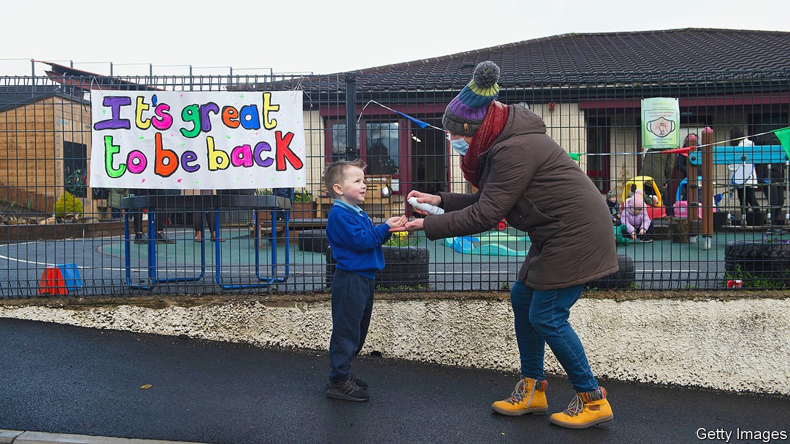

###### Pick and mix

# Northern Ireland’s schools are slowly becoming less segregated 

##### But most children, whether Catholic or Protestant, live and learn with few from outside their community 

 

> Jul 31st 2021 

WHEN THE autumn term starts, a school at the north-eastern edge of Northern Ireland will make a little piece of history. Seaview Primary in Glenarm, a coastal village where the accents are a constant reminder of the nearness of Scotland, will become the province’s first to leave the Catholic education system run independently from the state and overseen by Catholic bishops. The little school will become “integrated”, seeking to draw pupils and teachers from both sides of the province’s sectarian divide. Liam Neeson, a film star who grew up nearby and who now holds American citizenship, praised his former compatriots for “taking courageous steps to ensure that children from different traditions will get to learn and play together, every day, in the same school”.

The job of healing Northern Ireland’s deep social rifts is getting more urgent, and harder. When both the United Kingdom and Republic of Ireland were in the European Union, practical issues of trade and borders did not matter; when the UK left in January they became nigh-insoluble. The deal struck means that Northern Ireland has, in effect, remained inside the EU’s customs and trade union in order to avoid a trade border on the island of Ireland. That meant creating one in the Irish Sea, dividing the province from the mainland, and ratcheting up tensions in politics and on the street.


As politicians in both Northern Ireland and Westminster argue about the minutiae of customs and standards, they have lost focus on the bigger issue. The uneasy truce that had held since the signing of the Good Friday Agreement in 1998 is coming under pressure. The province’s nastiest rioting for many years broke out in March. Before Brexit it had seemed that settling Northern Ireland’s final status was something to be shelved for future generations, when decades of peace would have washed away the legacy of centuries of hatred. That happy confidence has been erased.

All this adds new significance to the question of who should educate Northern Irish children, and alongside whom. About 90% go to schools where one religious tradition dominates both intake and atmosphere. The Catholic system accounts for about half of pupils; in state-run schools Protestants predominate. Only around 7% go to the 60 or so integrated schools, and 2% to Irish-language ones. Since most neighbourhoods are segregated, children may rarely meet anyone from outside their own religious community. Even those in mixed classrooms go home to places where one camp controls the streets and supposedly defunct paramilitary forces still hold great sway.

Education is also a microcosm of the mutual resentment that feeds tribalism. Although a rising share of Northern Irish adults, especially young ones, say they feel neither “Protestant unionist” nor “Catholic nationalist” in culture and identity, those who still strongly identify with one side or other tend to vote accordingly—and to feel that when it comes to schooling it is their lot who are being squeezed.

Some Protestants grumble that “our schools”—those run by the state, where pictures of the Queen used to adorn walls and the British national anthem was sung—have adapted to Catholic sensibilities, even as Catholic schools remain devotional and therefore unwelcoming to them. Some nationalists, for their part, resist integrated schooling because they think the history of British colonisation and oppression will be glossed over. Meanwhile the opening of a handful of Irish-language schools has made them more confident that the tide is turning in their direction, and unionists more defensive still.

At a recent stormy debate in Northern Ireland’s assembly, a bill that would make integrated education the default for new schools was passed on second reading and sent to committee. But the Democratic Unionist Party, the largest of those that back the union with Great Britain, condemned it as an attack on parental choice. Sinn Fein, the largest party seeking a united Ireland, endorsed it half-heartedly, saying that integrated schools did too little to promote the Irish language, or Gaelic music and sports. (Advocates say they teach about both communities’ traditions and histories, not neither.)

Well over half of integrated schools are new institutions set up by parents who see them as an essential part of a desegregated and more peaceful future. Existing schools can join their number, however, if 20% of parents demand a ballot. If half of all parents with children in attendance vote, and of those half say yes, the education minister has the final say, depending on whether the school in its new form will attract enough pupils to remain viable.

Two small Catholic schools recently failed that test. But there is clearly an appetite for integrated schooling: once Glenarm said it planned to switch, pupil numbers doubled from 40 as Protestants enrolled. Integrated Education Fund, a charity, says it has set a precedent that many other small village schools may seek to follow.

Embedding an integrated ethos is a “long but worthwhile process”, says Sean Pettis of the Northern Ireland Council for Integration Education, a government-funded body. But it will not become the norm any time soon. Some of the Catholic schools seeking to switch are deciding between integration and closure; large, flourishing institutions are unlikely to follow their example.

These include prestigious grammar schools that selected pupils by competitive examination until covid-19 made that impossible, and which feature near the top of countrywide league tables. St Columb’s in Derry, for example, counts two Nobel laureates among its old boys. Others, in poor areas, have a record of turning around academic failure and thus boosting social mobility. Among the province’s schools that do not select by academic prowess, Catholic ones produce the best results. All these institutions are held in high regard by alumni who, even if they have lost their faith, tend to think their alma mater helped keep a beleaguered community’s culture alive through dark times.

“In a mixed system, all we are seeking is a place at the table,” says Donal McKeown, the Derry-based bishop who chairs the Catholic educational authority. He and others say that Catholic schools already do their bit for community relations. A couple of well-known ones are religiously and racially diverse; many share classes in some subjects with nearby schools that have mainly Protestant intakes.

Northern Ireland’s schools themselves do not foment sectarian prejudice. But that misses an important point: they are part of a system where cross-cultural ignorance allows prejudice to flourish. Schools cannot fix that alone; but it will surely be harder to tackle while children live and learn apart. Padraig O’Tuama, a theologian and poet, recalls a classroom discussion in a Catholic school in Belfast. One earnest little girl asked him a tough question: why did a loving God make Protestants? ■

