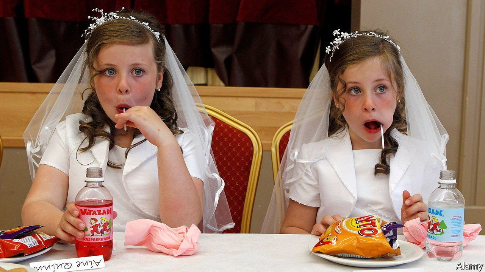

###### Loose and lacy

# Northern Irish Catholics are becoming less devout 

##### But cultural attachment to their faith is undiminished 

 

> Jul 31st 2021 

AMONG THE nine-year-old girls of Derry, demand for frilly white frocks that resemble mini-wedding dresses remains strong. The first time a child takes part in the Eucharist, the holiest of Christian rites, is an important milestone that features not only a fancy new outfit, but a big party (covid-19 permitting), and cash gifts that are splurged on toys and computer games.

By some measures Northern Ireland’s Catholic community is thriving. The census taken earlier this year is expected to show a rough demographic balance between Catholics and once-dominant Protestants—reinforcing the sense that the united Ireland desired by most Catholics is all but certain.


But communal affiliation does not equate to personal faith. Preparation for first communion is woven into the curriculum of Catholic primary schools, and few families opt out. Unlike some of their parents and most of their grandparents, however, these children are unlikely to grow up devout Mass-goers.

Thirty years ago, Northern Irish Catholics were among the Western world’s most observant religious groups, more so even than Catholics in the Irish Republic. Nine out of ten claimed to attend Mass regularly; now just 46% say they go at least once a month, with younger generations less pious than older ones.

Parents who do not attend Mass still often label their children as Catholic for the purposes of schooling. Lukewarm Protestants, by contrast, are shifting towards the “no religion” category. For about a decade, the share of Northern Irish schoolchildren registered as Catholic has hovered around 51%, with 33% now registered as Protestant and the rest as “other”, which includes many lapsed Protestants.

Northern Ireland also has a cohort of conservative young Protestants who resemble American evangelicals, says Gladys Ganiel, a scholar of religion at Queen’s University Belfast. But there is no Catholic equivalent (Derry, where pious lay movements have some traction, is an exception). Generally, attachment to Catholicism is loose and extensive; evangelical Protestantism is tighter and more zealous.

Ever since Ireland was partitioned a century ago, the Catholic church has shared stewardship of Irish culture with the Gaelic Athletic Association (GAA). This promotes not only traditional Irish sports, such as hurling and Gaelic football, but also Irish music and dance. Nowadays it can feel like the GAA, originally the junior partner, is calling the shots. Once Catholics prayed and only afterwards headed for the pitch, says Brian D’Arcy, a maverick priest. Today Gaelic football practice often clashes with Mass and few complain.

