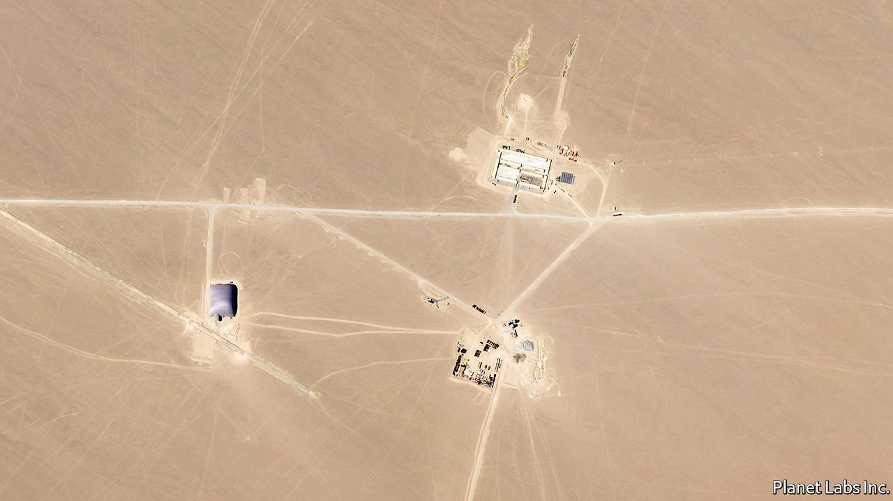
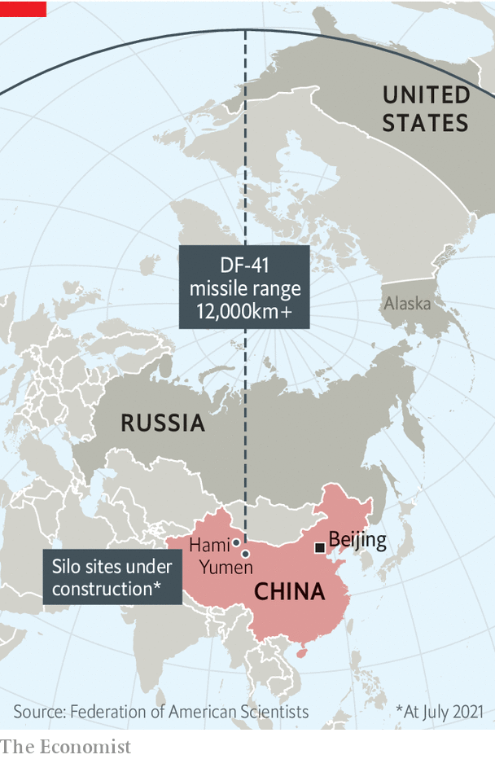

###### Select your shell

# China is rapidly building new nuclear-missile silos 

##### Their purpose is unclear, but the Americans are worried 

 

> Jul 31st 2021 

ON A HOT and sticky day in the northern city of Tianjin, America and China held their highest-level meeting on Chinese soil since Joe Biden was sworn in as America’s president in January. But the encounter on July 26th between Wendy Sherman, America’s deputy secretary of state, and counterparts from China’s foreign ministry failed to clear the air. Instead, it merely deepened the gloom that hangs over the world’s most critical great-power relationship.

According to an American spokesman, Ms Sherman promised “stiff competition” with China and raised its “ongoing genocide” in the far-western region of Xinjiang, among other sore issues. She suggested co-operation on tackling problems such as climate change, narcotics and Afghanistan. But that olive branch was snapped by Xie Feng, a deputy foreign minister, who said relations were at a “stalemate” and thundered that America’s aim was to “bring China down”. His boss, Wang Yi, told America to choose between improving ties or “clashes and confrontation”.


Mercifully, the two nuclear-armed countries do not appear as close to military conflict as the Soviet Union and America sometimes did during the cold war. But as the diplomats were sparring in Tianjin, the Federation of American Scientists (FAS), a research group, said it had spotted China building as many as 110 silos for intercontinental ballistic missiles (ICBMs) near the city of Hami, in eastern Xinjiang (see picture). A month earlier, the James Martin Centre for Nonproliferation Studies, an NGO in California, had identified 120 silos being built in Yumen, in the desert of Gansu, a neighbouring province. Both outfits found the sites by poring over satellite imagery from Planet, an American firm.

Nuclear wonks were shocked. For decades, China has hewed to a policy of “minimum deterrence”, involving the maintenance of a relatively small arsenal that would allow it to hit back at aggressors but not wage an elaborate nuclear war. The Pentagon reckons the country has 200 or so operational warheads—about the same number as Britain or France—and only 100 or so ICBMs. (America and Russia have nearly 12,000 warheads between them.)

The FAS says the satellite pictures suggest the “most extensive” building of silos since the construction of them by America and the Soviet Union during the cold war. On July 27th America’s Strategic Command, which is in charge of nuclear weapons, reacted with a tweet: “This is the second time in two months the public has discovered what we have been saying all along about the growing threat the world faces and the veil of secrecy that surrounds it.” America’s State Department said the discoveries were “deeply concerning” and demonstrated that China was “deviating” from its long-established nuclear strategy.

Experts believe the silos are designed for China’s newest ICBM, the DF-41, which can reach most of America’s mainland (see map). The question is why so many are needed. One theory is that they allow China to play a “shell game” with its missiles—an old conjuring trick in which a ball is placed under one of three cups that are shuffled to conceal where it is.

 


China would have good reason to bamboozle others about the precise whereabouts of its missiles. It has long feared that, in a crisis, America could use its large arsenal—or even a new generation of highly accurate conventional missiles—to wipe out China’s meagre forces on the ground. If some Chinese missiles were able to survive such an onslaught, they could be disabled in flight by America’s burgeoning missile defences, including . In other words, China’s nuclear arsenal could be rendered useless. America stresses that its missile-defence systems are not directed at Russia, but makes no such commitment about their use against China.

If, however, missiles could be moved underground between silos, America would have no way of knowing which ones to strike. America’s “MX” programme, launched in the 1970s, could have inspired China to use such trickery. The idea was to shuffle 200 missiles among almost 5,000 bunkers in Utah and Nevada. The plan was shelved in 1981 by America’s then president, Ronald Reagan. He mocked it as a needlessly complex “Rube Goldberg scheme”—a reference to that American cartoonist’s drawings of fanciful contraptions for accomplishing simple tasks.

The layout of the Chinese silos may suggest a similar aim, says James Acton of the Carnegie Endowment, an American think-tank. He points out that China’s older silos, in the northern region of Inner Mongolia, are tens of kilometres apart, whereas the ones in Gansu are only about 3km from each other. Mr Acton also argues that because most DF-41s would probably have more than one warhead, China would not have enough fissile material to fill all the new silos with them, not least because of competing demand for its use in other nuclear weapons. The country is thought to have stopped producing plutonium in the 1980s. There is little evidence that it has resumed, although new nuclear-power reactors being built in Fujian, a coastal province, could do so in future.

Not everyone is convinced that China is merely planning a shell game. In theory, and in the long term, 230 new silos could support the deployment of 230 new missiles with several hundred warheads, since each missile can carry at least two of them and perhaps many more. American officials have long been arguing that China is rapidly expanding its nuclear forces. In its most recent annual report on China’s military power, published last September, the Pentagon said the country’s stockpile of warheads was projected to “at least double in size” over the next decade. In April the head of Strategic Command, Admiral Charles Richard, presumably aware of the silo fields, said that China’s programme was advancing so quickly that intelligence was becoming out of date within a month.

The discovery of the silo-building projects raises two broader questions. One is whether they will prompt a change in China’s nuclear posture. America and Russia keep some weapons on high alert, ready to launch at a moment’s notice. China does not. But silo-based ICBMs can be launched more quickly than those on mobile launchers, which have to be erected and, in some cases, fuelled. American officials argue that with plenty of instantly ready missiles to hand, and with the more advanced early-warning radar that China is beginning to develop (with Russia’s help), along with an early-warning satellite already in polar orbit, the country may adopt a policy of “launch on warning”. That means it would be ready to fire missiles at the first sign of a nuclear strike.

The other question is whether this will affect nuclear-arms control. The last remaining pact between America and Russia, the New START treaty, was renewed in February and will expire in five years. If the White House sees the new silos as confirmation of a rapid nuclear expansion, it may adopt the former Trump administration’s view that any future arms-control measures must involve all three powers.

For now, the State Department says that the construction of the silos “reinforces the importance of pursuing practical measures to reduce nuclear risks”. But China is reticent about exposing its arsenal to scrutiny. And the fractious meetings in Tianjin suggest there is little likelihood of negotiations over such a contentious matter, let alone a productive outcome.

Ironically, the most benign interpretation of the new structures—as a shell-game—is in one sense the least encouraging for arms control. America and Russia verify New START by sending inspectors to peer into one another’s silos. If China’s plan is indeed to shuffle missiles around, it would become much harder for others to be certain of its deployments. “So the best case,” says James Cameron of the University of Oslo, “is that China has gone some way to confirming how uninterested in arms control it is.” ■

