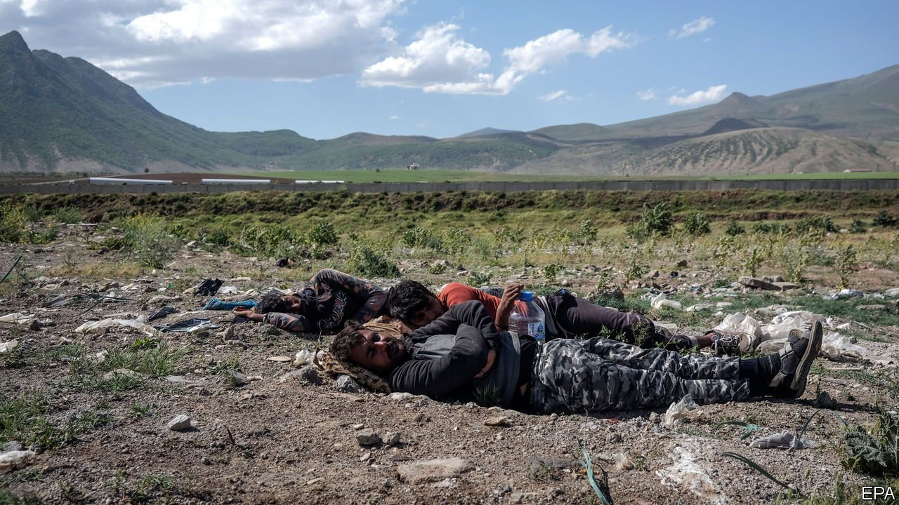

###### Point of no return

# Afghan refugees are reaching Turkey in greater numbers 

##### Many would like to get to Greece 

 

> Jul 31st 2021 

HAMMAD PASSED out from exhaustion, but continued walking after he recovered. Crossing from northern Iran into Turkey took three days. Smugglers guided Gharibullah and his group remotely, sending them photos and videos of the route. Their associates occasionally appeared on horseback near the mountaintops to offer directions. Habib was captured by Turkish border guards, but escaped. The guards assaulted one of his companions, he says, breaking bones in his back.

Today those three young men, who arrived from Afghanistan this summer, are scattered across Turkey—searching for jobs, or a way to reach Europe, and hiding from the authorities. Turkey is already home to anywhere between 200,000 and 600,000 Afghans, most of whom have arrived in the past decade, fleeing violence and poverty. But as the Taliban captures more of Afghanistan following America’s withdrawal, many more are trying to enter. Around a thousand Afghans are believed to be crossing into Turkey every day, after gruelling journeys across Iran.


Unlike the 3.6m Syrian refugees in Turkey, only a minority of Afghans are safe from deportation and offered some access to public services. Most of them have never registered with authorities, or else they have had their applications for international protection rejected. “We are in constant fear of being caught by the police and deported,” says Gharibullah, who worked as a teacher in a district of Afghanistan recently captured by Taliban fighters. Hammad, a computer technician from a district where the Taliban and Islamic State have been fighting each other, works 12-hour shifts, six days a week, at a sweatshop in Istanbul for a monthly salary of 2,500 lira ($290), less than the minimum wage. Habib, who fled his village after the Taliban killed four of his friends, worked for two weeks at an iron foundry in Kayseri, a Turkish city, but was then denied pay.

Turkey’s opposition is seizing on growing resentment towards all refugees. A leading opposition lawmaker recently called Syrians and Afghans, who now account for roughly 5% of the country’s population, “the number-one issue for Turkey’s survival.” The mayor of Bolu, a city in the north, said he would increase water bills for refugees tenfold. Frustration with European governments is mounting. “Turkey will not be the EU’s border guard or refugee camp,” snapped the foreign ministry on July 26th, after Sebastian Kurz, Austria’s chancellor, said Turkey was “a more suitable place” for Afghans than his country.

The influx could indeed become a problem for the EU soon. In 2015 over 850,000 people, most of them Syrians, reached Europe by way of Turkey and the Greek islands, crammed into cheap rubber boats. The number making this crossing dropped dramatically after Turkey pledged to keep the migrants on its side of the Aegean, in exchange for €6bn ($7.1bn) of assistance from the EU. (None of this money has been earmarked for Afghans.) It fell further this year, after Greek border and coast guards began turning back migrants without allowing them to apply for asylum.

But of all those who have recently succeeded in reaching Greek shores, Afghan nationals make up the largest share. Most see few prospects in Turkey. “We’ve come here,” says Hammad, “because this is the place where we decide where to go next.” ■

