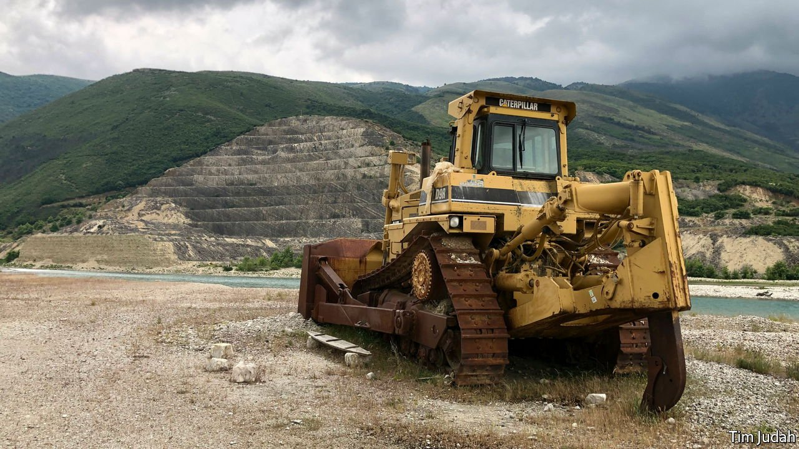
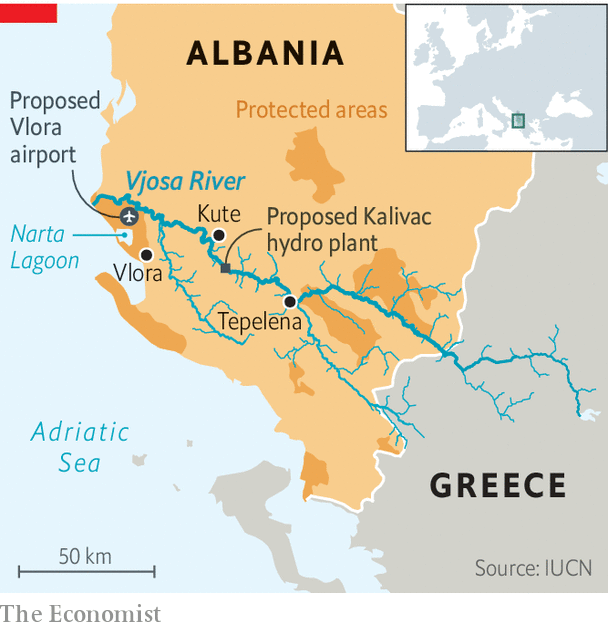

###### Unimpeded flows the Vjosa

# Albanian environmentalists are blocking a torrent of dams 

##### The future is the sun 

 

> Jul 31st 2021 

THE SILOS at the building site at Kalivac once held concrete for what was to have been a big hydroelectric plant. Now they echo with the squawks of the many birds that have taken up residence on them. Cement-mixers and earth-movers still stand ready to roll. But a court ruling in late May may keep them stationary for ever. The plaintiffs in the case included ecologists who have been battling against the plant for years. They are trying to prevent new dams from being built along the Vjosa, Albania’s second-longest river.

The Vjosa is still flowing freely, but Albania’s increasingly influential green activists are not cracking open the champagne yet. “We have won some legal battles, but we have not won the war,” says Besjana Guri, of EcoAlbania. In Kalivac the steep hills that fall down to the river have been scarred by terracing for the dam. The original concession was granted in 1997. Tens of millions of euros have been spent on preparatory works.


In 1997 Albania was on the verge of civil war. Protecting the environment was not on anyone’s agenda. Today in Albania, as in the rest of the Balkans, it is a different world. Green groups and angry locals are joining forces to oppose new hydroelectric plants, more than 3,400 of which are planned around the region.

 


The Vjosa rises in Greece, then flows for 135 miles (220km) through Albania. In places it is 2.5km wide. Unusually for a European river, its course is obstructed by only a single dam, near its headwaters. In Kute, from where 38 villagers went to court alongside EcoAlbania to stop their lands being flooded, Xhemal Goxhaj, aged 84, clicks his worry-beads and says, “We were going to lose everything…all the fields where the sheep go to graze, the olive trees and the vines.”

Even though there may be money to be made by damming the Vjosa, says Ulrich Eichelmann of the Save the Blue Heart of Europe campaign, which co-ordinates resistance against Balkan hydroelectric projects, that is not a good reason to do it. Londoners would not knock down Big Ben to build a shopping centre, he says, simply “to make more money”.

Fully 90% of Albania’s electricity comes from hydropower plants. But the future, environmentalists say, is solar. They point out that the country has 300 days of sun a year, and plenty of room for solar panels. Sali Berisha, a former prime minister and president, wanted Albania to become a big energy exporter. Now, though, the government emphasises tourism as a way of earning foreign exchange. Before the pandemic Tirana, the capital, had acquired a reputation for trendy nightspots. Albania also has miles of scarcely developed coastline.

Edi Rama, the prime minister, is visibly irritated by the Vjosa issue. Environmentalists are “making a fuss about nothing”, he says, because he has said before that the river will not be dammed on his watch. The problem is that the environmentalists do not trust him, because back in 2015 he had promised that the area would be declared a national park. In the end he granted it only “protected” status, which is less development-proof. The area can be properly protected only by becoming a national park, activists say. And even that would not cover all the Vjosa’s many tributaries, along which 37 dams are planned.

Mr Rama says those plans have been frozen; the problem, he insists, is how to cancel them completely without having to pay “half the country’s GDP” in compensation. In future the river will be protected by a patchwork of parks and protected areas. Albania is one of the poorest countries in Europe, notes Mr Rama: “You cannot ask a country that needs to develop to just enjoy wildness. We need to find a balance.”

Environmentalists still have plenty of concerns. Shell, an oil giant, is prospecting for oil close to the Vjosa. But activists’ attention is shifting to the river’s delta, near the town of Vlora. In the Narta lagoon, flamingos step gingerly and stately pelicans patrol their stretch of water, while fishermen grumble about how little they earn. Nearby, miles of empty, sandy beaches stretch into the distance.

Later this year construction should begin on Vlora’s new international airport, on the site of an abandoned military airfield. It was last used by drug-runners flying cannabis to Italy, just across the Adriatic Sea. In 2015 trenches were dug across the runway to stop them. Unlike the villagers upstream, the locals here are gung-ho about the future. Dams upriver may diminish that area’s appeal for tourists, but an airport here would be a boon. Preparing his fishing net, Pellumb Bala says that in his village there are “24 families with 24 men without jobs. We need the jobs.” Mr Rama says the birds in the area will be protected, but adds tartly, “Albania cannot be the zoo of Europe.” ■

