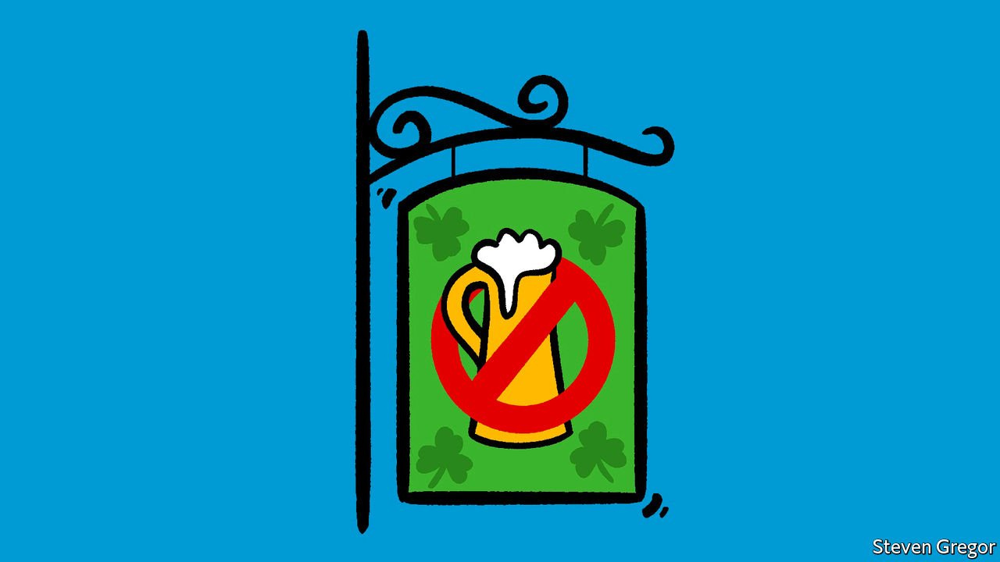

###### Filling in the craics

# An alcohol-free Irish pub refreshes parts that others cannot reach 

##### Dry bars promote Ireland to the sober 

 

> Jul 31st 2021 

FOR YEARS themed pubs have bolstered Ireland’s soft power around the world. But their reach is limited to those who like a drink. And in many places youngsters are quaffing less than their parents did. Influencers promote “sober curious” lifestyles on social media, noting that cutting back on alcohol can bring benefits such as better sleep, not just a happier liver. By 2024 sales of “low- and no-alcohol” tipples will increase by almost one-third in ten big countries, according to the IWSR, a British company that analyses the international drinks market.

These trends are mother’s milk to the owners of The Virgin Mary, a pub in Dublin that serves no booze of any kind. Vaughan Yates, who opened it in 2019, says his bar appeals to all sorts of people but that women are especially keen. He says that even pub-crawlers sometimes stop by for respite. Now the team behind it is seeking to set up duplicates abroad. If an alcohol-free bar can work in Dublin, it can work anywhere, says Sarah Connolly, a co-owner.


The first stop is the Middle East. A franchised outlet will open in Abu Dhabi later this summer under a secular name, TVM; another may follow in Saudi Arabia. The bar in Abu Dhabi will help promote Irish culture outside the usual watering holes, says Niveen Ibrahim, head of the restaurant-management group that is opening it. Bars there are largely restricted to hotels and intended for use by foreigners. Because it serves no alcohol, TVM will be allowed to open in a shopping centre.

Mr Yates thinks the dry pub will appeal to Emiratis who would never enter establishments that serve alcohol, but thirst for something other than humdrum coffee shops and juice bars. He promises it will feel distinctly Irish, though punters will be spared a “guy on a fiddle in the corner”. Employees at the original bar in Dublin say their customers are the nicest in the trade. “And the toilets are the cleanest.”

