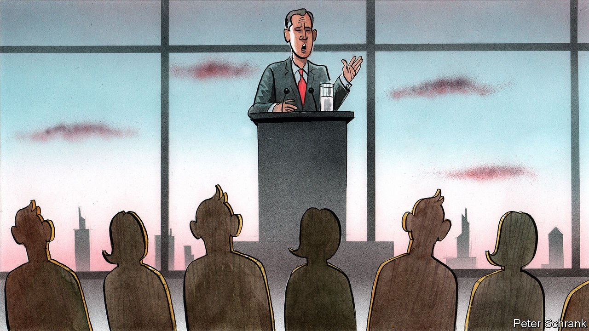

###### Charlemagne

# How Europe’s proverbial voters explain a continent 

##### What Irish breakfasts and Polish proboscis monkeys share in common 

 

> Jul 31st 2021 

THE IRISH breakfast roll is a feat of culinary engineering. Take a baguette, slice lengthways and butter it. Add a sausage, two fried eggs, two rashers of bacon, hash browns and some black or white pudding, cover in ketchup, then serve. At around 1,300 calories, it is nearly half the recommended daily allowance for a man, and is traditionally consumed while hungover.

It has a curious hold on the Irish psyche. A homage to the “Jumbo Breakfast Roll” was the best-selling song in 2006, beating Shakira’s “Hips Don’t Lie”. One academic produced a sociological study: “The Rise and Fall of the Jumbo Breakfast Roll: How a Sandwich Survived the Decline of the Irish Economy”. But it was in politics that the breakfast roll truly dominated.


Breakfast Roll Man was a symbol of the Celtic Tiger. A hungover construction worker gorging on one after a big night out was a common sight in the boom years. These were the cash-rich workers, argued David McWilliams, an Irish commentator who devised the term, who came out and guaranteed a victory for Bertie Ahern in 2007 just before the Irish economy came crashing down.

Every European country has its Breakfast Roll Man, a proverbial voter who sums up the political zeitgeist. For decades the housewife of Voghera, a town in Lombardy, has been a shorthand for middle-of-the-road voters in Italy. In Denmark it is Mr and Mrs Kakkelbord, named after the ubiquitous coffee tables found in Danish suburbia. The couple emerged after a politician unintentionally insulted the furniture choice of the common voter. From the Swabian housewife, an image favoured by Angela Merkel in her austerity days, to the Mondeo Man of Tony Blair’s era, each proverb is revealing in its own way.

Sometimes proverbial voters are used as a political weapon, rather than a tool of analysis. Populists use figurative voters to frame their base as the true voice of the nation. In the Netherlands an imaginary couple called Henk and Ingrid dominate. Invented by Geert Wilders, the bleached-blond anti-immigration politician, they are the ordinary supporters of the Party for Freedom (PVV). Alexander Pechtold, then the leader of the liberal D66, even wrote a book—“Henk, Ingrid and Alexander”—arguing with the imaginary couple. During the pandemic, Mr Wilders blamed “Mohammed and Fatima”, the immigrant antithesis of Henk and Ingrid, for blocking beds in hospitals from the native Dutch. It sparked another round of discourse on Mr Wilders’s terms.

Repeating a rival’s framework only helps the rival, argues Tom van der Meer, a professor at the University of Amsterdam. Mr Wilders wields influence in Dutch politics by an ability to drag parties towards his more radical positions. Although his party is usually the second or third-largest in the Netherlands, there is little chance of his entering government. Bluntly, there are not enough Henks or Ingrids to put him there. Yet so long as Henk and Ingrid loom over the debate as the archetypal voter, politicians end up spreading Mr Wilders’s message.

Where life is good, so is the life of the proverbial voter. Complaining about life in Scandinavia, one of the richest regions on the planet, is the equivalent of moaning about having stubbed a toe while celebrating a lottery win. Where Henk and Ingrid struggle along, proverbial voters in Scandinavia are content. In Sweden, politicians speak of Medelsvennsons, who are concerned with “villa, Volvo, vovve” (house, Volvo, dog). If those categories are fulfilled, then they are happy. Things for “Bla Bjarne”—a well-paid, middle-aged, Danish craftsman—are rather good. So good, in fact, that he can be tempted to the right by the promise of tax cuts.

Where life is worse, so is the life of the proverbial voter. Janusz and Grazyna, an imagined Polish couple from the country’s provincial hinterland, offer the cruellest example. Janusz is a middle-aged man who drinks to excess, watches too much television, wears socks with sandals and has a moustache. Online, he is often depicted as a proboscis monkey. His wife, Grazyna, is dim, enjoys gossip and shopping. Their son, Sebastian, is a ne’er-do-well.

If the stereotype is nasty, it is a reflection of Poland’s brutal politics. The country is the sharpest example of the most important schism in European politics: the increasing gap between the centre and the periphery. Poland’s liberal cities bristle under the government of the staunchly conservative Law and Justice party (PiS), who rely on the likes of Janusz and Grazyna for support. In turn, PiS loyalists suggest that city dwellers look down on them. Given the portrait of Janusz and Grazyna, this is fair enough.

Charging at windmills

A problem with imaginary voters is that they are imaginary. Social democrats are panicking about plunging vote shares across Europe. But their imagined target voter is outdated, says Tarik Abou-Chadi of the University of Zurich. Rather than engage with the potential voters who actually exist they pitch themselves towards voters who have disappeared, conjuring images of manly miners whom they must win back. This has turned some politicians into political Don Quixotes, charging towards voters that, like the Spaniard’s windmills, are not at all as expected.

Proverbial voters can blur political reality as often as reveal it. On the left, the same proverbial voter pops up repeatedly: male, middle-aged and a manufacturer. Young people in dead-end call-centre jobs are rarely represented. The Swabian housewife may be the epitome of Christian Democratic values in the eyes of Angela Merkel. But the party should also focus on those second- and third-generation Turkish-German voters tempted to the centre-right. Yet when it comes to proverbial voters, these groups are invisible. Even when the proverbial voter rings true, politicians must remember to move on. Breakfast Roll Man has had his day. He probably moved to America after the crash, suggests Mr McWilliams. A new voter, hopefully with a better diet, will take his place. When politics changes, so should the proverbial voter. ■

