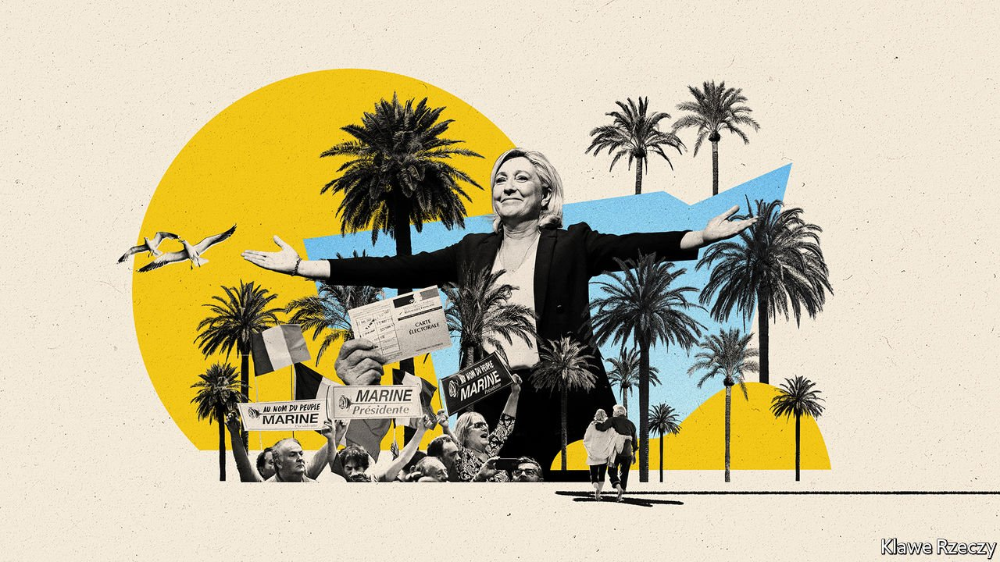

###### French politics

# Why France’s Provence and the Riviera are so right-wing 

##### Their politics are more like Florida’s than California’s 

 

> Jul 29th 2021 

WITH ITS palm-fringed beaches, ribbon of coastal cities, inland vineyards and year-round sunshine, the south of France feels in some ways like a southern California à la française. The region of Provence-Alpes-Côte d’Azur (PACA) is home to nearly 200,000 students and a tech hub at Sophia Antipolis, near Nice. Car-dependent, it boasts outside Marseille one of the biggest cases in France of urban commercial sprawl. Cosmetic surgeons are plentiful. Super-yachts fill marinas. The region even indulges Hollywood each year in Cannes. American stars favour multi-million-euro chateaux in the neighbourhood.

Politically, however, the south of France could scarcely be more different from liberal California. This is not a destination for young people seeking alternative living or counterculture. With a few exceptions, notably Marseille, almost the entire coastal and inland fringe leans to the right, or hard right. Most small towns and villages, as well as seven of its biggest ten cities, including Nice, Cannes and Aix-en-Provence, are run by centre-right mayors. The tenth-biggest, Fréjus, is held by Marine Le Pen’s hard-right National Rally (the RN, formerly the National Front). At first-round voting for the presidential election in 2017, PACA was the only region in mainland France that put Emmanuel Macron behind both Ms Le Pen and François Fillon, the centre-right Republican candidate.


This right-wing tendency has some specific historical roots. When Algeria won independence from France in 1962, nearly 700,000 pieds-noirs (French settlers) stepped off the boat in Marseille and other southern ports furious with Charles de Gaulle for ceding the territory. At the same time, North African immigrants, recruited to work on building sites or in factories, began to settle in the region. Xenophobic nationalism was a potent force used by Jean-Marie Le Pen, the National Front’s founder, to build support. He secured his highest early scores in PACA, scoring 19% there at elections to the European Parliament in 1984. Ten years later, the party’s first three town halls—Toulon, Orange and Marignane—were all in the region.

Over time, says Vincent Martigny at the University of Nice, this has “oriented the mainstream right in the region towards a more hardline position than elsewhere in France”. The right and far-right alike have pushed immigration and security to the fore. Politicians rail against illegal migrants, and the leaky border with Italy. Indeed, Ms Le Pen recruited Thierry Mariani, a former centre-right Republican deputy from Provence, as her candidate in PACA at . He lost in a run-off to the Republicans.

A second reason for the right-wing vote is demographic. The southern climate has long attracted retirees. There are proportionately more over-65s in the region than in France as a whole, as well-attended boules games attest. The ratio of private to public care homes in PACA is twice the national average. Les Senioriales, a gated residence of bungalows for “seniors” in the village of Les Mées, offers a swimming pool and cardio-training for what the industry describes as papy-boomers. The over-65s vote more, and tend to favour the right.

Inequality is another factor, argues Christèle Lagier, a political scientist at the University of Avignon. After Paris, the region has the country’s biggest income gap between the richest 10% and the poorest. Property prices are high. Philippe Aldrin, a political scientist at Sciences Po-Aix, says the decline of industrial employment, which used to organise workers in unions, and the rise of jobs in services such as care homes and supermarkets have loosened links to the parties of the left. The RN may thrive mostly on anti-immigrant sentiment in the south, and on industrial decline in the north. Yet in PACA too it lures voters who feel traditional parties have let them down. “RN voters are not a constant stock,” says Ms Lagier: “There are a lot of voters here who hesitate between the Republicans and the RN.”

This hesitation is encapsulated in Brignoles, a small town that lies amid Mediterranean-pine forest between the motorway and the coast. With its narrow medieval streets and terracotta-tiled roofs, its Provençal air is partly of the faded variety. The last nearby bauxite mine, once a provider of jobs, closed in 1989. On the main street, “For Sale” signs are pasted to a boarded-up hairdresser, shoe shop and boulangerie. Drab supermarkets lie along its ring-road. The town’s population of immigrant origin is mostly found in low-rise housing on the edge of town.

Yet, at the same time, in the shade of old plane trees and beside a fountain, terrace cafés on the main square are busy. Newly pedestrianised streets have been scrubbed clean, and softer street lighting installed. The town is holding a jazz festival this summer, and yoga classes in a public park. Word has it that even George Clooney has bought a chateau nearby.

Historically Brignoles voted on the left, electing a Communist mayor as recently as 2008. Eight years ago it grabbed headlines when the National Front won a local by-election, raising the spectre of a swing to the extreme right. Yet at municipal elections last year Brignoles defied the image that has clung to it ever since, and backed Didier Brémond, the outgoing centre-right mayor, with a thumping 79% of the vote. The RN did not even field a candidate.

Catherine Delzers, the centre-right candidate who lost in Brignoles to the National Front back in 2013, puts this triumph down to the fact that the mayor “listens to people”. The mayor himself is generous about his fellow townsfolks’ motives, arguing that the hard-right vote in the past was one of “ras-le-bol (fed-upness)” rather than genuine extremist feeling. Getting on with improving life in the town, says Mr Brémond, a local businessman, has proved the best way to fight back: “Brignoles had lost its footing; today we are reviving it.”

Other towns in the region have also evolved, but in different ways. The south of France is filled not only with ageing conservatives drinking pastis. Aix-en-Provence, home to lots of students, has an embryonic tech scene. Marseille, an edgy multicultural city, has recently attracted an arty younger population fleeing the high rents of Paris and elsewhere. Last year a Green-left candidate replaced its longtime Republican mayor. If télétravail (working from home) survives, this too could bring in younger sun-seekers, and perhaps shift regional politics. Until then, lifestyles in the south of France may feel Californian—but the region’s politics will remain more like that of equally sun-soaked, pensioner-heavy Florida. ■

